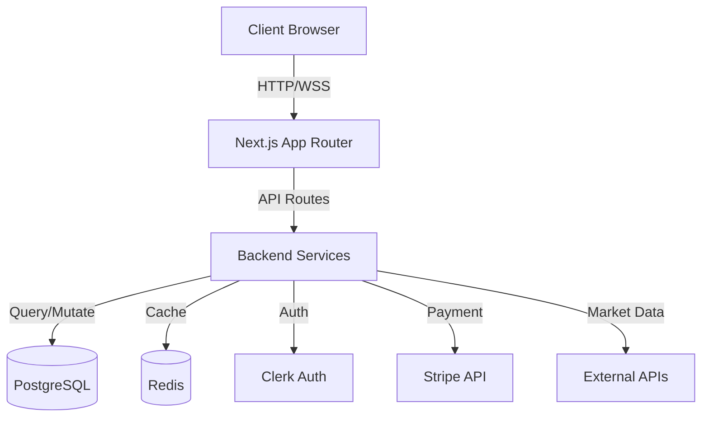
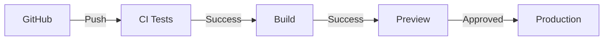

# Systemarchitektur NextLevelTraders

## 🏗️ Überblick

NextLevelTraders ist eine moderne, modulare Trading-Plattform basierend auf einer Microservices-Architektur mit Next.js als Frontend-Framework.



## 🎯 Kernkomponenten

### Frontend (Next.js App Router)

```
app/
├── (auth)/        # Authentication Routes
├── (dashboard)/   # Protected Dashboard Routes
├── (marketing)/   # Public Marketing Pages
└── api/          # Backend API Routes
```

#### Wichtige Verzeichnisse
- `components/` - Wiederverwendbare UI-Komponenten
- `hooks/` - Custom React Hooks
- `lib/` - Utility-Funktionen und Helpers
- `types/` - TypeScript Typdefinitionen

### Backend Services

1. **Authentication Service (Clerk)**
   - User Management
   - OAuth Integration
   - Session Handling

2. **Payment Service (Stripe)**
   - Subscription Management
   - Payment Processing
   - Webhook Handling

3. **Market Data Service**
   - Real-time Daten
   - Historische Daten
   - Technische Analysen

4. **Trading Service**
   - Order Management
   - Position Tracking
   - Risk Management

## 🔒 Security Layer

### Authentication & Authorization
- Clerk für Identity Management
- JWT Token Validation
- Role-Based Access Control (RBAC)

### Rate Limiting
- Redis-basiertes Rate Limiting
- IP-based Throttling
- Custom Limits pro Plan

### Data Protection
- End-to-End Encryption
- Data Sanitization
- Input Validation

## 💾 Datenbank Schema

### Users
```sql
users (
  id          UUID PRIMARY KEY,
  email       VARCHAR NOT NULL UNIQUE,
  name        VARCHAR,
  plan        VARCHAR DEFAULT 'free',
  created_at  TIMESTAMP DEFAULT NOW()
)
```

### Subscriptions
```sql
subscriptions (
  id              UUID PRIMARY KEY,
  user_id         UUID REFERENCES users(id),
  stripe_id       VARCHAR NOT NULL,
  plan_id         VARCHAR NOT NULL,
  status          VARCHAR NOT NULL,
  current_period  TSTZRANGE
)
```

### Watchlists
```sql
watchlists (
  id          UUID PRIMARY KEY,
  user_id     UUID REFERENCES users(id),
  name        VARCHAR NOT NULL,
  symbols     JSONB,
  created_at  TIMESTAMP DEFAULT NOW()
)
```

## 🔄 State Management

### Client-Side
- React Context für globalen UI State
- SWR für Server State Management
- Zustand für komplexen lokalen State

### Server-Side
- Redis für Caching
- PostgreSQL für persistente Daten
- Memory Caching für häufige Requests

## 📡 API Design

### REST Endpoints
- `/api/auth/*` - Authentication Routes
- `/api/subscriptions/*` - Subscription Management
- `/api/market-data/*` - Market Data Access
- `/api/watchlists/*` - Watchlist Management

### Websocket Connections
- Real-time Market Data
- Live Trading Updates
- System Notifications

## 🎨 UI/UX Architektur

### Component Hierarchie
```
Layout
└── Navigation
    ├── Dashboard
    │   ├── Charts
    │   ├── Watchlists
    │   └── Orders
    └── Settings
        ├── Profile
        ├── Preferences
        └── Billing
```

### Design System
- Tailwind CSS für Styling
- shadcn/ui für UI Komponenten
- Custom Theme System

## 🔧 Testing Strategie

1. **Unit Tests**
   - Jest für Komponenten
   - React Testing Library

2. **Integration Tests**
   - API Route Testing
   - Database Interactions

3. **E2E Tests**
   - Playwright für wichtige User Flows
   - Cross-browser Testing

## 📈 Performance

### Optimierungen
- Server-Side Rendering
- Static Page Generation
- Dynamic Imports
- Image Optimization

### Monitoring
- Vercel Analytics
- Custom Performance Metrics
- Error Tracking

## 🚀 Deployment

### Infrastruktur
- Vercel für Frontend/API
- Upstash für Redis
- Supabase für PostgreSQL

### CI/CD Pipeline


## 📦 Dependencies

### Core
- next.js
- react
- typescript
- tailwindcss

### Data Management
- prisma
- @upstash/redis
- swr

### UI/UX
- shadcn/ui
- lucide-react
- tailwind-merge

### Testing
- jest
- @testing-library/react
- playwright

## 🔄 Update-Prozess

1. **Breaking Changes**
   - Migration Guide
   - Versioning Strategy
   - Rollback Plan

2. **Feature Updates**
   - Feature Flags
   - A/B Testing
   - Gradual Rollout

## 🎯 Zukünftige Architektur

### Geplante Erweiterungen
1. Microservices Migration
2. GraphQL API Layer
3. ML-basierte Analysen
4. Mobile App Integration

### Technische Schulden
1. Performance Optimierungen
2. Test Coverage erhöhen
3. Dokumentation verbessern
4. Monitoring ausbauen