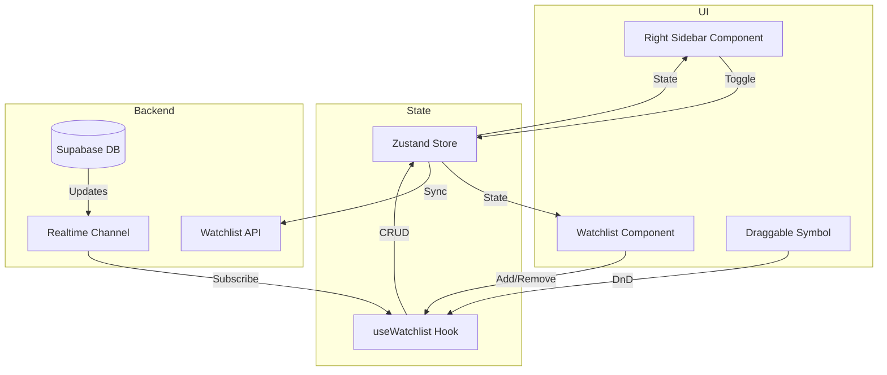

# Watchlist Sidebar Implementation Plan

## 1. Architektur



## 2. Komponenten

### RightSidebar
- Position: Rechte Seite des Viewports
- Eigenschaften:
  - Ein/Ausklappbar (mit Animation)
  - Persistent State (speichert Position)
  - Responsive Design
  - Z-Index Management
- Subkomponenten:
  - Header mit Toggle Button
  - Watchlist Container
  - Drag Handle für mobile Geräte

### Watchlist Integration
- Erweiterte Version der bestehenden EditableWatchlist
- Neue Features:
  - Drag & Drop Symbole
  - Echtzeit-Updates
  - Visuelles Feedback beim Hovern
  - Compact/Expanded Views

## 3. State Management

```typescript
interface WatchlistStore {
  // Sidebar State
  isSidebarOpen: boolean
  sidebarWidth: number
  
  // Watchlist State
  symbols: WatchlistItem[]
  isLoading: boolean
  error: Error | null
  
  // Actions
  toggleSidebar: () => void
  setSidebarWidth: (width: number) => void
  addSymbol: (symbol: string) => Promise<void>
  removeSymbol: (symbol: string) => Promise<void>
  reorderSymbols: (fromIndex: number, toIndex: number) => void
}
```

## 4. Supabase Integration

### Realtime Subscription
```typescript
const watchlistChannel = supabase
  .channel('watchlist_changes')
  .on(
    'postgres_changes',
    {
      event: '*',
      schema: 'public',
      table: 'watchlist_items'
    },
    (payload) => {
      // Update local state
    }
  )
  .subscribe()
```

### API Routes
- POST /api/watchlist/items - Symbol hinzufügen
- DELETE /api/watchlist/items/:symbol - Symbol entfernen
- PUT /api/watchlist/items/reorder - Reihenfolge aktualisieren

## 5. Styling & Animation

### Sidebar Animation
```typescript
const variants = {
  open: { 
    width: 300,
    x: 0,
    transition: { type: "spring", stiffness: 300, damping: 30 }
  },
  closed: { 
    width: 0,
    x: '100%',
    transition: { type: "spring", stiffness: 300, damping: 30 }
  }
}
```

### Responsive Design Breakpoints
```typescript
const breakpoints = {
  mobile: {
    width: '100%',
    height: '50vh',
    position: 'bottom'
  },
  tablet: {
    width: '300px',
    height: '100vh',
    position: 'right'
  },
  desktop: {
    width: '300px',
    height: '100vh',
    position: 'right'
  }
}
```

## 6. Implementierungsschritte

1. **Phase 1: Basis-Setup**
   - Neue RightSidebar Komponente erstellen
   - Zustand Store implementieren
   - Grundlegende Ein/Ausklapp-Funktionalität

2. **Phase 2: Watchlist Integration**
   - Watchlist Komponente in Sidebar integrieren
   - Supabase Realtime Channel einrichten
   - CRUD Operationen implementieren

3. **Phase 3: Drag & Drop**
   - DnD Funktionalität hinzufügen
   - Reorder-Logik implementieren
   - Visuelles Feedback optimieren

4. **Phase 4: Mobile Optimierung**
   - Responsive Breakpoints einrichten
   - Touch Interactions implementieren
   - Performance Optimierungen

5. **Phase 5: Testing & Polish**
   - Unit Tests schreiben
   - Performance Monitoring einrichten
   - Edge Cases behandeln

## 7. Technische Spezifikationen

### Performance Targets
- First Paint: < 100ms
- Animation FPS: 60
- Synchronisation Latenz: < 500ms

### Browser Support
- Modern Browsers (letzte 2 Versionen)
- Mobile Safari & Chrome
- PWA-ready

### Accessibility
- Keyboard Navigation
- Screen Reader Support
- ARIA Labels
- Focus Management

## 8. Sicherheit

### Supabase RLS Policies
```sql
-- Nur eigene Watchlist Items lesen
create policy "read_own_items" on watchlist_items
  for select using (auth.uid() = user_id);

-- Nur eigene Items manipulieren
create policy "manage_own_items" on watchlist_items
  for all using (auth.uid() = user_id);
```

## 9. Monitoring & Logging

- Performance Metriken
  - Sidebar Toggle Latenz
  - Sync Verzögerungen
  - Error Rates
- User Analytics
  - Nutzungsmuster
  - Häufig verwendete Symbole
  - Device/Viewport Stats