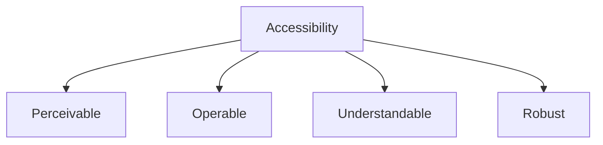

# Accessibility Guidelines

## 🎯 WCAG-Konformität



## 🖥️ Semantic HTML

### 1. Document Structure

```typescript
// ✅ Gut: Semantische Struktur
const Page = () => {
  return (
    <main>
      <h1>Trading Dashboard</h1>
      
      <nav aria-label="Main navigation">
        <ul>
          <li><a href="/dashboard">Dashboard</a></li>
          <li><a href="/trades">Trades</a></li>
        </ul>
      </nav>
      
      <section aria-labelledby="trades-title">
        <h2 id="trades-title">Recent Trades</h2>
        <TradeList />
      </section>
      
      <aside aria-label="Market Overview">
        <MarketOverview />
      </aside>
    </main>
  );
};

// ❌ Schlecht: Div Suppe
const BadPage = () => {
  return (
    <div>
      <div>Trading Dashboard</div>
      <div>
        <div>Dashboard</div>
        <div>Trades</div>
      </div>
      <div>
        <div>Recent Trades</div>
        <TradeList />
      </div>
    </div>
  );
};
```

### 2. ARIA Attributes

```typescript
// Form Controls
const TradeForm = () => {
  return (
    <form aria-labelledby="form-title">
      <h2 id="form-title">Place Trade</h2>
      
      <div role="group" aria-labelledby="amount-label">
        <label id="amount-label" htmlFor="amount">
          Amount
        </label>
        <input
          id="amount"
          type="number"
          aria-describedby="amount-help"
          min="0"
          step="0.01"
        />
        <span id="amount-help">
          Enter trade amount in USD
        </span>
      </div>
      
      <div role="group" aria-labelledby="type-label">
        <span id="type-label">Trade Type</span>
        <div role="radiogroup" aria-labelledby="type-label">
          <label>
            <input
              type="radio"
              name="type"
              value="buy"
              aria-checked="true"
            />
            Buy
          </label>
          <label>
            <input
              type="radio"
              name="type"
              value="sell"
            />
            Sell
          </label>
        </div>
      </div>
    </form>
  );
};
```

## 🎨 Visual Design

### 1. Color Contrast

```typescript
// Color Utilities
const colors = {
  // Accessible Color Pairs
  text: {
    primary: '#1A1A1A',    // Contrast 16:1 auf Weiß
    secondary: '#595959',   // Contrast 7:1 auf Weiß
    disabled: '#737373',    // Contrast 4.5:1 auf Weiß
  },
  
  // Status Colors
  status: {
    success: '#2D741F',    // Contrast 4.5:1 auf Weiß
    error: '#D32F2F',      // Contrast 4.5:1 auf Weiß
    warning: '#F57C00',    // Contrast 4.5:1 auf Weiß
  }
};

// Color Usage
const Button = styled.button<{ variant: 'primary' | 'secondary' }>`
  background: ${props => props.variant === 'primary' 
    ? colors.primary
    : colors.secondary};
  color: white;
  
  &:disabled {
    background: ${colors.disabled};
  }
`;
```

### 2. Focus Management

```typescript
// Focus Styles
const FocusStyles = css`
  &:focus {
    outline: 2px solid ${colors.primary};
    outline-offset: 2px;
  }
  
  &:focus:not(:focus-visible) {
    outline: none;
  }
  
  &:focus-visible {
    outline: 2px solid ${colors.primary};
    outline-offset: 2px;
  }
`;

// Focus Trap
const Modal = ({ isOpen, onClose, children }) => {
  const ref = useRef<HTMLDivElement>(null);
  
  useEffect(() => {
    if (isOpen) {
      const trap = createFocusTrap(ref.current!, {
        initialFocus: ref.current!,
        escapeDeactivates: true,
        fallbackFocus: ref.current!,
      });
      
      trap.activate();
      return () => trap.deactivate();
    }
  }, [isOpen]);
  
  return (
    <div ref={ref} role="dialog" aria-modal="true">
      {children}
    </div>
  );
};
```

## ⌨️ Keyboard Navigation

### 1. Keyboard Interactions

```typescript
// Keyboard Navigation
const NavigationMenu = () => {
  const [activeIndex, setActiveIndex] = useState(0);
  const items = ['Dashboard', 'Trades', 'Analytics'];
  
  const handleKeyDown = (event: KeyboardEvent) => {
    switch (event.key) {
      case 'ArrowRight':
        setActiveIndex(i => (i + 1) % items.length);
        break;
      case 'ArrowLeft':
        setActiveIndex(i => (i - 1 + items.length) % items.length);
        break;
    }
  };
  
  return (
    <nav role="navigation">
      <ul onKeyDown={handleKeyDown}>
        {items.map((item, index) => (
          <li key={item}>
            <a
              href={`/${item.toLowerCase()}`}
              tabIndex={index === activeIndex ? 0 : -1}
            >
              {item}
            </a>
          </li>
        ))}
      </ul>
    </nav>
  );
};
```

### 2. Skip Links

```typescript
// Skip Navigation
const SkipLinks = () => {
  return (
    <>
      <a
        href="#main-content"
        className="skip-link"
      >
        Skip to main content
      </a>
      <a
        href="#navigation"
        className="skip-link"
      >
        Skip to navigation
      </a>
    </>
  );
};

const styles = css`
  .skip-link {
    position: absolute;
    top: -40px;
    left: 0;
    padding: 8px;
    background: white;
    z-index: 100;
    
    &:focus {
      top: 0;
    }
  }
`;
```

## 📱 Responsive Design

### 1. Viewport Settings

```typescript
// Viewport Configuration
const Layout = () => {
  return (
    <head>
      <meta
        name="viewport"
        content="width=device-width, initial-scale=1.0"
      />
      <meta
        name="theme-color"
        content="#ffffff"
      />
    </head>
  );
};

// Responsive Text
const Typography = {
  h1: css`
    font-size: clamp(2rem, 5vw, 3rem);
    line-height: 1.2;
  `,
  
  body: css`
    font-size: clamp(1rem, 2vw, 1.2rem);
    line-height: 1.5;
  `
};
```

### 2. Touch Targets

```typescript
// Touch Target Sizes
const TouchableStyles = css`
  // Mindestgröße für Touch-Targets
  min-width: 44px;
  min-height: 44px;
  
  // Ausreichend Abstand
  margin: 8px;
  padding: 12px;
  
  // Touch Feedback
  &:active {
    opacity: 0.7;
  }
  
  @media (hover: hover) {
    &:hover {
      opacity: 0.8;
    }
  }
`;

// Anwendung
const Button = styled.button`
  ${TouchableStyles}
`;
```

## 📝 Content

### 1. Text Alternatives

```typescript
// Image Alternatives
const TradeChart = () => {
  return (
    <figure>
      
      <figcaption id="chart-description">
        Detailed price movement showing 15% increase
        from $100 to $115 over the past week
      </figcaption>
    </figure>
  );
};

// Icon Labels
const ActionButton = ({ icon, label }) => {
  return (
    <button aria-label={label}>
      <span aria-hidden="true">{icon}</span>
    </button>
  );
};
```

### 2. Error Messages

```typescript
// Error Messaging
const FormField = ({ error, label, id }) => {
  const errorId = `${id}-error`;
  
  return (
    <div>
      <label htmlFor={id}>{label}</label>
      <input
        id={id}
        aria-invalid={Boolean(error)}
        aria-describedby={error ? errorId : undefined}
      />
      {error && (
        <div
          id={errorId}
          role="alert"
          className="error-message"
        >
          {error}
        </div>
      )}
    </div>
  );
};