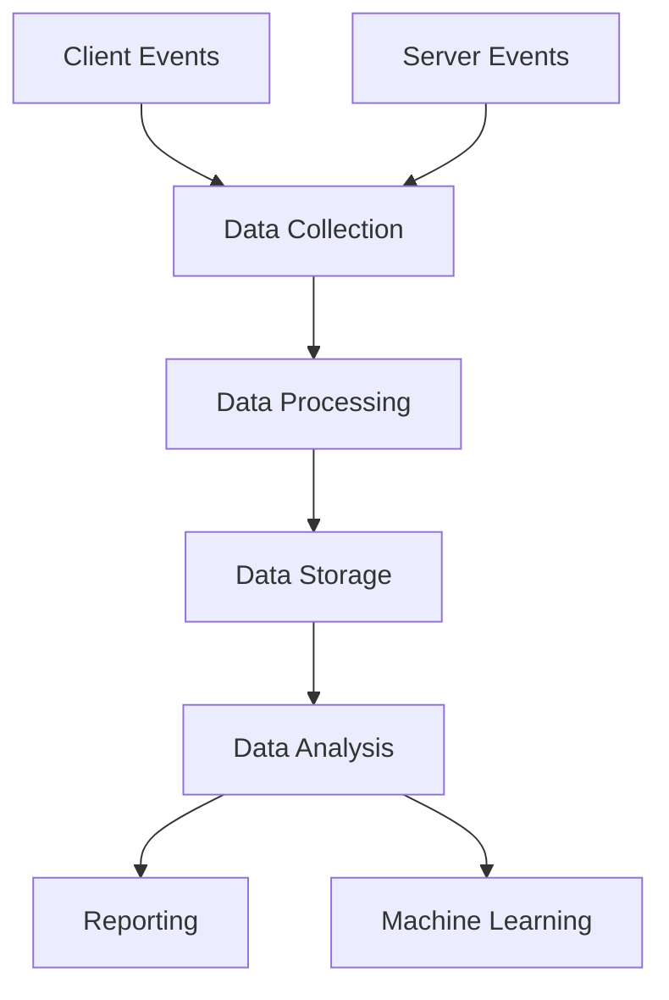

# Analytics & Tracking

## 📊 Analytics-Übersicht



## 🔍 Event Tracking

### Core Events

```typescript
// Analytics Setup
const analytics = new Analytics({
  writeKey: process.env.SEGMENT_WRITE_KEY,
  flushAt: 20,
  flushInterval: 10000
});

// Event Types
type TrackingEvent =
  | 'User Signed Up'
  | 'Order Placed'
  | 'Trade Executed'
  | 'Watchlist Created'
  | 'Analysis Viewed'
  | 'Strategy Created';

// Properties für jeden Event-Typ
interface EventProperties {
  'User Signed Up': {
    source: string;
    referral?: string;
    utm_source?: string;
  };
  'Order Placed': {
    symbol: string;
    amount: number;
    type: 'buy' | 'sell';
    price: number;
  };
  // ...weitere Event-Definitionen
}
```

### User Properties

```typescript
interface UserProperties {
  // Demografische Daten
  userId: string;
  email: string;
  name?: string;
  country?: string;
  language?: string;

  // Trading-Präferenzen
  tradingExperience: 'beginner' | 'intermediate' | 'expert';
  preferredMarkets: string[];
  riskTolerance: 'low' | 'medium' | 'high';

  // Subscription
  plan: 'free' | 'pro' | 'enterprise';
  subscriptionStart: Date;
  billing?: {
    status: 'active' | 'past_due' | 'canceled';
    interval: 'monthly' | 'yearly';
  };
}
```

## 📈 Tracking Implementation

### Client-Side Tracking

```typescript
// Analytics Provider
export function AnalyticsProvider({ children }: PropsWithChildren) {
  useEffect(() => {
    analytics.load(process.env.NEXT_PUBLIC_SEGMENT_WRITE_KEY);
  }, []);

  return (
    <AnalyticsContext.Provider value={analytics}>
      {children}
    </AnalyticsContext.Provider>
  );
}

// Analytics Hook
export function useAnalytics() {
  const analytics = useContext(AnalyticsContext);

  return {
    trackEvent<T extends TrackingEvent>(
      event: T,
      properties: EventProperties[T]
    ) {
      analytics.track(event, {
        ...properties,
        timestamp: new Date().toISOString(),
        url: window.location.href,
      });
    },

    identifyUser(user: UserProperties) {
      analytics.identify(user.userId, {
        ...user,
        lastUpdated: new Date().toISOString(),
      });
    },
  };
}
```

### Server-Side Tracking

```typescript
// API Route Handler
export async function POST(req: Request) {
  const { user, order } = await req.json();

  // Track order placement
  await analytics.track({
    userId: user.id,
    event: 'Order Placed',
    properties: {
      orderId: order.id,
      symbol: order.symbol,
      amount: order.amount,
      type: order.type,
      price: order.price,
      timestamp: new Date().toISOString(),
    },
  });

  // Update user properties
  await analytics.identify({
    userId: user.id,
    traits: {
      totalOrders: user.orderCount + 1,
      totalVolume: user.volume + order.amount,
      lastOrderDate: new Date().toISOString(),
    },
  });
}
```

## 📊 Data Warehousing

### Schema Design

```sql
-- User Events Table
CREATE TABLE user_events (
    event_id UUID PRIMARY KEY,
    user_id UUID NOT NULL,
    event_type VARCHAR(50) NOT NULL,
    properties JSONB NOT NULL,
    timestamp TIMESTAMP WITH TIME ZONE NOT NULL,
    session_id UUID,
    client_id VARCHAR(50)
);

-- User Properties Table
CREATE TABLE user_properties (
    user_id UUID PRIMARY KEY,
    properties JSONB NOT NULL,
    first_seen TIMESTAMP WITH TIME ZONE NOT NULL,
    last_seen TIMESTAMP WITH TIME ZONE NOT NULL,
    last_updated TIMESTAMP WITH TIME ZONE NOT NULL
);
```

### ETL Prozesse

```typescript
// Data Transformation
const etl = {
  async processRawEvents() {
    const events = await getRawEvents();
    
    for (const event of events) {
      // Normalisierung
      const normalizedEvent = normalizeEvent(event);
      
      // Anreicherung
      const enrichedEvent = await enrichEventData(normalizedEvent);
      
      // Laden
      await loadEventToWarehouse(enrichedEvent);
    }
  },
};
```

## 📈 Reporting

### Dashboards

```typescript
// Dashboard Configuration
const dashboards = {
  business: {
    title: 'Business Metrics',
    refresh: '1h',
    metrics: [
      {
        name: 'Daily Active Users',
        query: `
          SELECT DATE_TRUNC('day', timestamp) as date,
                 COUNT(DISTINCT user_id) as count
          FROM user_events
          GROUP BY 1
          ORDER BY 1 DESC
        `
      },
      {
        name: 'Order Volume',
        query: `
          SELECT DATE_TRUNC('day', timestamp) as date,
                 SUM(properties->>'amount') as volume
          FROM user_events
          WHERE event_type = 'Order Placed'
          GROUP BY 1
          ORDER BY 1 DESC
        `
      }
    ]
  }
};
```

### Automated Reports

```typescript
// Report Generation
const reports = {
  async generateWeeklyReport() {
    const data = await Promise.all([
      getNewUsers(),
      getOrderMetrics(),
      getRetentionData(),
      getRevenueMetrics()
    ]);

    const report = {
      period: 'weekly',
      date: new Date(),
      metrics: {
        newUsers: data[0],
        orders: data[1],
        retention: data[2],
        revenue: data[3]
      }
    };

    await sendReportToStakeholders(report);
  }
};
```

## 🤖 Machine Learning

### Predictive Analytics

```typescript
// Feature Engineering
const features = {
  async prepareUserFeatures(userId: string) {
    const userData = await getUserEvents(userId);
    
    return {
      // Aktivitäts-Features
      tradingFrequency: calculateTradingFrequency(userData),
      averageOrderSize: calculateAverageOrderSize(userData),
      preferredSymbols: extractPreferredSymbols(userData),
      
      // Engagement-Features
      sessionFrequency: calculateSessionFrequency(userData),
      featuresUsed: extractUsedFeatures(userData),
      
      // Risiko-Features
      riskScore: calculateRiskScore(userData),
      profitLossRatio: calculateProfitLossRatio(userData)
    };
  }
};
```

## 🔒 Privacy & Compliance

### Data Retention

```typescript
// Data Retention Policy
const retention = {
  async cleanupOldData() {
    const retentionPeriod = 24; // months
    
    await Promise.all([
      // Anonymisiere alte User-Daten
      anonymizeOldUserData(retentionPeriod),
      
      // Lösche alte Events
      deleteOldEvents(retentionPeriod),
      
      // Archiviere aggregierte Daten
      archiveAggregatedData(retentionPeriod)
    ]);
  }
};
```

### GDPR Compliance

```typescript
// GDPR Data Export
const gdpr = {
  async exportUserData(userId: string) {
    const userData = {
      profile: await getUserProfile(userId),
      events: await getUserEvents(userId),
      preferences: await getUserPreferences(userId)
    };

    return formatGDPRExport(userData);
  },

  async deleteUserData(userId: string) {
    await Promise.all([
      deleteUserProfile(userId),
      deleteUserEvents(userId),
      deleteUserPreferences(userId)
    ]);
  }
};
```

## 📱 Mobile Analytics

### App Tracking

```typescript
// Mobile Event Tracking
const mobileAnalytics = {
  async trackScreenView(screenName: string, properties: any) {
    await analytics.screen(screenName, {
      ...properties,
      platform: 'mobile',
      appVersion: APP_VERSION,
      osVersion: Device.osVersion
    });
  },

  async trackAppState(state: AppState) {
    await analytics.track('App State Change', {
      previousState: state.previous,
      currentState: state.current,
      timestamp: new Date().toISOString()
    });
  }
};
```

## 📊 A/B Testing

### Test Configuration

```typescript
// A/B Test Setup
const abTests = {
  async setupTest(testId: string, config: ABTestConfig) {
    return {
      name: testId,
      variants: config.variants,
      allocation: config.allocation,
      metrics: {
        primary: config.primaryMetric,
        secondary: config.secondaryMetrics
      }
    };
  },

  async trackVariant(userId: string, testId: string, variant: string) {
    await analytics.track('Experiment Viewed', {
      experimentId: testId,
      experimentVariant: variant,
      userId
    });
  }
};