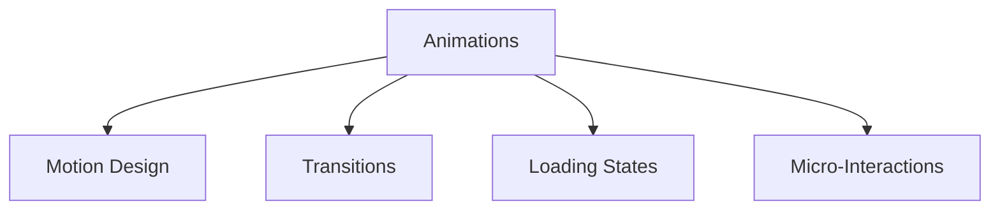

# Animation Guidelines

## 🎯 Animation-Übersicht



## 🎨 Motion Design

### 1. Animation Variables

```typescript
// Animation Tokens
const animation = {
  // Durations
  duration: {
    fast: '100ms',
    normal: '200ms',
    slow: '300ms',
    slower: '500ms'
  },
  
  // Timing Functions
  easing: {
    default: 'cubic-bezier(0.4, 0, 0.2, 1)',
    linear: 'linear',
    in: 'cubic-bezier(0.4, 0, 1, 1)',
    out: 'cubic-bezier(0, 0, 0.2, 1)',
    inOut: 'cubic-bezier(0.4, 0, 0.2, 1)'
  },
  
  // Animation Presets
  presets: {
    fadeIn: {
      initial: { opacity: 0 },
      animate: { opacity: 1 },
      transition: { duration: 0.2 }
    },
    slideIn: {
      initial: { x: -20, opacity: 0 },
      animate: { x: 0, opacity: 1 },
      transition: { duration: 0.3 }
    }
  }
};
```

### 2. Framer Motion Components

```typescript
// Animated Components
const AnimatedCard = motion(Card);
const AnimatedButton = motion(Button);

// Animation Variants
const containerVariants = {
  hidden: { opacity: 0 },
  show: {
    opacity: 1,
    transition: {
      staggerChildren: 0.1,
      delayChildren: 0.3
    }
  }
};

const itemVariants = {
  hidden: { y: 20, opacity: 0 },
  show: {
    y: 0,
    opacity: 1,
    transition: {
      type: 'spring',
      stiffness: 300,
      damping: 24
    }
  }
};

// Usage
const AnimatedList = ({ children }) => {
  return (
    <motion.ul
      variants={containerVariants}
      initial="hidden"
      animate="show"
    >
      {children.map((child, index) => (
        <motion.li
          key={index}
          variants={itemVariants}
        >
          {child}
        </motion.li>
      ))}
    </motion.ul>
  );
};
```

## 🔄 Transitions

### 1. Page Transitions

```typescript
// Page Transition
const pageTransition = {
  initial: { opacity: 0, y: 20 },
  animate: { opacity: 1, y: 0 },
  exit: { opacity: 0, y: -20 },
  transition: {
    type: 'spring',
    stiffness: 500,
    damping: 30
  }
};

// Layout Component
const Layout = ({ children }) => {
  return (
    <AnimatePresence mode="wait">
      <motion.main
        key={router.pathname}
        {...pageTransition}
      >
        {children}
      </motion.main>
    </AnimatePresence>
  );
};
```

### 2. Component Transitions

```typescript
// Component Transitions
const fadeSlide = {
  initial: { opacity: 0, x: -20 },
  animate: { opacity: 1, x: 0 },
  exit: { opacity: 0, x: 20 }
};

// Modal Animation
const Modal = ({ isOpen, onClose, children }) => {
  return (
    <AnimatePresence>
      {isOpen && (
        <>
          <motion.div
            initial={{ opacity: 0 }}
            animate={{ opacity: 0.4 }}
            exit={{ opacity: 0 }}
            className="backdrop"
            onClick={onClose}
          />
          <motion.div
            initial={{ scale: 0.95, opacity: 0 }}
            animate={{ scale: 1, opacity: 1 }}
            exit={{ scale: 0.95, opacity: 0 }}
            className="modal"
          >
            {children}
          </motion.div>
        </>
      )}
    </AnimatePresence>
  );
};
```

## ⌛ Loading States

### 1. Loading Animations

```typescript
// Skeleton Loading
const SkeletonPulse = styled.div`
  animation: pulse 2s cubic-bezier(0.4, 0, 0.6, 1) infinite;
  
  @keyframes pulse {
    0%, 100% {
      opacity: 1;
    }
    50% {
      opacity: .5;
    }
  }
`;

// Loading Spinner
const Spinner = () => (
  <motion.div
    animate={{
      rotate: 360
    }}
    transition={{
      duration: 1,
      repeat: Infinity,
      ease: "linear"
    }}
    className="spinner"
  />
);
```

### 2. Progress Indicators

```typescript
// Progress Bar
const ProgressBar = ({ progress }) => {
  return (
    <motion.div
      className="progress-bar"
      initial={{ width: 0 }}
      animate={{ width: `${progress}%` }}
      transition={{
        type: 'spring',
        stiffness: 100,
        damping: 20
      }}
    />
  );
};

// Circular Progress
const CircularProgress = ({ progress }) => {
  const circumference = 2 * Math.PI * 45; // r=45
  
  return (
    <motion.circle
      r="45"
      cx="50"
      cy="50"
      fill="transparent"
      strokeDasharray={circumference}
      animate={{
        strokeDashoffset:
          circumference - (progress / 100) * circumference
      }}
      transition={{ duration: 0.5 }}
    />
  );
};
```

## 🎈 Micro-Interactions

### 1. Button Animations

```typescript
// Animated Button
const AnimatedButton = styled(motion.button)`
  &:hover {
    transform: translateY(-1px);
  }
  
  &:active {
    transform: translateY(1px);
  }
`;

// Button with Ripple
const RippleButton = ({ onClick, children }) => {
  const [ripples, setRipples] = useState([]);
  
  const handleClick = (e) => {
    const rect = e.target.getBoundingClientRect();
    const x = e.clientX - rect.left;
    const y = e.clientY - rect.top;
    
    setRipples([...ripples, { x, y, id: Date.now() }]);
    onClick?.();
  };
  
  return (
    <button onClick={handleClick}>
      {children}
      {ripples.map(ripple => (
        <motion.span
          key={ripple.id}
          initial={{ scale: 0, opacity: 0.5 }}
          animate={{ scale: 2, opacity: 0 }}
          exit={{ opacity: 0 }}
          style={{
            position: 'absolute',
            left: ripple.x,
            top: ripple.y
          }}
        />
      ))}
    </button>
  );
};
```

### 2. Focus & Hover States

```typescript
// Hover Card
const HoverCard = styled(motion.div)`
  &:hover {
    transform: translateY(-4px);
    box-shadow: 0 4px 12px rgba(0, 0, 0, 0.1);
  }
`;

// Focus Ring Animation
const FocusInput = styled(motion.input)`
  &:focus {
    outline: none;
    box-shadow: 0 0 0 2px rgba(66, 153, 225, 0.6);
    transform: scale(1.01);
  }
  
  transition: all 0.2s ease-in-out;
`;
```

## 🎭 Animation Hooks

### 1. Custom Hooks

```typescript
// Use Animation Controls
const useAnimationControls = () => {
  const controls = useAnimation();
  
  const play = async () => {
    await controls.start({
      scale: [1, 1.1, 1],
      transition: {
        duration: 0.3
      }
    });
  };
  
  const reset = () => controls.set({ scale: 1 });
  
  return { controls, play, reset };
};

// Use Spring Animation
const useSpring = (value: number) => {
  return useSpring({
    from: { value: 0 },
    to: { value },
    config: {
      mass: 1,
      tension: 170,
      friction: 26
    }
  });
};