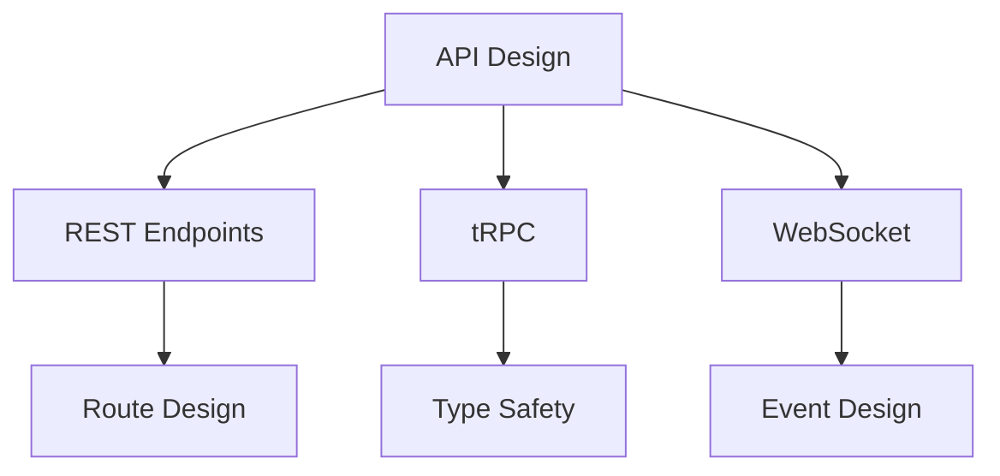

# API Design Guidelines

## 🎯 API-Übersicht



## 🌐 REST API Design

### 1. Endpoint Structure

```typescript
// API Routes Structure
/api
  /v1
    /auth
      POST /login
      POST /register
      POST /logout
    /users
      GET  /me
      PUT  /me
      GET  /:id
    /trades
      GET    /
      POST   /
      GET    /:id
      PUT    /:id
      DELETE /:id
    /market
      GET /quotes/:symbol
      GET /history/:symbol

// Response Types
interface ApiResponse<T> {
  data: T;
  meta?: {
    page?: number;
    limit?: number;
    total?: number;
  };
  error?: {
    code: string;
    message: string;
    details?: unknown;
  };
}
```

### 2. Request/Response Standards

```typescript
// Request Validation
const createTradeSchema = z.object({
  symbol: z.string(),
  type: z.enum(['buy', 'sell']),
  amount: z.number().positive(),
  price: z.number().positive()
});

// Route Handler
export async function POST(req: Request) {
  try {
    // Validate Request
    const body = await req.json();
    const data = createTradeSchema.parse(body);
    
    // Process Request
    const trade = await createTrade(data);
    
    // Return Response
    return Response.json({
      data: trade
    });
  } catch (error) {
    if (error instanceof z.ZodError) {
      return Response.json({
        error: {
          code: 'VALIDATION_ERROR',
          message: 'Invalid input',
          details: error.errors
        }
      }, { status: 400 });
    }
    
    throw error;
  }
}
```

## 🔄 tRPC Design

### 1. Router Design

```typescript
// Router Definition
export const appRouter = createTRPCRouter({
  users: userRouter,
  trades: tradeRouter,
  market: marketRouter
});

// User Router
export const userRouter = createTRPCRouter({
  me: protectedProcedure
    .query(async ({ ctx }) => {
      return ctx.prisma.user.findUnique({
        where: { id: ctx.session.user.id }
      });
    }),
    
  update: protectedProcedure
    .input(updateUserSchema)
    .mutation(async ({ ctx, input }) => {
      return ctx.prisma.user.update({
        where: { id: ctx.session.user.id },
        data: input
      });
    })
});
```

### 2. Type Safety

```typescript
// Input Types
interface TradeInput {
  symbol: string;
  type: 'buy' | 'sell';
  amount: number;
  price: number;
}

// Procedure Definition
const createTrade = protectedProcedure
  .input(tradeSchema)
  .mutation(async ({ ctx, input }) => {
    // Type-safe input
    const trade = await ctx.prisma.trade.create({
      data: {
        ...input,
        userId: ctx.session.user.id
      }
    });
    
    return trade;
  });

// Client Usage
const { mutate } = api.trades.create.useMutation();
```

## 📡 WebSocket API

### 1. Event Structure

```typescript
// Event Types
type WSEvent = {
  type: string;
  payload: unknown;
  timestamp: number;
};

// Market Data Events
interface MarketDataEvent extends WSEvent {
  type: 'quote' | 'trade' | 'orderbook';
  payload: {
    symbol: string;
    data: QuoteData | TradeData | OrderBookData;
  };
}

// Client Events
interface ClientEvent extends WSEvent {
  type: 'subscribe' | 'unsubscribe';
  payload: {
    symbols: string[];
    channels: string[];
  };
}
```

### 2. Connection Management

```typescript
// WebSocket Server
class WSServer {
  private clients = new Map<string, WebSocket>();
  
  handleConnection(ws: WebSocket, req: Request) {
    const clientId = generateId();
    this.clients.set(clientId, ws);
    
    ws.on('message', (data) => {
      this.handleMessage(clientId, data);
    });
    
    ws.on('close', () => {
      this.handleDisconnect(clientId);
    });
  }
  
  broadcast(event: WSEvent) {
    for (const client of this.clients.values()) {
      if (client.readyState === WebSocket.OPEN) {
        client.send(JSON.stringify(event));
      }
    }
  }
}
```

## 🔒 API Security

### 1. Authentication

```typescript
// Auth Middleware
export const withAuth = createMiddleware(async (req) => {
  // Verify Token
  const token = req.headers.get('authorization')?.split(' ')[1];
  if (!token) {
    throw new UnauthorizedError();
  }
  
  // Validate Session
  const session = await validateSession(token);
  if (!session) {
    throw new UnauthorizedError();
  }
  
  // Attach User
  req.user = session.user;
  
  return NextResponse.next();
});

// Protected Route
export const GET = withAuth(async (req) => {
  // Access authenticated user
  const user = req.user;
  
  // Process request
  return Response.json({ data: user });
});
```

### 2. Rate Limiting

```typescript
// Rate Limit Configuration
const rateLimiter = new RateLimit({
  // General Limits
  default: {
    window: '1m',
    max: 60
  },
  
  // Endpoint Specific
  endpoints: {
    'POST /api/trades': {
      window: '1m',
      max: 10
    },
    'GET /api/market/quotes': {
      window: '1m',
      max: 120
    }
  }
});

// Rate Limit Middleware
export const withRateLimit = createMiddleware(async (req) => {
  const endpoint = `${req.method} ${req.url}`;
  const limits = rateLimiter.getLimits(endpoint);
  
  await rateLimiter.check(req, limits);
  
  return NextResponse.next();
});
```

## 📊 API Monitoring

### 1. Performance Tracking

```typescript
// API Metrics
const apiMetrics = {
  // Response Time
  trackResponseTime(endpoint: string, duration: number) {
    metrics.histogram('api_response_time', {
      value: duration,
      tags: { endpoint }
    });
  },
  
  // Error Rates
  trackError(endpoint: string, error: Error) {
    metrics.increment('api_errors', {
      tags: { 
        endpoint,
        type: error.name
      }
    });
  }
};

// Monitoring Middleware
export const withMonitoring = createMiddleware(async (req) => {
  const start = Date.now();
  
  try {
    const response = await NextResponse.next();
    
    // Track Success
    const duration = Date.now() - start;
    apiMetrics.trackResponseTime(req.url, duration);
    
    return response;
  } catch (error) {
    // Track Error
    apiMetrics.trackError(req.url, error);
    throw error;
  }
});
```

### 2. Error Tracking

```typescript
// Error Handler
export function handleApiError(error: unknown) {
  // Log Error
  logger.error('API Error', {
    error,
    stack: error instanceof Error ? error.stack : undefined
  });
  
  // Track Error
  Sentry.captureException(error);
  
  // Return Error Response
  if (error instanceof ApiError) {
    return Response.json({
      error: {
        code: error.code,
        message: error.message
      }
    }, { status: error.status });
  }
  
  return Response.json({
    error: {
      code: 'INTERNAL_ERROR',
      message: 'An unexpected error occurred'
    }
  }, { status: 500 });
}