# System Architecture

## 🏗️ Systemübersicht

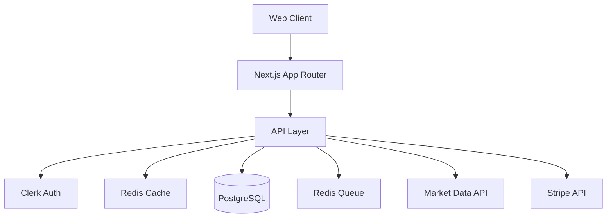

## 🎯 Kernkomponenten

### 1. Frontend Layer
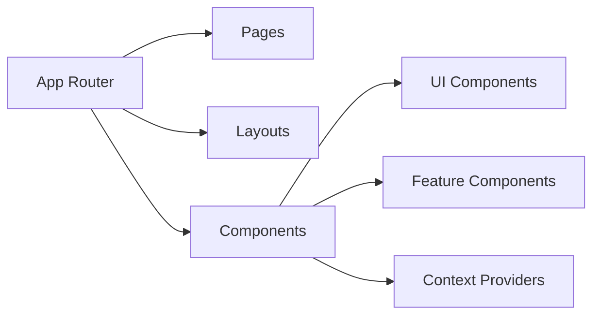

#### Technologie-Stack
- Next.js 14 (App Router)
- React 18 (Server Components)
- TailwindCSS
- shadcn/ui Components

### 2. API Layer
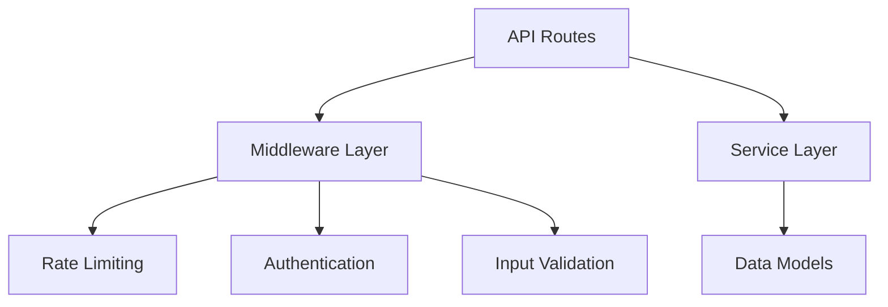

#### API Design
- REST API Endpoints
- tRPC für Type Safety
- OpenAPI Spezifikation
- Rate Limiting & Caching

### 3. Datenbank Layer
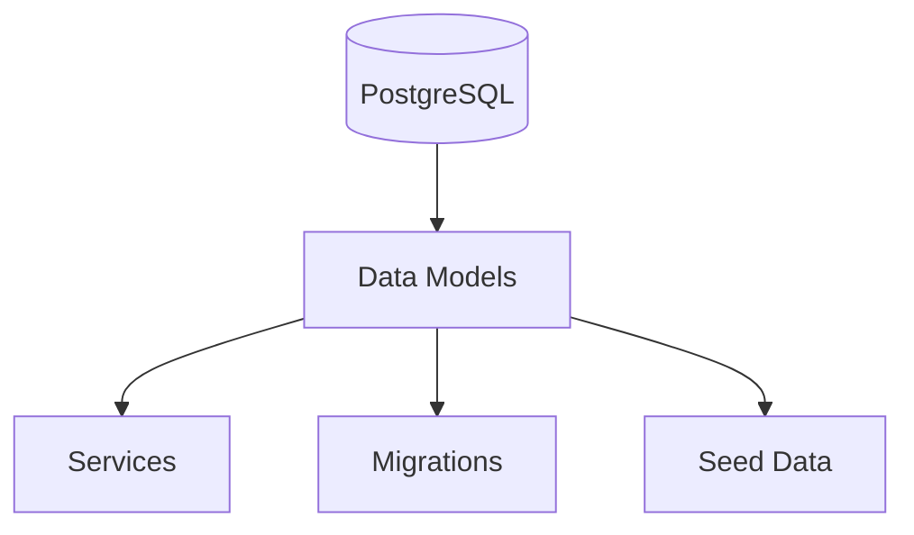

#### Datenmodelle
```prisma
// User Model
model User {
  id        String   @id @default(cuid())
  email     String   @unique
  name      String?
  plan      Plan     @default(FREE)
  createdAt DateTime @default(now())
}

// Subscription Model
model Subscription {
  id        String   @id @default(cuid())
  userId    String   @unique
  planId    String
  status    Status
  startDate DateTime @default(now())
  endDate   DateTime?
}

// Trading Model
model Trade {
  id        String   @id @default(cuid())
  userId    String
  symbol    String
  type      TradeType
  amount    Float
  price     Float
  status    TradeStatus
  createdAt DateTime @default(now())
}
```

## 🔄 Datenfluss

### 1. Request Flow
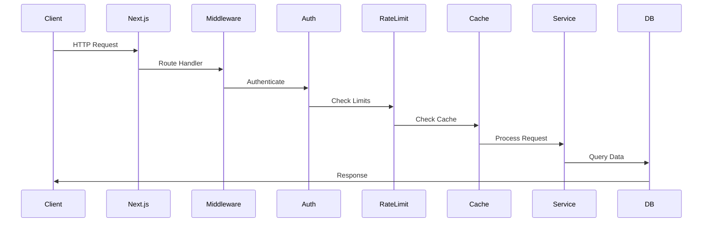

### 2. Real-time Updates
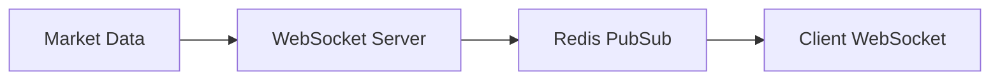

## 🏛️ Architekturprinzipien

### 1. Clean Architecture
```
src/
├── domain/      # Business Logic
├── application/ # Use Cases
├── interfaces/  # Controllers/Presenters
└── infrastructure/ # External Services
```

### 2. SOLID Principles
- Single Responsibility
- Open/Closed
- Liskov Substitution
- Interface Segregation
- Dependency Inversion

### 3. Design Patterns
- Repository Pattern
- Factory Pattern
- Strategy Pattern
- Observer Pattern
- Decorator Pattern

## 🔒 Sicherheitsarchitektur

### 1. Authentication Flow
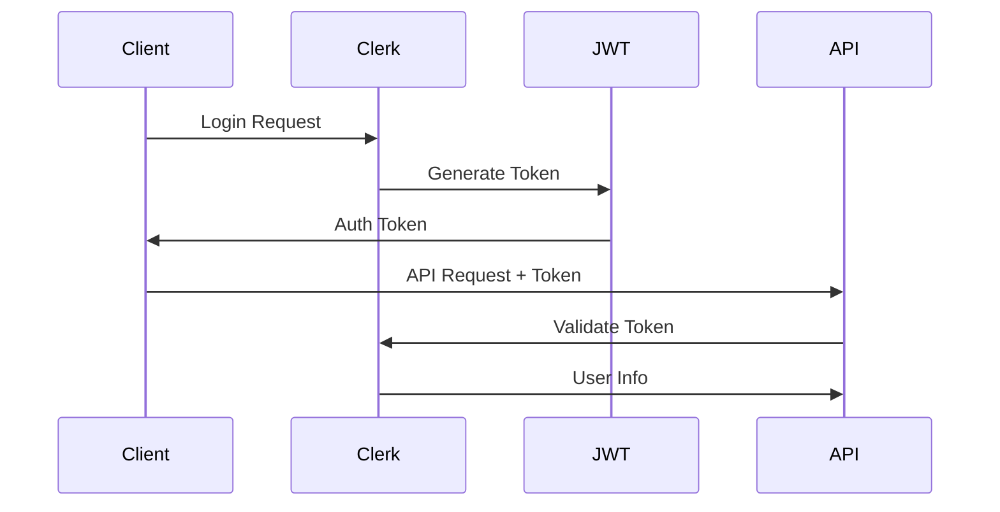

### 2. Authorization Layers
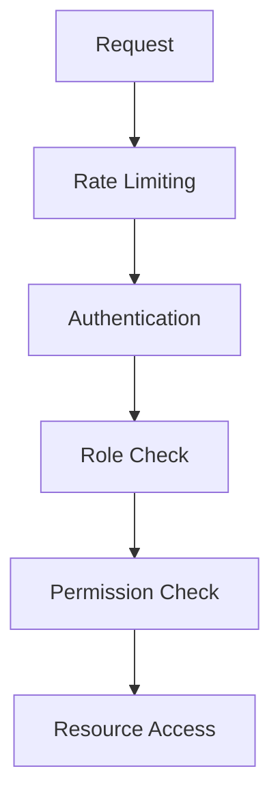

## 📈 Skalierung

### 1. Horizontale Skalierung
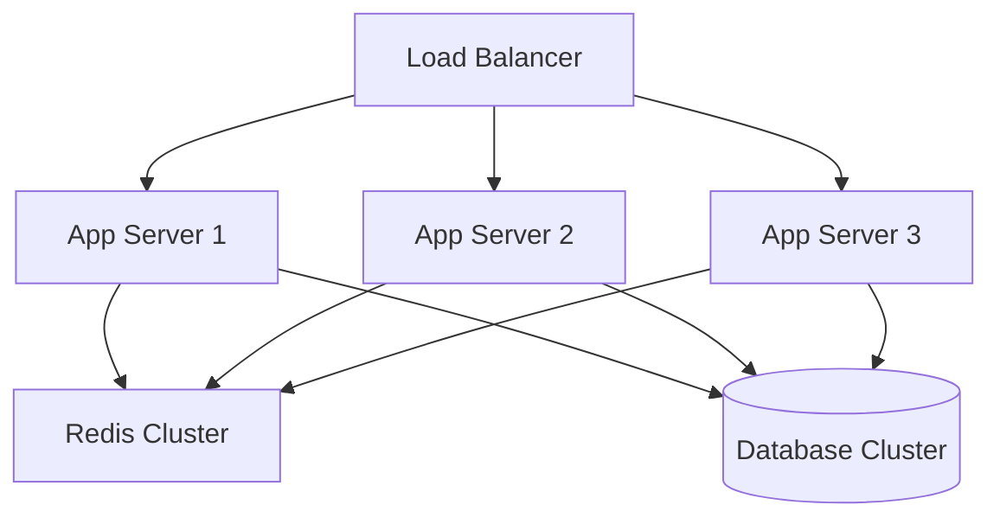

### 2. Caching Strategie
- Redis Cache Layer
- Static Asset Caching
- API Response Caching
- Database Query Caching

## 🔍 Monitoring & Logging

### 1. Metriken
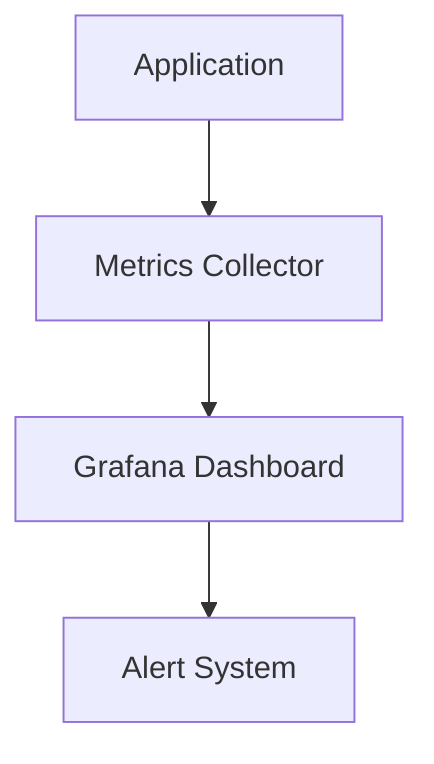

### 2. Logging
- Structured Logging
- Error Tracking
- Performance Monitoring
- User Analytics

## 🚀 Deployment Architektur

### 1. CI/CD Pipeline
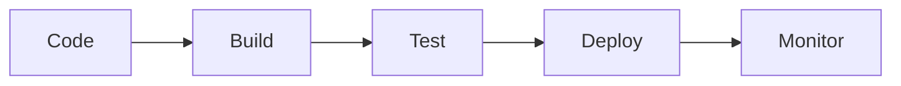

### 2. Infrastruktur
- Vercel für Frontend/API
- Supabase für Datenbank
- Upstash für Redis
- Clerk für Auth

## 📚 Weitere Dokumentation

- [API Dokumentation](docs/api.md)
- [Datenmodelle](docs/models.md)
- [Frontend Architektur](docs/frontend.md)
- [Sicherheitskonzept](docs/security.md)

## 🔄 Architektur-Evolution

### Phase 1 (Current)
- Monolithische Architektur
- Server-Side Rendering
- REST APIs

### Phase 2 (Planned)
- Microservices Migration
- Event-Driven Architecture
- GraphQL API Layer

### Phase 3 (Future)
- Edge Computing
- ML Pipeline Integration
- Blockchain Integration

## 📋 Architektur-Entscheidungen

### ADR-001: Next.js App Router
- **Status**: Accepted
- **Kontext**: Frontend Framework Selection
- **Entscheidung**: Next.js App Router für bessere Performance
- **Konsequenzen**: Bessere SEO, komplexere Learning Curve

### ADR-002: PostgreSQL
- **Status**: Accepted
- **Kontext**: Database Selection
- **Entscheidung**: PostgreSQL für Zuverlässigkeit
- **Konsequenzen**: Skalierbarkeit, ACID Compliance

## 🎯 Performance

### Frontend
- Core Web Vitals
- Code Splitting
- Image Optimization
- Edge Caching

### Backend
- Query Optimization
- Connection Pooling
- Caching Strategies
- Load Balancing

## 🔄 System Boundaries

### Internal Systems
- Trading Engine
- User Management
- Billing System
- Analytics Engine

### External Systems
- Market Data Providers
- Payment Processors
- Authentication Service
- Email Service

## 📊 Kapazitätsplanung

### Current Limits
- 1000 req/min per user
- 10,000 concurrent users
- 1TB database storage
- 100GB cache storage

### Scale Targets
- 10,000 req/min per user
- 100,000 concurrent users
- 10TB database storage
- 1TB cache storage