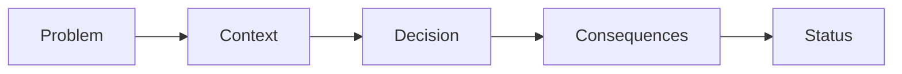

# Architecture Decision Records (ADR)

## 🎯 ADR Prozess



## 📝 ADR-001: Next.js App Router

### Status
- Datum: 2025-03-01
- Status: Accepted
- Beteiligte: Tech Lead, Frontend Team

### Context
- Migration von Pages Router zu App Router notwendig
- Performance-Optimierung erforderlich
- Bessere SEO-Unterstützung benötigt
- Server Components als neue Technologie verfügbar

### Decision
Wir haben uns für die Migration zum Next.js App Router entschieden:

```typescript
// App Router Structure
app/
  ├── (auth)/
  │   ├── login/
  │   │   └── page.tsx
  │   └── register/
  │       └── page.tsx
  ├── (dashboard)/
  │   ├── layout.tsx
  │   └── trading/
  │       ├── page.tsx
  │       └── loading.tsx
  └── layout.tsx
```

### Consequences

#### Positiv
- Verbesserte Performance durch Server Components
- Automatisches Code Splitting
- Bessere SEO durch Metadata API
- Vereinfachtes Routing und Layouts

#### Negativ
- Lernkurve für das Team
- Migration bestehender Code erforderlich
- Einige Third-Party Libraries noch nicht kompatibel

## 📝 ADR-002: Datenbank-Architektur

### Status
- Datum: 2025-03-02
- Status: Accepted
- Beteiligte: Tech Lead, Backend Team

### Decision
PostgreSQL als primäre Datenbank mit Prisma als ORM:

```typescript
// Prisma Schema
datasource db {
  provider = "postgresql"
  url      = env("DATABASE_URL")
}

model User {
  id        String   @id @default(cuid())
  email     String   @unique
  trades    Trade[]
  profile   Profile?
}

model Trade {
  id        String   @id @default(cuid())
  userId    String
  user      User     @relation(fields: [userId], references: [id])
  symbol    String
  amount    Float
  type      String
  status    String
  createdAt DateTime @default(now())
}
```

### Consequences

#### Positiv
- ACID Compliance
- Typ-Sicherheit durch Prisma
- Gute Performance für relationale Daten
- Bewährte Technologie

#### Negativ
- Vertikale Skalierung teurer als NoSQL
- Schema-Migration erforderlich
- Connection Pool Management

## 📝 ADR-003: Authentication Strategy

### Status
- Datum: 2025-03-03
- Status: Accepted
- Beteiligte: Tech Lead, Security Team

### Decision
Clerk als Authentication Provider:

```typescript
// Auth Configuration
import { authMiddleware } from "@clerk/nextjs";

export default authMiddleware({
  publicRoutes: ["/", "/api/webhook"],
  ignoredRoutes: ["/api/health"],
  debug: process.env.NODE_ENV === "development",
});

export const config = {
  matcher: ["/((?!.*\\..*|_next).*)", "/", "/(api|trpc)(.*)"],
};
```

### Consequences

#### Positiv
- Managed Authentication Service
- OAuth Integration
- MFA Support
- GDPR Compliant

#### Negativ
- Vendor Lock-in
- Zusätzliche Kosten
- Externe Abhängigkeit

## 📝 ADR-004: State Management

### Status
- Datum: 2025-03-04
- Status: Accepted
- Beteiligte: Frontend Team

### Decision
Tanstack Query für Server State, Zustand für UI State:

```typescript
// Server State
const { data, isLoading } = useQuery({
  queryKey: ['trades'],
  queryFn: fetchTrades,
});

// UI State
const useStore = create<UIState>((set) => ({
  theme: 'light',
  setTheme: (theme) => set({ theme }),
  sidebarOpen: false,
  toggleSidebar: () => set((state) => ({ 
    sidebarOpen: !state.sidebarOpen 
  })),
}));
```

### Consequences

#### Positiv
- Klare Trennung von Server/Client State
- Automatisches Caching
- Optimistic Updates
- Kleine Bundle Size

#### Negativ
- Zwei verschiedene APIs
- Lernaufwand für das Team
- Mehr Boilerplate Code

## 📝 ADR-005: API Design

### Status
- Datum: 2025-03-04
- Status: Accepted
- Beteiligte: Backend Team

### Decision
tRPC für Typ-sichere APIs:

```typescript
// API Router
export const appRouter = createTRPCRouter({
  trades: tradesRouter,
  users: usersRouter,
  analytics: analyticsRouter,
});

// Procedure Example
export const tradesRouter = createTRPCRouter({
  create: protectedProcedure
    .input(tradeSchema)
    .mutation(async ({ ctx, input }) => {
      return ctx.prisma.trade.create({
        data: input,
      });
    }),
});
```

### Consequences

#### Positiv
- End-to-end Typsicherheit
- Automatische API Dokumentation
- Reduzierter Boilerplate Code
- Bessere DX

#### Negativ
- Next.js spezifisch
- Weniger Flexibilität
- Keine OpenAPI Spezifikation

## 📝 ADR-006: Deployment Strategy

### Status
- Datum: 2025-03-04
- Status: Accepted
- Beteiligte: DevOps Team

### Decision
Vercel für Deployment und Hosting:

```typescript
// vercel.json
{
  "version": 2,
  "builds": [
    {
      "src": "package.json",
      "use": "@vercel/next"
    }
  ],
  "routes": [
    {
      "src": "/(.*)",
      "dest": "/$1"
    }
  ]
}
```

### Consequences

#### Positiv
- Zero-Config Deployment
- Automatisches CDN
- Edge Functions
- Analytics integriert

#### Negativ
- Vendor Lock-in
- Höhere Kosten
- Eingeschränkte Kontrolle

## 📝 ADR-007: Testing Strategy

### Status
- Datum: 2025-03-04
- Status: Accepted
- Beteiligte: QA Team

### Decision
Jest für Unit Tests, Playwright für E2E Tests:

```typescript
// Unit Test
describe('Trade Utils', () => {
  it('calculates profit correctly', () => {
    expect(calculateProfit({
      entry: 100,
      exit: 120,
      amount: 10
    })).toBe(200);
  });
});

// E2E Test
test('user can place trade', async ({ page }) => {
  await page.goto('/trading');
  await page.fill('[name="amount"]', '100');
  await page.click('button[type="submit"]');
  await expect(page.locator('.success')).toBeVisible();
});
```

### Consequences

#### Positiv
- Umfassende Test Coverage
- Parallele Testausführung
- Gute DX
- CI Integration

#### Negativ
- Komplexe Setup
- Langsame E2E Tests
- Maintenance Aufwand