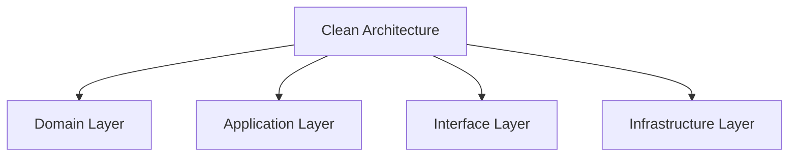

# Architecture Patterns

## 🏗️ Pattern-Übersicht



## 🎯 Clean Architecture

### 1. Domain Layer

```typescript
// Domain Entities
interface Trade {
  id: string;
  symbol: string;
  type: 'buy' | 'sell';
  amount: number;
  price: number;
  status: TradeStatus;
  timestamp: Date;
}

// Domain Value Objects
class Money {
  constructor(
    private amount: number,
    private currency: string
  ) {}

  add(other: Money): Money {
    if (this.currency !== other.currency) {
      throw new Error('Currency mismatch');
    }
    return new Money(
      this.amount + other.amount,
      this.currency
    );
  }
}

// Domain Services
interface TradingService {
  executeTrade(trade: Trade): Promise<Trade>;
  calculatePosition(trades: Trade[]): Position;
  validateTrade(trade: Trade): boolean;
}
```

### 2. Application Layer

```typescript
// Use Cases
class ExecuteTradeUseCase {
  constructor(
    private tradingService: TradingService,
    private tradingRepository: TradingRepository
  ) {}

  async execute(command: ExecuteTradeCommand): Promise<Trade> {
    // 1. Validate Command
    this.validateCommand(command);

    // 2. Create Trade
    const trade = this.createTrade(command);

    // 3. Execute Trade
    const executedTrade = await this.tradingService
      .executeTrade(trade);

    // 4. Save Trade
    await this.tradingRepository.save(executedTrade);

    // 5. Return Result
    return executedTrade;
  }
}

// Application Services
class TradingApplicationService {
  constructor(
    private executeTradeUseCase: ExecuteTradeUseCase,
    private calculatePositionUseCase: CalculatePositionUseCase
  ) {}

  async placeTrade(command: PlaceTradeCommand): Promise<Trade> {
    return this.executeTradeUseCase.execute(command);
  }

  async getPosition(userId: string): Promise<Position> {
    return this.calculatePositionUseCase.execute(userId);
  }
}
```

## 🔄 Repository Pattern

### 1. Repository Interfaces

```typescript
// Repository Interface
interface TradingRepository {
  save(trade: Trade): Promise<Trade>;
  findById(id: string): Promise<Trade>;
  findByUser(userId: string): Promise<Trade[]>;
  update(trade: Trade): Promise<Trade>;
}

// Implementation
class PostgresTradingRepository implements TradingRepository {
  constructor(private prisma: PrismaClient) {}

  async save(trade: Trade): Promise<Trade> {
    return this.prisma.trade.create({
      data: {
        id: trade.id,
        symbol: trade.symbol,
        type: trade.type,
        amount: trade.amount,
        price: trade.price,
        status: trade.status,
        timestamp: trade.timestamp
      }
    });
  }
}
```

### 2. Unit of Work

```typescript
// Unit of Work Pattern
class UnitOfWork {
  constructor(
    private tradingRepository: TradingRepository,
    private userRepository: UserRepository
  ) {}

  async withTransaction<T>(
    work: () => Promise<T>
  ): Promise<T> {
    try {
      await this.beginTransaction();
      const result = await work();
      await this.commitTransaction();
      return result;
    } catch (error) {
      await this.rollbackTransaction();
      throw error;
    }
  }
}
```

## 🎨 Factory Pattern

### 1. Entity Factories

```typescript
// Trade Factory
class TradeFactory {
  static create(command: CreateTradeCommand): Trade {
    return {
      id: generateId(),
      symbol: command.symbol,
      type: command.type,
      amount: command.amount,
      price: command.price,
      status: 'pending',
      timestamp: new Date()
    };
  }
}

// Repository Factory
class RepositoryFactory {
  static create(type: 'postgres' | 'mongodb'): TradingRepository {
    switch (type) {
      case 'postgres':
        return new PostgresTradingRepository();
      case 'mongodb':
        return new MongoTradingRepository();
      default:
        throw new Error('Unknown repository type');
    }
  }
}
```

## 🔄 CQRS Pattern

### 1. Commands

```typescript
// Command Handlers
class PlaceTradeCommandHandler {
  constructor(private tradingService: TradingService) {}

  async handle(command: PlaceTradeCommand): Promise<void> {
    // 1. Validate Command
    this.validateCommand(command);

    // 2. Execute Trade
    await this.tradingService.executeTrade(
      TradeFactory.create(command)
    );
  }
}

// Command Bus
class CommandBus {
  private handlers = new Map<string, CommandHandler>();

  register(
    commandType: string,
    handler: CommandHandler
  ): void {
    this.handlers.set(commandType, handler);
  }

  async dispatch(command: Command): Promise<void> {
    const handler = this.handlers.get(command.type);
    if (!handler) {
      throw new Error(`No handler for ${command.type}`);
    }
    await handler.handle(command);
  }
}
```

### 2. Queries

```typescript
// Query Handlers
class GetTradesQueryHandler {
  constructor(private tradingRepository: TradingRepository) {}

  async handle(query: GetTradesQuery): Promise<Trade[]> {
    return this.tradingRepository.findByUser(query.userId);
  }
}

// Query Bus
class QueryBus {
  private handlers = new Map<string, QueryHandler>();

  register(
    queryType: string,
    handler: QueryHandler
  ): void {
    this.handlers.set(queryType, handler);
  }

  async dispatch<T>(query: Query): Promise<T> {
    const handler = this.handlers.get(query.type);
    if (!handler) {
      throw new Error(`No handler for ${query.type}`);
    }
    return handler.handle(query);
  }
}
```

## 🛡️ Decorator Pattern

### 1. Service Decorators

```typescript
// Logging Decorator
class LoggingTradingService implements TradingService {
  constructor(
    private service: TradingService,
    private logger: Logger
  ) {}

  async executeTrade(trade: Trade): Promise<Trade> {
    this.logger.log('Executing trade', trade);
    const result = await this.service.executeTrade(trade);
    this.logger.log('Trade executed', result);
    return result;
  }
}

// Caching Decorator
class CachingTradingService implements TradingService {
  constructor(
    private service: TradingService,
    private cache: Cache
  ) {}

  async executeTrade(trade: Trade): Promise<Trade> {
    const cached = await this.cache.get(trade.id);
    if (cached) return cached;

    const result = await this.service.executeTrade(trade);
    await this.cache.set(trade.id, result);
    return result;
  }
}
```

## 🔄 Event Sourcing

### 1. Events

```typescript
// Domain Events
interface TradeEvent {
  type: string;
  tradeId: string;
  timestamp: Date;
  data: any;
}

// Event Store
interface EventStore {
  save(event: TradeEvent): Promise<void>;
  getEvents(tradeId: string): Promise<TradeEvent[]>;
}

// Event Sourced Entity
class TradeAggregate {
  private state: Trade;

  constructor(private events: TradeEvent[]) {
    this.state = this.replay(events);
  }

  private replay(events: TradeEvent[]): Trade {
    return events.reduce(
      (state, event) => this.apply(state, event),
      {} as Trade
    );
  }
}