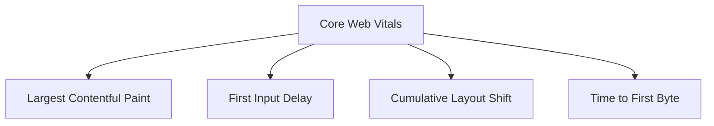

# Performance Benchmarks

## 📊 Performance-Übersicht



## 🎯 Core Web Vitals

### 1. Messwerte & Ziele

```typescript
const webVitalsTargets = {
  // Largest Contentful Paint
  lcp: {
    target: 2500,      // ms
    acceptable: 4000,  // ms
    current: {
      p75: 2300,      // 75th percentile
      p90: 3100,      // 90th percentile
      p95: 3800       // 95th percentile
    }
  },

  // First Input Delay
  fid: {
    target: 100,      // ms
    acceptable: 300,  // ms
    current: {
      p75: 80,
      p90: 150,
      p95: 200
    }
  },

  // Cumulative Layout Shift
  cls: {
    target: 0.1,
    acceptable: 0.25,
    current: {
      p75: 0.08,
      p90: 0.15,
      p95: 0.22
    }
  }
};
```

## 🚀 API Performance

### 1. Latenz-Ziele

```typescript
const apiTargets = {
  // Response Times
  responseTime: {
    p50: 100,   // ms (50th percentile)
    p90: 250,   // ms (90th percentile)
    p99: 500    // ms (99th percentile)
  },

  // Endpoints
  endpoints: {
    '/api/market/quotes': {
      target: 50,    // ms
      timeout: 500   // ms
    },
    '/api/trading/order': {
      target: 200,   // ms
      timeout: 1000  // ms
    },
    '/api/analytics': {
      target: 500,   // ms
      timeout: 2000  // ms
    }
  }
};
```

### 2. Durchsatz

```typescript
const throughputTargets = {
  // Requests per Second
  rps: {
    sustained: 1000,
    peak: 2000,
    limit: 3000
  },

  // Concurrent Users
  concurrentUsers: {
    sustained: 5000,
    peak: 10000,
    limit: 15000
  }
};
```

## 💾 Database Performance

### 1. Query Performance

```typescript
const queryTargets = {
  // Query Times
  queryTime: {
    simple: 10,    // ms
    complex: 100,  // ms
    report: 1000   // ms
  },

  // Common Queries
  queries: {
    'getUserProfile': {
      target: 20,    // ms
      indexes: ['userId'],
      optimization: 'cached'
    },
    'getTradeHistory': {
      target: 50,    // ms
      indexes: ['userId', 'timestamp'],
      optimization: 'paginated'
    },
    'generateReport': {
      target: 500,   // ms
      indexes: ['date', 'type'],
      optimization: 'materialized view'
    }
  }
};
```

### 2. Connection Pool

```typescript
const connectionPooling = {
  // Pool Configuration
  pool: {
    min: 5,
    max: 20,
    idleTimeout: 10000,   // ms
    acquireTimeout: 1000  // ms
  },

  // Metrics
  metrics: {
    waitTime: {
      target: 5,     // ms
      critical: 100  // ms
    },
    utilization: {
      target: 70,    // %
      critical: 90   // %
    }
  }
};
```

## 🔄 Cache Performance

### 1. Hit Rates

```typescript
const cacheTargets = {
  // Cache Hit Rates
  hitRate: {
    browser: 90,  // %
    cdn: 85,      // %
    redis: 95     // %
  },

  // TTL Configuration
  ttl: {
    browserCache: {
      static: '1y',
      api: '5m'
    },
    cdnCache: {
      static: '1y',
      api: '1m'
    },
    redisCache: {
      session: '24h',
      marketData: '1m'
    }
  }
};
```

### 2. Redis Metrics

```typescript
const redisMetrics = {
  // Performance Metrics
  performance: {
    latency: {
      target: 1,     // ms
      critical: 10   // ms
    },
    memory: {
      usage: 70,     // %
      fragmentation: 1.5
    }
  },

  // Monitoring
  monitoring: {
    commands: ['GET', 'SET', 'DEL'],
    metrics: ['hits', 'misses', 'latency'],
    alerts: {
      latencyThreshold: 10,   // ms
      memoryThreshold: 80,    // %
      hitRateThreshold: 80    // %
    }
  }
};
```

## 📱 Client Performance

### 1. Bundle Size

```typescript
const bundleTargets = {
  // JavaScript Bundles
  javascript: {
    initial: 100,    // KB
    async: 50,       // KB per chunk
    total: 500      // KB
  },

  // CSS Bundles
  css: {
    initial: 50,     // KB
    total: 100      // KB
  },

  // Image Optimization
  images: {
    hero: 200,       // KB
    thumbnail: 20,   // KB
    icon: 5         // KB
  }
};
```

### 2. Rendering Metrics

```typescript
const renderingMetrics = {
  // Server-Side Rendering
  ssr: {
    timeToFirstByte: 100,  // ms
    timeToInteractive: 1000,  // ms
    rehydration: 100        // ms
  },

  // Client-Side Rendering
  csr: {
    firstPaint: 1000,      // ms
    firstContentful: 1500, // ms
    fullyLoaded: 2000     // ms
  }
};
```

## 📊 Load Testing Results

### 1. Baseline Performance

```typescript
const baselineResults = {
  // API Performance
  api: {
    responseTime: 95,    // ms (p95)
    throughput: 1200,    // rps
    errorRate: 0.01      // %
  },

  // Database Performance
  database: {
    queryTime: 45,       // ms (p95)
    connections: 15,     // average
    deadlocks: 0        // per hour
  },

  // Cache Performance
  cache: {
    hitRate: 92,        // %
    latency: 0.8,       // ms
    evictions: 100      // per hour
  }
};
```

### 2. Load Test Scenarios

```typescript
const loadTests = {
  // Normal Load
  normal: {
    users: 1000,
    rampUp: '1m',
    duration: '30m',
    targetRps: 500
  },

  // Peak Load
  peak: {
    users: 5000,
    rampUp: '5m',
    duration: '15m',
    targetRps: 2000
  },

  // Stress Test
  stress: {
    users: 10000,
    rampUp: '10m',
    duration: '30m',
    targetRps: 3000
  }
};