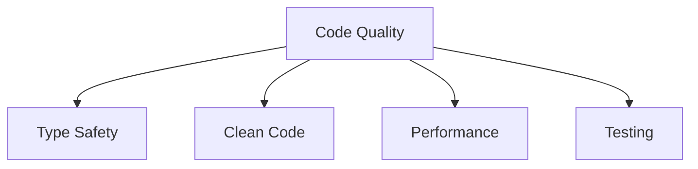

# Development Best Practices

## 🎯 Best Practice Übersicht



## 🔒 Type Safety

### 1. TypeScript Best Practices

```typescript
// ✅ Gut: Präzise Typen
interface User {
  id: string;
  email: string;
  name: string | null;
  preferences: UserPreferences;
}

// ❌ Schlecht: Vermeiden von 'any'
interface BadUser {
  id: any;
  data: any;
}

// ✅ Gut: Generics für Wiederverwendbarkeit
function fetchData<T>(url: string): Promise<T> {
  return fetch(url).then(res => res.json());
}

// ✅ Gut: Discriminated Unions
type Result<T> = 
  | { status: 'success'; data: T }
  | { status: 'error'; error: Error };
```

### 2. Type Guards

```typescript
// Type Guards für Runtime Safety
function isUser(value: unknown): value is User {
  return (
    typeof value === 'object' &&
    value !== null &&
    'id' in value &&
    'email' in value &&
    typeof (value as User).id === 'string' &&
    typeof (value as User).email === 'string'
  );
}

// Verwendung
function processUser(input: unknown) {
  if (isUser(input)) {
    // TypeScript weiß, dass input ein User ist
    console.log(input.email);
  }
}
```

## 📝 Clean Code

### 1. Naming Conventions

```typescript
// ✅ Gut: Beschreibende Namen
const calculateTotalPrice = (items: CartItem[]): number => {
  return items.reduce(
    (total, item) => total + item.price * item.quantity,
    0
  );
};

// ❌ Schlecht: Unklare Namen
const calc = (i: any[]): number => {
  return i.reduce((t, item) => t + item.p * item.q, 0);
};

// ✅ Gut: Konsistente Benennungen
interface FetchUserOptions {
  includeOrders: boolean;
  includePosts: boolean;
}

// ✅ Gut: Boolean Namen als Fragen
const isUserActive = true;
const hasPermission = false;
```

### 2. Function Design

```typescript
// ✅ Gut: Single Responsibility
class UserService {
  async createUser(userData: CreateUserDTO): Promise<User> {
    // Validierung
    this.validateUserData(userData);
    
    // Datenbank Operation
    const user = await this.usersRepository.create(userData);
    
    // Event Emission
    this.eventEmitter.emit('user.created', user);
    
    return user;
  }
  
  private validateUserData(data: CreateUserDTO): void {
    // Separate Validierungslogik
  }
}

// ✅ Gut: Pure Functions
function calculateDiscount(
  price: number,
  discountPercent: number
): number {
  return price * (1 - discountPercent / 100);
}
```

## 🚀 Performance

### 1. React Performance

```typescript
// ✅ Gut: Memoization
const MemoizedComponent = React.memo(({ data }) => {
  return <div>{data.map(renderItem)}</div>;
});

// ✅ Gut: useMemo für teure Berechnungen
function ExpensiveComponent({ data }) {
  const processedData = useMemo(
    () => expensiveCalculation(data),
    [data]
  );
  
  return <div>{processedData}</div>;
}

// ✅ Gut: useCallback für Event Handler
function ParentComponent() {
  const handleClick = useCallback(() => {
    console.log('clicked');
  }, []);
  
  return <ChildComponent onClick={handleClick} />;
}
```

### 2. State Management

```typescript
// ✅ Gut: Zustand für globalen State
const useStore = create<Store>((set) => ({
  count: 0,
  increment: () => set((state) => ({ 
    count: state.count + 1 
  })),
  decrement: () => set((state) => ({ 
    count: state.count - 1 
  }))
}));

// ✅ Gut: Context für Theme/Auth
const ThemeContext = createContext<Theme>(defaultTheme);

function ThemeProvider({ children }) {
  const [theme, setTheme] = useState(defaultTheme);
  
  return (
    <ThemeContext.Provider value={{ theme, setTheme }}>
      {children}
    </ThemeContext.Provider>
  );
}
```

## 🧪 Testing

### 1. Test Structure

```typescript
// ✅ Gut: Beschreibende Test Blöcke
describe('UserService', () => {
  describe('createUser', () => {
    it('creates a new user with valid data', async () => {
      const userData = createTestUser();
      const result = await userService.createUser(userData);
      expect(result).toMatchObject(userData);
    });

    it('throws error with invalid data', async () => {
      const invalidData = {};
      await expect(
        userService.createUser(invalidData)
      ).rejects.toThrow();
    });
  });
});

// ✅ Gut: Test Utilities
const createTestUser = () => ({
  email: 'test@example.com',
  name: 'Test User'
});
```

### 2. Test Coverage

```typescript
// ✅ Gut: Edge Cases testen
describe('calculateDiscount', () => {
  it('handles zero price', () => {
    expect(calculateDiscount(0, 10)).toBe(0);
  });
  
  it('handles 100% discount', () => {
    expect(calculateDiscount(100, 100)).toBe(0);
  });
  
  it('handles negative price', () => {
    expect(() => 
      calculateDiscount(-100, 10)
    ).toThrow();
  });
});
```

## 🔄 Error Handling

### 1. Custom Errors

```typescript
// ✅ Gut: Custom Error Klassen
class ValidationError extends Error {
  constructor(
    message: string,
    public field?: string
  ) {
    super(message);
    this.name = 'ValidationError';
  }
}

class NotFoundError extends Error {
  constructor(resource: string, id: string) {
    super(`${resource} with id ${id} not found`);
    this.name = 'NotFoundError';
  }
}
```

### 2. Error Boundaries

```typescript
// ✅ Gut: Error Boundaries für UI
class ErrorBoundary extends React.Component {
  state = { hasError: false };

  static getDerivedStateFromError() {
    return { hasError: true };
  }

  componentDidCatch(error: Error) {
    // Log to error service
    errorService.log(error);
  }

  render() {
    if (this.state.hasError) {
      return <ErrorFallback />;
    }

    return this.props.children;
  }
}
```

## 📝 Code Organization

### 1. File Structure

```typescript
// ✅ Gut: Feature-basierte Organisation
src/
  features/
    users/
      components/
      hooks/
      services/
      types/
      utils/
    orders/
      components/
      hooks/
      services/
      types/
      utils/
```

### 2. Import Organization

```typescript
// ✅ Gut: Import Gruppierung
// 1. React und Next.js
import { useState, useEffect } from 'react';
import { useRouter } from 'next/router';

// 2. Third Party
import { motion } from 'framer-motion';
import { toast } from 'react-hot-toast';

// 3. Internal Modules
import { useAuth } from '@/hooks/useAuth';
import { Button } from '@/components/ui/button';

// 4. Types
import type { User } from '@/types';

// 5. Styles
import styles from './Component.module.css';