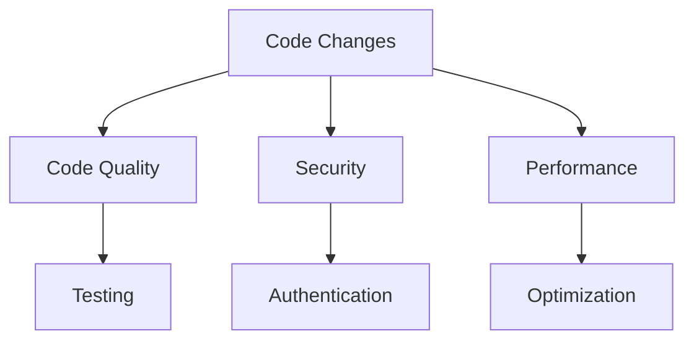

# Code Review Guidelines

## 🎯 Review-Übersicht



## 📋 Review Checklist

### 1. Code Quality

```typescript
const codeQualityChecks = {
  // Allgemeine Checks
  general: [
    'Coding Standards eingehalten',
    'Keine Code-Duplikation',
    'Klare Benennungen',
    'Konsistenter Stil'
  ],
  
  // TypeScript Spezifisch
  typescript: {
    types: [
      'Korrekte Typen verwendet',
      'Keine any Types',
      'Interface statt Type wo sinnvoll',
      'Generics richtig eingesetzt'
    ],
    patterns: [
      'Immutability beachtet',
      'Null Checks vorhanden',
      'Error Handling implementiert'
    ]
  }
};
```

### 2. Architektur & Design

```typescript
interface ArchitectureChecks {
  // Pattern Checks
  patterns: {
    solid: [
      'Single Responsibility Principle',
      'Open/Closed Principle',
      'Interface Segregation',
      'Dependency Inversion'
    ],
    react: [
      'Komponenten-Struktur',
      'Props Interface',
      'State Management',
      'Side Effects'
    ]
  };
  
  // Code Organization
  organization: {
    structure: 'Logische Datei-Organisation',
    modularity: 'Wiederverwendbare Module',
    dependencies: 'Sinnvolle Abhängigkeiten'
  };
}
```

## 🔍 Review Process

### 1. Pre-Review

```typescript
const preReviewChecks = {
  // Automated Checks
  automated: {
    lint: 'npm run lint',
    types: 'npm run typecheck',
    tests: 'npm run test',
    format: 'npm run format:check'
  },
  
  // Manual Checks
  manual: {
    scope: 'Änderungsumfang prüfen',
    context: 'Kontext verstehen',
    requirements: 'Anforderungen prüfen'
  }
};
```

### 2. Review-Prozess

```typescript
const reviewProcess = {
  // Review Steps
  steps: [
    {
      name: 'First Pass',
      focus: [
        'Gesamtüberblick',
        'Architektur-Entscheidungen',
        'Breaking Changes'
      ]
    },
    {
      name: 'Detailed Review',
      focus: [
        'Code-Qualität',
        'Implementierungsdetails',
        'Edge Cases'
      ]
    },
    {
      name: 'Final Check',
      focus: [
        'Tests vollständig',
        'Dokumentation aktuell',
        'CI/CD erfolgreich'
      ]
    }
  ]
};
```

## 🧪 Testing Review

### 1. Test Coverage

```typescript
const testingChecks = {
  // Coverage Requirements
  coverage: {
    statements: '> 80%',
    branches: '> 75%',
    functions: '> 85%',
    lines: '> 80%'
  },
  
  // Test Types
  types: {
    unit: [
      'Einzelkomponenten getestet',
      'Mocks korrekt verwendet',
      'Edge Cases abgedeckt'
    ],
    integration: [
      'Komponenten-Interaktion',
      'API-Integration',
      'Datenfluss'
    ],
    e2e: [
      'Critical Paths',
      'User Flows',
      'Error Scenarios'
    ]
  }
};
```

### 2. Test Qualität

```typescript
const testQuality = {
  // Test Structure
  structure: [
    'Arrange-Act-Assert Pattern',
    'Beschreibende Test-Namen',
    'Sinnvolle Gruppierung'
  ],
  
  // Test Implementation
  implementation: {
    mocking: 'Sinnvolle Mock-Strategie',
    fixtures: 'Realistische Test-Daten',
    assertions: 'Präzise Assertions'
  }
};
```

## 🔒 Security Review

### 1. Security Checks

```typescript
const securityChecks = {
  // Common Vulnerabilities
  vulnerabilities: [
    'XSS Prevention',
    'SQL Injection',
    'CSRF Protection',
    'Authentication Checks'
  ],
  
  // Data Security
  data: {
    validation: 'Input Validation',
    sanitization: 'Output Sanitization',
    encryption: 'Sensitive Data Encryption'
  }
};
```

### 2. Authorization

```typescript
const authChecks = {
  // Access Control
  access: [
    'Permission Checks',
    'Role Validation',
    'Resource Access'
  ],
  
  // Authentication
  auth: {
    session: 'Session Management',
    tokens: 'Token Handling',
    mfa: 'MFA Implementation'
  }
};
```

## 📈 Performance Review

### 1. Frontend Performance

```typescript
const frontendChecks = {
  // Loading Performance
  loading: [
    'Code Splitting',
    'Lazy Loading',
    'Asset Optimization'
  ],
  
  // Runtime Performance
  runtime: {
    rendering: 'Render Optimization',
    memory: 'Memory Management',
    animations: 'Animation Performance'
  }
};
```

### 2. Backend Performance

```typescript
const backendChecks = {
  // Database
  database: [
    'Query Optimization',
    'Index Usage',
    'Connection Management'
  ],
  
  // API
  api: {
    caching: 'Cache Strategy',
    batching: 'Request Batching',
    pagination: 'Data Pagination'
  }
};
```

## 🤝 Review Etiquette

### 1. Kommunikation

```typescript
const reviewCommunication = {
  // Feedback Style
  feedback: {
    tone: 'Konstruktiv und respektvoll',
    focus: 'Auf Code, nicht Person',
    clarity: 'Klar und spezifisch'
  },
  
  // Review Comments
  comments: {
    structure: [
      'Problem beschreiben',
      'Begründung geben',
      'Lösung vorschlagen'
    ],
    examples: [
      'Code-Beispiele anbieten',
      'Dokumentation verlinken',
      'Best Practices zeigen'
    ]
  }
};
```

### 2. Zusammenarbeit

```typescript
const collaboration = {
  // Review Process
  process: {
    timing: 'Zeitnahe Reviews',
    iteration: 'Konstruktiver Dialog',
    resolution: 'Gemeinsame Lösungsfindung'
  },
  
  // Learning
  learning: {
    sharing: 'Wissen teilen',
    mentoring: 'Junior Dev unterstützen',
    growth: 'Team-Entwicklung fördern'
  }
};