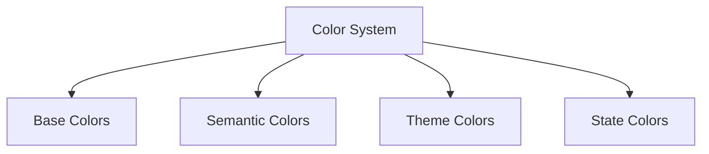

# Color System

## 🎨 Farb-Übersicht



## 🌈 Base Colors

### 1. Primary Colors

```typescript
// Primary Color Scale
const primary = {
  50: '#f0f9ff',
  100: '#e0f2fe',
  200: '#bae6fd',
  300: '#7dd3fc',
  400: '#38bdf8',
  500: '#0ea5e9',
  600: '#0284c7',
  700: '#0369a1',
  800: '#075985',
  900: '#0c4a6e',
  950: '#082f49'
};

// Primary Color Usage
const primaryColors = {
  // Base
  default: primary[600],
  light: primary[400],
  dark: primary[800],
  
  // Interactive
  hover: primary[700],
  active: primary[800],
  focus: primary[500]
};
```

### 2. Neutral Colors

```typescript
// Gray Scale
const gray = {
  50: '#f8fafc',
  100: '#f1f5f9',
  200: '#e2e8f0',
  300: '#cbd5e1',
  400: '#94a3b8',
  500: '#64748b',
  600: '#475569',
  700: '#334155',
  800: '#1e293b',
  900: '#0f172a',
  950: '#020617'
};

// Neutral Color Usage
const neutralColors = {
  // Text
  textPrimary: gray[900],
  textSecondary: gray[600],
  textTertiary: gray[400],
  
  // Background
  background: gray[50],
  surface: 'white',
  divider: gray[200]
};
```

## 🎯 Semantic Colors

### 1. Status Colors

```typescript
// Status Color Scale
const status = {
  // Success Colors
  success: {
    light: '#86efac',  // Green 300
    base: '#22c55e',   // Green 500
    dark: '#15803d'    // Green 700
  },
  
  // Error Colors
  error: {
    light: '#fca5a5',  // Red 300
    base: '#ef4444',   // Red 500
    dark: '#b91c1c'    // Red 700
  },
  
  // Warning Colors
  warning: {
    light: '#fcd34d',  // Yellow 300
    base: '#f59e0b',   // Yellow 500
    dark: '#b45309'    // Yellow 700
  },
  
  // Info Colors
  info: {
    light: '#93c5fd',  // Blue 300
    base: '#3b82f6',   // Blue 500
    dark: '#1d4ed8'    // Blue 700
  }
};

// Status Color Usage
const statusColors = {
  // Success States
  success: {
    background: status.success.light,
    text: status.success.dark,
    border: status.success.base
  },
  
  // Error States
  error: {
    background: status.error.light,
    text: status.error.dark,
    border: status.error.base
  }
};
```

### 2. Data Visualization

```typescript
// Chart Colors
const chartColors = {
  // Sequential Scale
  sequential: [
    primary[700],
    primary[600],
    primary[500],
    primary[400],
    primary[300]
  ],
  
  // Categorical Scale
  categorical: [
    '#0ea5e9',  // Blue
    '#f59e0b',  // Yellow
    '#10b981',  // Green
    '#8b5cf6',  // Purple
    '#f43f5e'   // Pink
  ],
  
  // Divergent Scale
  divergent: [
    '#ef4444',  // Red
    '#f97316',  // Orange
    '#eab308',  // Yellow
    '#84cc16',  // Green
    '#22c55e'   // Emerald
  ]
};
```

## 🌙 Theme System

### 1. Theme Configuration

```typescript
// Theme Definition
interface ColorTheme {
  background: {
    primary: string;
    secondary: string;
    tertiary: string;
  };
  text: {
    primary: string;
    secondary: string;
    tertiary: string;
  };
  border: {
    default: string;
    focus: string;
  };
}

// Theme Variants
const themes = {
  // Light Theme
  light: {
    background: {
      primary: gray[50],
      secondary: 'white',
      tertiary: gray[100]
    },
    text: {
      primary: gray[900],
      secondary: gray[600],
      tertiary: gray[400]
    },
    border: {
      default: gray[200],
      focus: primary[500]
    }
  },
  
  // Dark Theme
  dark: {
    background: {
      primary: gray[900],
      secondary: gray[800],
      tertiary: gray[700]
    },
    text: {
      primary: gray[50],
      secondary: gray[300],
      tertiary: gray[400]
    },
    border: {
      default: gray[700],
      focus: primary[400]
    }
  }
};
```

### 2. Theme Usage

```typescript
// Theme Hook
const useTheme = () => {
  const [theme, setTheme] = useState<'light' | 'dark'>('light');
  
  // System Theme Detection
  useEffect(() => {
    const mediaQuery = window.matchMedia('(prefers-color-scheme: dark)');
    const handleChange = (e: MediaQueryListEvent) => {
      setTheme(e.matches ? 'dark' : 'light');
    };
    
    mediaQuery.addEventListener('change', handleChange);
    return () => mediaQuery.removeEventListener('change', handleChange);
  }, []);
  
  return { theme, setTheme };
};

// Theme Provider
const ThemeProvider = ({ children }) => {
  const { theme } = useTheme();
  
  return (
    <div data-theme={theme}>
      {children}
    </div>
  );
};
```

## 🎨 Color Utils

### 1. Color Functions

```typescript
// Color Manipulation
const colorUtils = {
  // Lighten Color
  lighten: (color: string, amount: number) => {
    return Color(color).lighten(amount).toString();
  },
  
  // Darken Color
  darken: (color: string, amount: number) => {
    return Color(color).darken(amount).toString();
  },
  
  // Alpha Transparency
  alpha: (color: string, amount: number) => {
    return Color(color).alpha(amount).toString();
  },
  
  // Mix Colors
  mix: (color1: string, color2: string, weight = 0.5) => {
    return Color(color1).mix(Color(color2), weight).toString();
  }
};
```

### 2. Accessibility Utils

```typescript
// Color Contrast
const contrastUtils = {
  // Check Contrast Ratio
  getContrastRatio: (fg: string, bg: string) => {
    return Color(fg).contrast(Color(bg));
  },
  
  // Get Readable Color
  getReadableColor: (bg: string) => {
    const contrast = Color(bg).contrast('white');
    return contrast > 4.5 ? 'white' : 'black';
  },
  
  // WCAG Guidelines
  isWCAGAA: (fg: string, bg: string) => {
    const ratio = Color(fg).contrast(Color(bg));
    return ratio >= 4.5;
  },
  
  isWCAGAAA: (fg: string, bg: string) => {
    const ratio = Color(fg).contrast(Color(bg));
    return ratio >= 7;
  }
};