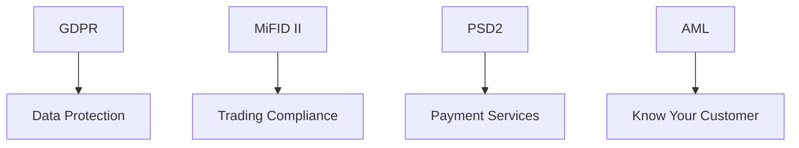

# Compliance Documentation

## 🎯 Compliance Framework



## 🔒 GDPR Compliance

### 1. Data Protection

```typescript
interface PersonalData {
  type: 'personal' | 'sensitive' | 'financial';
  retention: number;  // in days
  encryption: boolean;
  access: string[];
  purpose: string[];
}

const dataProtection = {
  // Data Categories
  categories: {
    userProfile: {
      type: 'personal',
      retention: 365 * 2,  // 2 years
      encryption: true,
      access: ['user-service', 'auth-service'],
      purpose: ['account-management', 'communication']
    },
    tradingData: {
      type: 'financial',
      retention: 365 * 7,  // 7 years (regulatory)
      encryption: true,
      access: ['trading-service', 'audit-service'],
      purpose: ['trading', 'reporting', 'audit']
    }
  },

  // Data Subject Rights
  subjectRights: {
    async handleRequest(
      type: 'access' | 'deletion' | 'portability',
      userId: string
    ) {
      switch (type) {
        case 'access':
          return await generateDataReport(userId);
        case 'deletion':
          return await handleDeletion(userId);
        case 'portability':
          return await exportUserData(userId);
      }
    }
  }
};
```

### 2. Consent Management

```typescript
const consentManagement = {
  // Consent Types
  consentTypes: {
    marketing: {
      description: 'Marketing Communications',
      required: false,
      defaultValue: false
    },
    dataProcessing: {
      description: 'Essential Data Processing',
      required: true,
      defaultValue: true
    },
    thirdParty: {
      description: 'Third Party Data Sharing',
      required: false,
      defaultValue: false
    }
  },

  // Consent Tracking
  async trackConsent(userId: string, type: string, value: boolean) {
    await prisma.consent.create({
      data: {
        userId,
        type,
        value,
        timestamp: new Date(),
        ipAddress: request.ip,
        userAgent: request.headers['user-agent']
      }
    });
  }
};
```

## 📈 MiFID II Compliance

### 1. Trading Reports

```typescript
const tradingReports = {
  // Transaction Reporting
  async generateTransactionReport(trade: Trade) {
    return {
      transactionId: trade.id,
      timestamp: trade.timestamp,
      instrument: {
        isin: trade.instrument.isin,
        name: trade.instrument.name,
        type: trade.instrument.type
      },
      execution: {
        price: trade.price,
        quantity: trade.quantity,
        venue: trade.venue
      },
      client: {
        id: trade.clientId,
        category: trade.clientCategory,
        nationality: trade.clientNationality
      }
    };
  },

  // Best Execution
  async documentBestExecution(order: Order) {
    return {
      orderId: order.id,
      marketData: await getMarketData(order.timestamp),
      venues: await getVenuePrices(order.instrument),
      executionFactors: {
        price: order.price,
        costs: order.costs,
        speed: order.executionSpeed,
        likelihood: order.executionLikelihood
      }
    };
  }
};
```

### 2. Client Categorization

```typescript
const clientCategorization = {
  categories: {
    retail: {
      criteria: {
        tradingFrequency: 'low',
        portfolioSize: '< 500,000€',
        experience: '< 2 years'
      },
      protections: ['full'],
      limits: {
        leverage: 1:30,
        maxExposure: 100000
      }
    },
    professional: {
      criteria: {
        tradingFrequency: 'high',
        portfolioSize: '≥ 500,000€',
        experience: '≥ 2 years'
      },
      protections: ['limited'],
      limits: {
        leverage: 1:100,
        maxExposure: 1000000
      }
    }
  }
};
```

## 💳 PSD2 Compliance

### 1. Strong Customer Authentication

```typescript
const sca = {
  // Authentication Methods
  methods: {
    inherence: ['fingerprint', 'faceId'],
    knowledge: ['password', 'pin'],
    possession: ['sms', 'authenticator']
  },

  // Transaction Validation
  async validateTransaction(transaction: Transaction) {
    const riskScore = await calculateRiskScore(transaction);
    
    if (riskScore > 0.7) {
      return {
        requireSCA: true,
        methods: ['sms', 'authenticator']
      };
    }
    
    return {
      requireSCA: false,
      reason: 'low-risk-transaction'
    };
  }
};
```

### 2. API Access

```typescript
const psd2Api = {
  // Account Information Service
  async getAccountInfo(userId: string) {
    const consent = await checkConsent(userId, 'account-info');
    
    if (!consent.valid) {
      throw new Error('No valid consent');
    }
    
    return {
      accounts: await getAccounts(userId),
      balances: await getBalances(userId),
      transactions: await getTransactions(userId)
    };
  },

  // Payment Initiation Service
  async initiatePayment(payment: Payment) {
    const sca = await validateSCA(payment);
    
    if (sca.required) {
      return await requestSCA(payment);
    }
    
    return await processPayment(payment);
  }
};
```

## 🔍 KYC/AML Compliance

### 1. Customer Due Diligence

```typescript
const kyc = {
  // Verification Levels
  levels: {
    basic: {
      requirements: ['email', 'phone'],
      limits: {
        deposit: 1000,
        withdrawal: 1000
      }
    },
    verified: {
      requirements: ['id', 'address', 'selfie'],
      limits: {
        deposit: 10000,
        withdrawal: 10000
      }
    },
    enhanced: {
      requirements: ['income_proof', 'source_of_funds'],
      limits: {
        deposit: null,
        withdrawal: null
      }
    }
  },

  // Verification Process
  async verifyCustomer(userId: string, level: string) {
    const requirements = this.levels[level].requirements;
    const documents = await getCustomerDocuments(userId);
    
    return {
      verified: checkRequirements(requirements, documents),
      missing: getMissingDocuments(requirements, documents)
    };
  }
};
```

### 2. Transaction Monitoring

```typescript
const aml = {
  // Risk Scoring
  async calculateRiskScore(transaction: Transaction) {
    const factors = {
      amount: weightAmount(transaction.amount),
      frequency: weightFrequency(transaction.userId),
      country: weightCountry(transaction.country),
      pattern: weightPattern(transaction)
    };
    
    return calculateScore(factors);
  },

  // Suspicious Activity Reporting
  async reportSuspiciousActivity(activity: Activity) {
    await createSARReport(activity);
    await notifyComplianceTeam(activity);
    await restrictAccount(activity.userId);
    
    return {
      reportId: generateReportId(),
      timestamp: new Date(),
      status: 'submitted'
    };
  }
};
```

## 📝 Compliance Reporting

### 1. Regular Reports

```typescript
const complianceReporting = {
  // Daily Reports
  async generateDailyReport() {
    return {
      transactions: await getTransactionReport(),
      kyc: await getKYCReport(),
      aml: await getAMLReport(),
      incidents: await getIncidentReport()
    };
  },

  // Monthly Reports
  async generateMonthlyReport() {
    return {
      statistics: await getComplianceStats(),
      violations: await getViolationReport(),
      audits: await getAuditReport(),
      recommendations: await getRecommendations()
    };
  }
};
```

### 2. Audit Trail

```typescript
const auditTrail = {
  async logActivity(
    activity: ComplianceActivity
  ) {
    await prisma.auditLog.create({
      data: {
        type: activity.type,
        userId: activity.userId,
        action: activity.action,
        details: activity.details,
        timestamp: new Date(),
        ip: activity.ip,
        userAgent: activity.userAgent
      }
    });
  }
};