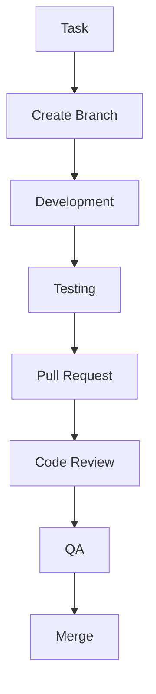

# Development Workflow

## 🔄 Workflow-Übersicht



## 📋 Task Management

### 1. Task Lifecycle

```typescript
interface TaskLifecycle {
  // Task States
  states: {
    backlog: 'Waiting to be picked up',
    planning: 'Being planned/refined',
    ready: 'Ready for development',
    inProgress: 'Being worked on',
    review: 'In code review',
    qa: 'In testing',
    done: 'Completed'
  };
  
  // Task Requirements
  requirements: {
    description: 'Clear task description',
    acceptance: 'Acceptance criteria',
    estimate: 'Time estimate',
    dependencies: 'Related tasks'
  };
}
```

### 2. Task Assignment

```typescript
const taskAssignment = {
  // Assignment Process
  process: {
    prioritization: [
      'Business value',
      'Technical dependencies',
      'Team capacity'
    ],
    assignment: [
      'Skill match',
      'Workload balance',
      'Learning opportunities'
    ]
  },
  
  // Task Tracking
  tracking: {
    status: 'Regular updates',
    blockers: 'Early identification',
    progress: 'Daily updates'
  }
};
```

## 🌿 Git Workflow

### 1. Branch Strategy

```typescript
const branchStrategy = {
  // Branch Types
  branches: {
    main: {
      purpose: 'Production code',
      protection: true,
      mergeRequirements: [
        'Approved PR',
        'Passing tests',
        'Up-to-date branch'
      ]
    },
    develop: {
      purpose: 'Integration branch',
      protection: true,
      mergeRequirements: [
        'Passing tests',
        'No conflicts'
      ]
    },
    feature: {
      pattern: 'feature/<ticket-id>-description',
      purpose: 'New features',
      lifetime: 'Until feature complete'
    }
  }
};
```

### 2. Commit Guidelines

```typescript
const commitGuidelines = {
  // Commit Message Format
  format: {
    type: [
      'feat: New feature',
      'fix: Bug fix',
      'docs: Documentation',
      'style: Formatting',
      'refactor: Code restructuring',
      'test: Adding tests',
      'chore: Maintenance'
    ],
    structure: {
      header: '<type>(<scope>): <subject>',
      body: 'Detailed description',
      footer: 'Breaking changes, issues'
    }
  },
  
  // Git Hooks
  hooks: {
    preCommit: [
      'lint-staged',
      'type-check',
      'test affected'
    ],
    commitMsg: [
      'commitlint',
      'spellcheck'
    ]
  }
};
```

## 🔄 Development Cycle

### 1. Feature Development

```typescript
const developmentCycle = {
  // Development Steps
  steps: {
    planning: [
      'Review requirements',
      'Create technical design',
      'Break down tasks'
    ],
    implementation: [
      'Create feature branch',
      'Implement functionality',
      'Write tests',
      'Update documentation'
    ],
    review: [
      'Self-review code',
      'Update based on feedback',
      'Ensure test coverage'
    ]
  },
  
  // Quality Checks
  qualityChecks: {
    code: 'Lint and format',
    types: 'TypeScript checks',
    tests: 'Unit and integration',
    performance: 'Performance checks'
  }
};
```

### 2. Code Review Process

```typescript
const reviewProcess = {
  // Review Steps
  steps: {
    preparation: [
      'Clean up code',
      'Add comments',
      'Update tests'
    ],
    submission: [
      'Create PR',
      'Fill template',
      'Assign reviewers'
    ],
    review: [
      'Address feedback',
      'Update changes',
      'Re-request review'
    ]
  },
  
  // Review Criteria
  criteria: [
    'Code quality',
    'Test coverage',
    'Documentation',
    'Performance',
    'Security'
  ]
};
```

## 🧪 Testing Strategy

### 1. Testing Levels

```typescript
const testingLevels = {
  // Test Types
  types: {
    unit: {
      scope: 'Single components',
      tools: ['Jest', 'React Testing Library'],
      coverage: '> 80%'
    },
    integration: {
      scope: 'Component interaction',
      tools: ['Cypress', 'MSW'],
      coverage: '> 70%'
    },
    e2e: {
      scope: 'Full workflows',
      tools: ['Playwright'],
      coverage: 'Critical paths'
    }
  },
  
  // Test Environment
  environment: {
    setup: 'Clean test DB',
    data: 'Test fixtures',
    cleanup: 'Post-test cleanup'
  }
};
```

## 📦 Release Process

### 1. Release Preparation

```typescript
const releasePrep = {
  // Release Steps
  steps: {
    version: [
      'Update version',
      'Generate changelog',
      'Update docs'
    ],
    testing: [
      'Full test suite',
      'Performance tests',
      'Security scans'
    ],
    review: [
      'Release notes',
      'Migration guide',
      'Breaking changes'
    ]
  },
  
  // Release Checks
  checks: {
    quality: 'Code quality metrics',
    coverage: 'Test coverage',
    performance: 'Performance benchmarks',
    security: 'Security audit'
  }
};
```

### 2. Deployment

```typescript
const deploymentProcess = {
  // Deployment Steps
  steps: {
    staging: [
      'Deploy to staging',
      'Smoke tests',
      'UAT testing'
    ],
    production: [
      'Deployment window',
      'Backup data',
      'Rolling update'
    ],
    monitoring: [
      'Health checks',
      'Error rates',
      'Performance metrics'
    ]
  },
  
  // Rollback Plan
  rollback: {
    triggers: 'Error thresholds',
    process: 'Automated rollback',
    verification: 'System health'
  }
};
```

## 📊 Metrics & Reporting

### 1. Development Metrics

```typescript
const devMetrics = {
  // Team Metrics
  team: {
    velocity: 'Story points/sprint',
    quality: 'Defect rate',
    efficiency: 'Cycle time'
  },
  
  // Code Metrics
  code: {
    coverage: 'Test coverage',
    complexity: 'Cyclomatic complexity',
    duplication: 'Code duplication'
  }
};
```

### 2. Reporting

```typescript
const reporting = {
  // Regular Reports
  reports: {
    daily: [
      'Standup updates',
      'Blocker status'
    ],
    weekly: [
      'Sprint progress',
      'Quality metrics'
    ],
    monthly: [
      'Team velocity',
      'Technical debt'
    ]
  },
  
  // Dashboards
  dashboards: {
    development: 'Team metrics',
    quality: 'Code quality',
    performance: 'System performance'
  }
};