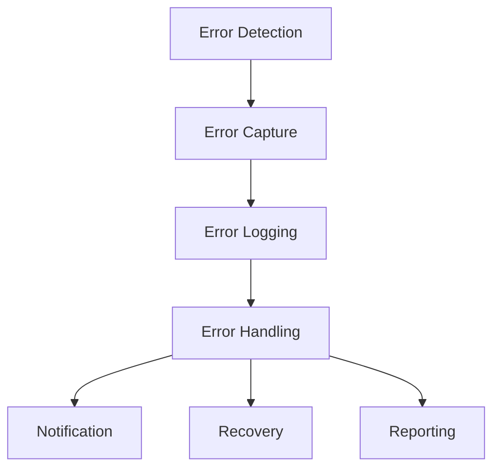

# Error Handling & Logging

## 🎯 Error-Strategie



## 🔍 Error Types

### Custom Error Classes

```typescript
// Base Error
export class AppError extends Error {
  constructor(
    message: string,
    public code: string,
    public statusCode: number = 500,
    public data?: unknown
  ) {
    super(message);
    this.name = 'AppError';
  }
}

// Specific Errors
export class ValidationError extends AppError {
  constructor(message: string, data?: unknown) {
    super(message, 'VALIDATION_ERROR', 400, data);
    this.name = 'ValidationError';
  }
}

export class AuthenticationError extends AppError {
  constructor(message: string) {
    super(message, 'AUTHENTICATION_ERROR', 401);
    this.name = 'AuthenticationError';
  }
}

export class AuthorizationError extends AppError {
  constructor(message: string) {
    super(message, 'AUTHORIZATION_ERROR', 403);
    this.name = 'AuthorizationError';
  }
}

export class NotFoundError extends AppError {
  constructor(message: string) {
    super(message, 'NOT_FOUND', 404);
    this.name = 'NotFoundError';
  }
}

export class RateLimitError extends AppError {
  constructor(message: string) {
    super(message, 'RATE_LIMIT_EXCEEDED', 429);
    this.name = 'RateLimitError';
  }
}
```

## 🎯 Error Handling

### Global Error Handler

```typescript
// Error Middleware
export async function errorHandler(
  error: unknown,
  req: Request,
  res: Response
) {
  // Fehler normalisieren
  const normalizedError = normalizeError(error);
  
  // Fehler loggen
  await logger.error('Request failed', {
    error: normalizedError,
    request: {
      method: req.method,
      url: req.url,
      headers: req.headers,
      body: req.body,
    },
  });

  // Fehler tracken
  await Sentry.captureException(error, {
    extra: {
      requestId: req.headers['x-request-id'],
      userId: req.user?.id,
    },
  });

  // Response senden
  return res.status(normalizedError.statusCode).json({
    error: {
      code: normalizedError.code,
      message: normalizedError.message,
      ...(process.env.NODE_ENV === 'development' && {
        stack: normalizedError.stack,
      }),
    },
  });
}
```

### API Error Responses

```typescript
// Error Response Format
interface ErrorResponse {
  error: {
    code: string;
    message: string;
    details?: unknown;
    requestId?: string;
    timestamp: string;
  };
}

// Error Handler
export async function handleApiError(error: unknown): Promise<ErrorResponse> {
  const timestamp = new Date().toISOString();
  
  if (error instanceof ValidationError) {
    return {
      error: {
        code: 'VALIDATION_ERROR',
        message: error.message,
        details: error.data,
        timestamp,
      },
    };
  }
  
  // ... weitere Error Handling
}
```

## 📝 Error Logging

### Structured Logging

```typescript
// Logger Configuration
const logger = winston.createLogger({
  format: winston.format.combine(
    winston.format.timestamp(),
    winston.format.errors({ stack: true }),
    winston.format.json()
  ),
  defaultMeta: {
    service: 'nextleveltraders',
    environment: process.env.NODE_ENV,
  },
  transports: [
    new winston.transports.Console(),
    new winston.transports.Elasticsearch({
      level: 'error',
      index: 'errors',
    }),
  ],
});

// Error Logging
async function logError(error: Error, context: ErrorContext) {
  await logger.error(error.message, {
    error: {
      name: error.name,
      message: error.message,
      stack: error.stack,
      code: (error as AppError).code,
    },
    context: {
      requestId: context.requestId,
      userId: context.userId,
      action: context.action,
    },
    timestamp: new Date().toISOString(),
  });
}
```

## 🔄 Error Recovery

### Retry Mechanismen

```typescript
// Retry Configuration
const retry = {
  attempts: 3,
  backoff: {
    type: 'exponential',
    minDelay: 1000,
    maxDelay: 10000,
  },
};

// Retry Utility
async function withRetry<T>(
  operation: () => Promise<T>,
  options: RetryOptions = {}
): Promise<T> {
  let lastError: Error;
  
  for (let attempt = 1; attempt <= retry.attempts; attempt++) {
    try {
      return await operation();
    } catch (error) {
      lastError = error;
      
      if (!isRetryableError(error)) {
        throw error;
      }
      
      const delay = calculateBackoff(attempt);
      await sleep(delay);
    }
  }
  
  throw lastError;
}
```

## 🔍 Error Monitoring

### Sentry Integration

```typescript
// Sentry Setup
Sentry.init({
  dsn: process.env.SENTRY_DSN,
  environment: process.env.NODE_ENV,
  tracesSampleRate: 0.1,
  beforeSend(event) {
    // PII filtern
    if (event.user) {
      delete event.user.ip_address;
      delete event.user.email;
    }
    return event;
  },
});

// Error Tracking
function trackError(error: Error, context: ErrorContext) {
  Sentry.withScope(scope => {
    scope.setExtra('context', context);
    scope.setTag('feature', context.feature);
    scope.setUser({ id: context.userId });
    Sentry.captureException(error);
  });
}
```

## 📊 Error Reporting

### Error Aggregation

```typescript
// Error Analytics
const errorAnalytics = {
  async aggregateErrors(timeframe: string) {
    const errors = await getErrorsInTimeframe(timeframe);
    
    return {
      total: errors.length,
      byType: groupBy(errors, 'name'),
      byEndpoint: groupBy(errors, 'context.endpoint'),
      byUser: groupBy(errors, 'context.userId'),
      topErrors: getTopErrors(errors, 10),
    };
  },
};
```

### Alert Rules

```typescript
// Error Alert Configuration
const alertRules = [
  {
    name: 'High Error Rate',
    condition: (metrics: ErrorMetrics) => 
      metrics.errorRate > 0.05,
    action: async (metrics: ErrorMetrics) => {
      await notify('slack', {
        channel: '#alerts',
        text: `🚨 High error rate detected: ${metrics.errorRate * 100}%`,
      });
    },
  },
  {
    name: 'Critical Error',
    condition: (error: AppError) =>
      error.statusCode >= 500,
    action: async (error: AppError) => {
      await notify('pagerduty', {
        severity: 'critical',
        message: error.message,
      });
    },
  },
];
```

## 🔒 Security Errors

### Security Error Handling

```typescript
// Security Error Types
export class SecurityError extends AppError {
  constructor(message: string, code: string) {
    super(message, code, 403);
    this.name = 'SecurityError';
  }
}

// CSRF Protection
export class CSRFError extends SecurityError {
  constructor() {
    super('Invalid CSRF token', 'INVALID_CSRF_TOKEN');
  }
}

// Rate Limiting
export class RateLimitExceededError extends SecurityError {
  constructor(limit: number, reset: Date) {
    super('Rate limit exceeded', 'RATE_LIMIT_EXCEEDED');
    this.data = { limit, reset };
  }
}
```

## 📱 Client Error Handling

### React Error Boundary

```typescript
// Error Boundary Component
export class ErrorBoundary extends React.Component<
  PropsWithChildren<{
    fallback: React.ReactNode;
    onError?: (error: Error) => void;
  }>
> {
  state = { hasError: false, error: null };

  static getDerivedStateFromError(error: Error) {
    return { hasError: true, error };
  }

  componentDidCatch(error: Error, errorInfo: React.ErrorInfo) {
    if (this.props.onError) {
      this.props.onError(error);
    }
    
    // Fehler tracken
    Sentry.captureException(error, { extra: errorInfo });
  }

  render() {
    if (this.state.hasError) {
      return this.props.fallback;
    }

    return this.props.children;
  }
}
```

### Toast Notifications

```typescript
// Error Toast
export function showErrorToast(error: AppError) {
  toast({
    title: 'Error',
    description: error.message,
    status: 'error',
    duration: 5000,
    isClosable: true,
    position: 'top-right',
  });
}

// API Error Handler
export async function handleApiError(error: unknown) {
  const normalizedError = normalizeError(error);
  
  showErrorToast(normalizedError);
  
  if (normalizedError.statusCode === 401) {
    await router.push('/login');
  }
}