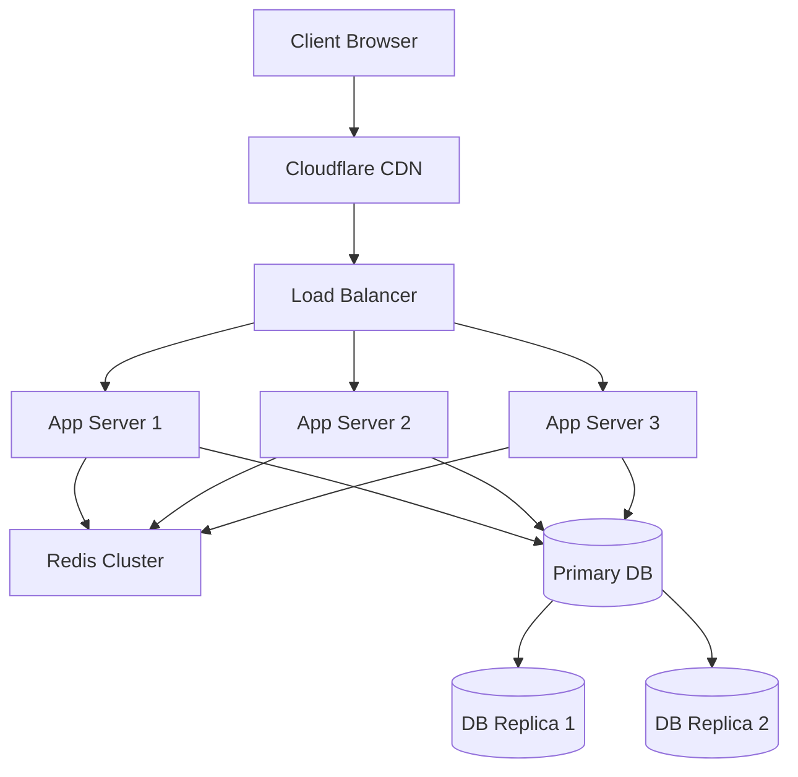

# Infrastruktur-Dokumentation

## 🏗️ Infrastruktur-Übersicht



## 🌐 Cloud-Komponenten

### Vercel (Frontend/API)
```yaml
# vercel.json
{
  "version": 2,
  "regions": ["fra1", "lhr1"],
  "functions": {
    "api/**/*.ts": {
      "memory": 1024,
      "maxDuration": 10
    }
  },
  "crons": [
    {
      "path": "/api/cron/cleanup",
      "schedule": "0 0 * * *"
    }
  ]
}
```

### Supabase (Datenbank)
```typescript
// Database Configuration
const supabase = createClient(
  process.env.SUPABASE_URL,
  process.env.SUPABASE_KEY,
  {
    db: {
      schema: 'public'
    },
    auth: {
      persistSession: true
    },
    realtime: {
      enabled: true
    }
  }
);
```

### Upstash (Redis)
```typescript
// Redis Configuration
const redis = new Redis({
  url: process.env.UPSTASH_REDIS_URL,
  token: process.env.UPSTASH_REDIS_TOKEN,
  automaticDeserialization: true,
  retryStrategy: (times) => Math.min(times * 50, 2000)
});
```

## 🔒 Security & Compliance

### SSL/TLS
```nginx
# Nginx SSL Configuration
server {
    listen 443 ssl http2;
    server_name api.nextleveltraders.com;

    ssl_certificate /etc/letsencrypt/live/api.nextleveltraders.com/fullchain.pem;
    ssl_certificate_key /etc/letsencrypt/live/api.nextleveltraders.com/privkey.pem;
    
    ssl_protocols TLSv1.2 TLSv1.3;
    ssl_ciphers HIGH:!aNULL:!MD5;
    ssl_prefer_server_ciphers on;
}
```

### WAF Rules
```yaml
# Cloudflare WAF Rules
rules:
  - id: 'block-sql-injection'
    expression: 'matches(http.request.uri.path, "(?i)(union|select|insert|delete|update)")'
    action: 'block'
  
  - id: 'rate-limit-api'
    expression: 'http.request.uri.path contains "/api/"'
    action: 'rate_limit'
    rateLimit:
      period: '1m'
      requests: 60
```

## 📊 Monitoring & Logging

### New Relic
```typescript
// Monitoring Configuration
const newrelic = require('newrelic');
newrelic.setTransactionName('/api/trading/orders');

// Custom Metrics
newrelic.recordMetric('Custom/Order/ProcessingTime', 123);
```

### Sentry
```typescript
// Error Tracking
Sentry.init({
  dsn: process.env.SENTRY_DSN,
  environment: process.env.NODE_ENV,
  tracesSampleRate: 0.1,
  integrations: [
    new Sentry.Integrations.Http({ tracing: true }),
    new Sentry.Integrations.Prisma({ client: prisma })
  ]
});
```

## 🚀 Deployment Pipeline

### GitHub Actions
```yaml
name: Deploy
on:
  push:
    branches: [main]

jobs:
  deploy:
    runs-on: ubuntu-latest
    steps:
      - uses: actions/checkout@v3
      
      - name: Deploy to Vercel
        uses: vercel/actions@v3
        with:
          vercel-token: ${{ secrets.VERCEL_TOKEN }}
          vercel-org-id: ${{ secrets.ORG_ID }}
          vercel-project-id: ${{ secrets.PROJECT_ID }}
          vercel-args: '--prod'
```

### Docker Setup
```dockerfile
# Dockerfile
FROM node:18-alpine

WORKDIR /app
COPY package*.json ./
RUN npm ci
COPY . .
RUN npm run build

ENV NODE_ENV production
CMD ["npm", "start"]
```

## 🔄 Load Balancing

### Traffic Distribution
```nginx
# Nginx Load Balancer Configuration
upstream app_servers {
    least_conn;  # Least Connections Algorithm
    server app1.nextleveltraders.com:3000;
    server app2.nextleveltraders.com:3000;
    server app3.nextleveltraders.com:3000;
}
```

### Health Checks
```yaml
# Health Check Configuration
health_check:
  enabled: true
  interval: 5s
  timeout: 3s
  healthy_threshold: 2
  unhealthy_threshold: 3
  http_path: /api/health
```

## 💾 Backup Strategie

### Database Backups
```bash
# Automated Backup Script
#!/bin/bash
DATE=$(date +%Y%m%d)
pg_dump -Fc nextleveltraders > /backups/db_$DATE.dump
aws s3 cp /backups/db_$DATE.dump s3://backups/db/
```

### File Storage
```typescript
// S3 Backup Configuration
const s3 = new AWS.S3({
  region: process.env.AWS_REGION,
  accessKeyId: process.env.AWS_ACCESS_KEY_ID,
  secretAccessKey: process.env.AWS_SECRET_ACCESS_KEY
});
```

## 🚨 Disaster Recovery

### Failover Procedure
1. **Database Failover**
```sql
-- Promote Replica to Primary
SELECT pg_promote_replica();
```

2. **DNS Failover**
```bash
# Update DNS Records
aws route53 change-resource-record-sets \
  --hosted-zone-id $ZONE_ID \
  --change-batch file://failover.json
```

### Recovery Time Objectives
- RTO (Recovery Time Objective): 15 minutes
- RPO (Recovery Point Objective): 5 minutes

## 📈 Skalierung

### Auto-Scaling Rules
```yaml
# Kubernetes HPA Configuration
apiVersion: autoscaling/v2
kind: HorizontalPodAutoscaler
metadata:
  name: app-hpa
spec:
  scaleTargetRef:
    apiVersion: apps/v1
    kind: Deployment
    name: nextleveltraders
  minReplicas: 3
  maxReplicas: 10
  metrics:
  - type: Resource
    resource:
      name: cpu
      target:
        type: Utilization
        averageUtilization: 70
```

### Cache Strategie
```typescript
// Redis Cache Configuration
const cache = new Redis.Cluster([
  {
    host: 'redis-1.nextleveltraders.com',
    port: 6379
  },
  {
    host: 'redis-2.nextleveltraders.com',
    port: 6379
  }
]);
```

## 🔐 Access Management

### IAM Policies
```json
{
  "Version": "2012-10-17",
  "Statement": [
    {
      "Effect": "Allow",
      "Action": [
        "s3:PutObject",
        "s3:GetObject"
      ],
      "Resource": "arn:aws:s3:::nextleveltraders-backups/*"
    }
  ]
}
```

### VPC Configuration
```yaml
# VPC Setup
vpc:
  cidr: 10.0.0.0/16
  subnets:
    public:
      - 10.0.1.0/24
      - 10.0.2.0/24
    private:
      - 10.0.3.0/24
      - 10.0.4.0/24
```

## 📊 Performance Optimierung

### CDN Configuration
```typescript
// Next.js Image Configuration
module.exports = {
  images: {
    domains: ['assets.nextleveltraders.com'],
    loader: 'cloudinary',
    path: 'https://res.cloudinary.com/nextleveltraders/'
  }
};
```

### Edge Functions
```typescript
// Vercel Edge Function
export const config = {
  runtime: 'edge',
  regions: ['fra1', 'lhr1']
};
```

## 📱 Mobile Infrastructure

### Push Notifications
```typescript
// Firebase Configuration
const messaging = firebase.initializeApp({
  apiKey: process.env.FIREBASE_API_KEY,
  projectId: process.env.FIREBASE_PROJECT_ID,
  messagingSenderId: process.env.FIREBASE_MESSAGING_SENDER_ID
}).messaging();
```

### App Distribution
```yaml
# Fastlane Configuration
app_identifier: "com.nextleveltraders.app"
apple_id: "developer@nextleveltraders.com"
team_id: "XXXXXXXXXX"