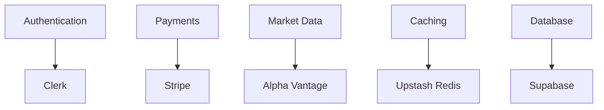

# Third-Party Integrations

## 🔄 Integration-Übersicht



## 🔐 Authentication (Clerk)

### 1. Setup & Configuration

```typescript
// Clerk Configuration
const clerkConfig = {
  // Environment Variables
  env: {
    NEXT_PUBLIC_CLERK_PUBLISHABLE_KEY: string;
    CLERK_SECRET_KEY: string;
  },
  
  // Middleware Configuration
  middleware: `
    import { authMiddleware } from "@clerk/nextjs";
    
    export default authMiddleware({
      publicRoutes: ["/", "/api/webhook"],
      ignoredRoutes: ["/api/health"]
    });
  `,
  
  // Auth Components
  components: {
    signIn: '<SignIn routing="path" path="/sign-in" />',
    signUp: '<SignUp routing="path" path="/sign-up" />',
    userProfile: '<UserProfile routing="path" path="/profile" />'
  }
};
```

### 2. User Management

```typescript
interface UserManagement {
  // User Operations
  operations: {
    create: `
      await clerkClient.users.createUser({
        emailAddress: email,
        password,
        firstName,
        lastName
      });
    `,
    update: `
      await clerkClient.users.updateUser(userId, {
        firstName,
        lastName
      });
    `,
    delete: `
      await clerkClient.users.deleteUser(userId);
    `
  };
  
  // Hooks
  hooks: {
    useUser: 'Current user data & status',
    useAuth: 'Authentication state & methods',
    useSession: 'Active session management'
  };
}
```

## 💳 Payments (Stripe)

### 1. Configuration

```typescript
// Stripe Setup
const stripeConfig = {
  // Environment
  env: {
    STRIPE_SECRET_KEY: string;
    STRIPE_WEBHOOK_SECRET: string;
    NEXT_PUBLIC_STRIPE_PUBLISHABLE_KEY: string;
  },
  
  // Initialization
  setup: `
    import Stripe from 'stripe';
    
    export const stripe = new Stripe(process.env.STRIPE_SECRET_KEY!, {
      apiVersion: '2023-10-16',
      appInfo: {
        name: 'NextLevelTraders',
        version: '1.0.0'
      }
    });
  `
};
```

### 2. Payment Processing

```typescript
interface PaymentIntegration {
  // Payment Flows
  flows: {
    subscription: `
      const subscription = await stripe.subscriptions.create({
        customer: customerId,
        items: [{ price: priceId }],
        payment_behavior: 'default_incomplete',
        expand: ['latest_invoice.payment_intent']
      });
    `,
    
    oneTime: `
      const paymentIntent = await stripe.paymentIntents.create({
        amount,
        currency: 'eur',
        customer: customerId,
        payment_method_types: ['card']
      });
    `
  };
  
  // Webhook Handling
  webhooks: `
    export async function POST(req: Request) {
      const payload = await req.text();
      const signature = req.headers.get('stripe-signature')!;
      
      const event = stripe.webhooks.constructEvent(
        payload,
        signature,
        process.env.STRIPE_WEBHOOK_SECRET!
      );
      
      // Handle event types
      switch (event.type) {
        case 'payment_intent.succeeded':
          await handleSuccessfulPayment(event.data.object);
          break;
        // ... other events
      }
    }
  `;
}
```

## 📊 Market Data (Alpha Vantage)

### 1. API Integration

```typescript
// Market Data Client
const marketDataConfig = {
  // Configuration
  config: {
    baseUrl: 'https://www.alphavantage.co/query',
    apiKey: process.env.ALPHA_VANTAGE_API_KEY
  },
  
  // API Client
  client: `
    export class MarketDataClient {
      async getQuote(symbol: string) {
        return this.get('GLOBAL_QUOTE', { symbol });
      }
      
      async getIntraday(symbol: string) {
        return this.get('TIME_SERIES_INTRADAY', {
          symbol,
          interval: '5min'
        });
      }
      
      async getDaily(symbol: string) {
        return this.get('TIME_SERIES_DAILY', { symbol });
      }
    }
  `
};
```

### 2. Data Processing

```typescript
interface MarketDataProcessing {
  // Data Transformation
  transform: {
    normalize: `
      function normalizeQuote(raw: any) {
        return {
          symbol: raw['01. symbol'],
          price: parseFloat(raw['05. price']),
          volume: parseInt(raw['06. volume']),
          timestamp: raw['07. latest trading day']
        };
      }
    `,
    
    aggregate: `
      function aggregateCandles(data: any[]) {
        return {
          open: data[0].open,
          high: Math.max(...data.map(d => d.high)),
          low: Math.min(...data.map(d => d.low)),
          close: data[data.length - 1].close,
          volume: data.reduce((sum, d) => sum + d.volume, 0)
        };
      }
    `
  };
}
```

## 🔄 Caching (Upstash Redis)

### 1. Setup

```typescript
// Redis Configuration
const redisConfig = {
  // Environment
  env: {
    UPSTASH_REDIS_REST_URL: string;
    UPSTASH_REDIS_REST_TOKEN: string;
  },
  
  // Client Setup
  client: `
    import { Redis } from '@upstash/redis';
    
    export const redis = new Redis({
      url: process.env.UPSTASH_REDIS_REST_URL!,
      token: process.env.UPSTASH_REDIS_REST_TOKEN!
    });
  `
};
```

### 2. Cache Operations

```typescript
interface CacheOperations {
  // Basic Operations
  operations: {
    get: `
      const data = await redis.get(['key']);
    `,
    set: `
      await redis.set(['key'], value, { ex: 3600 });
    `,
    del: `
      await redis.del(['key']);
    `
  };
  
  // Cache Patterns
  patterns: {
    rateLimit: `
      const identifier = 'rate-limit:${ip}';
      const [response] = await redis.pipeline()
        .incr(identifier)
        .expire(identifier, 60)
        .exec();
    `,
    
    cacheFirst: `
      async function getCachedData(key: string) {
        const cached = await redis.get(['cache', key]);
        if (cached) return cached;
        
        const data = await fetchData(key);
        await redis.set(['cache', key], data, { ex: 3600 });
        return data;
      }
    `
  };
}
```

## 🗄️ Database (Supabase)

### 1. Configuration

```typescript
// Supabase Setup
const supabaseConfig = {
  // Environment
  env: {
    NEXT_PUBLIC_SUPABASE_URL: string;
    NEXT_PUBLIC_SUPABASE_ANON_KEY: string;
    SUPABASE_SERVICE_ROLE_KEY: string;
  },
  
  // Client Setup
  client: `
    import { createClient } from '@supabase/supabase-js';
    
    export const supabase = createClient(
      process.env.NEXT_PUBLIC_SUPABASE_URL!,
      process.env.NEXT_PUBLIC_SUPABASE_ANON_KEY!
    );
  `
};
```

### 2. Database Operations

```typescript
interface DatabaseOperations {
  // CRUD Operations
  operations: {
    select: `
      const { data, error } = await supabase
        .from('trades')
        .select('*')
        .eq('user_id', userId);
    `,
    
    insert: `
      const { data, error } = await supabase
        .from('trades')
        .insert([{ user_id: userId, symbol, amount }])
        .select();
    `,
    
    update: `
      const { data, error } = await supabase
        .from('trades')
        .update({ status: 'completed' })
        .eq('id', tradeId);
    `
  };
}