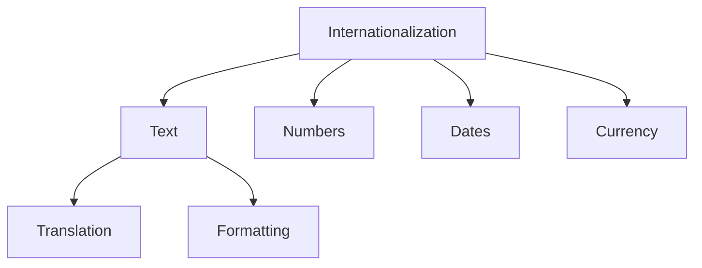

# Internationalization & Localization

## 🌍 i18n-Übersicht



## 🔤 Text Translation

### 1. Translation Setup

```typescript
// next-i18next.config.js
module.exports = {
  i18n: {
    defaultLocale: 'en',
    locales: ['en', 'de', 'fr', 'es'],
    
    // Load paths
    localePath: './public/locales',
    
    // Default namespace
    defaultNS: 'common'
  }
};

// Translation Types
interface Translations {
  common: {
    nav: {
      home: string;
      dashboard: string;
      trades: string;
    };
    actions: {
      save: string;
      cancel: string;
      confirm: string;
    };
  };
  
  trading: {
    orders: {
      buy: string;
      sell: string;
      limit: string;
      market: string;
    };
  };
}
```

### 2. Translation Usage

```typescript
// Component Translation
const TradingPanel = () => {
  const { t } = useTranslation('trading');
  
  return (
    <div>
      <h2>{t('orders.title')}</h2>
      
      <div>
        <button>{t('orders.buy')}</button>
        <button>{t('orders.sell')}</button>
      </div>
      
      <select>
        <option value="market">
          {t('orders.market')}
        </option>
        <option value="limit">
          {t('orders.limit')}
        </option>
      </select>
    </div>
  );
};

// Translation Files
const en = {
  trading: {
    orders: {
      title: 'Place Order',
      buy: 'Buy',
      sell: 'Sell',
      market: 'Market Order',
      limit: 'Limit Order'
    }
  }
};

const de = {
  trading: {
    orders: {
      title: 'Order aufgeben',
      buy: 'Kaufen',
      sell: 'Verkaufen',
      market: 'Market Order',
      limit: 'Limit Order'
    }
  }
};
```

## 🔢 Number Formatting

### 1. Number Configuration

```typescript
// Number Format Config
const numberFormats = {
  number: {
    // General numbers
    default: {
      minimumFractionDigits: 0,
      maximumFractionDigits: 2
    },
    
    // Percentages
    percent: {
      style: 'percent',
      minimumFractionDigits: 2
    },
    
    // Large numbers
    compact: {
      notation: 'compact',
      minimumFractionDigits: 1
    }
  } as const;
};

// Number Formatting Hook
function useNumberFormat(
  style: keyof typeof numberFormats.number
) {
  const locale = useLocale();
  
  return useCallback((value: number) => {
    return new Intl.NumberFormat(
      locale,
      numberFormats.number[style]
    ).format(value);
  }, [locale, style]);
}
```

### 2. Usage Examples

```typescript
// Number Formatting Usage
const PortfolioSummary = ({ value, change }) => {
  const formatNumber = useNumberFormat('default');
  const formatPercent = useNumberFormat('percent');
  
  return (
    <div>
      <div>
        Portfolio Value: ${formatNumber(value)}
      </div>
      <div>
        Change: {formatPercent(change)}
      </div>
    </div>
  );
};
```

## 📅 Date & Time

### 1. Date Configuration

```typescript
// Date Format Config
const dateFormats = {
  date: {
    // Short date
    short: {
      year: 'numeric',
      month: 'short',
      day: 'numeric'
    },
    
    // Long date
    long: {
      year: 'numeric',
      month: 'long',
      day: 'numeric',
      weekday: 'long'
    },
    
    // Time only
    time: {
      hour: '2-digit',
      minute: '2-digit'
    }
  } as const;
};

// Date Formatting Hook
function useDateFormat(
  style: keyof typeof dateFormats.date
) {
  const locale = useLocale();
  const timeZone = useTimeZone();
  
  return useCallback((date: Date) => {
    return new Intl.DateTimeFormat(
      locale,
      {
        ...dateFormats.date[style],
        timeZone
      }
    ).format(date);
  }, [locale, timeZone, style]);
}
```

### 2. Usage Examples

```typescript
// Date Formatting Usage
const TradeHistory = ({ trades }) => {
  const formatDate = useDateFormat('short');
  const formatTime = useDateFormat('time');
  
  return (
    <table>
      <thead>
        <tr>
          <th>Date</th>
          <th>Time</th>
          <th>Action</th>
        </tr>
      </thead>
      <tbody>
        {trades.map(trade => (
          <tr key={trade.id}>
            <td>{formatDate(trade.timestamp)}</td>
            <td>{formatTime(trade.timestamp)}</td>
            <td>{trade.type}</td>
          </tr>
        ))}
      </tbody>
    </table>
  );
};
```

## 💰 Currency

### 1. Currency Configuration

```typescript
// Currency Format Config
const currencyFormats = {
  currency: {
    // Standard currency
    standard: {
      style: 'currency',
      minimumFractionDigits: 2
    },
    
    // Compact currency
    compact: {
      style: 'currency',
      notation: 'compact'
    }
  } as const;
};

// Currency Formatting Hook
function useCurrencyFormat(
  style: keyof typeof currencyFormats.currency,
  currency: string
) {
  const locale = useLocale();
  
  return useCallback((value: number) => {
    return new Intl.NumberFormat(
      locale,
      {
        ...currencyFormats.currency[style],
        currency
      }
    ).format(value);
  }, [locale, currency, style]);
}
```

### 2. Usage Examples

```typescript
// Currency Formatting Usage
const OrderBook = ({ orders }) => {
  const formatUSD = useCurrencyFormat('standard', 'USD');
  
  return (
    <div>
      {orders.map(order => (
        <div key={order.id}>
          <span>{order.amount}</span>
          <span>{formatUSD(order.price)}</span>
          <span>{formatUSD(order.total)}</span>
        </div>
      ))}
    </div>
  );
};
```

## 🔄 Dynamic Content

### 1. Pluralization

```typescript
// Plural Rules
const pluralRules = {
  en: {
    trade: {
      one: '{{count}} trade',
      other: '{{count}} trades'
    },
    order: {
      one: '{{count}} order',
      other: '{{count}} orders'
    }
  },
  
  de: {
    trade: {
      one: '{{count}} Trade',
      other: '{{count}} Trades'
    },
    order: {
      one: '{{count}} Order',
      other: '{{count}} Orders'
    }
  }
};

// Pluralization Usage
const TradeSummary = ({ count }) => {
  const { t } = useTranslation();
  
  return (
    <div>
      {t('trade', { count })}
    </div>
  );
};
```

### 2. Dynamic Messages

```typescript
// Dynamic Message Composition
const StatusMessage = ({ status, data }) => {
  const { t } = useTranslation();
  
  const messages = {
    success: t('status.success', {
      action: data.action,
      amount: formatNumber(data.amount)
    }),
    error: t('status.error', {
      code: data.code,
      message: data.message
    })
  };
  
  return (
    <div role="alert">
      {messages[status]}
    </div>
  );
};