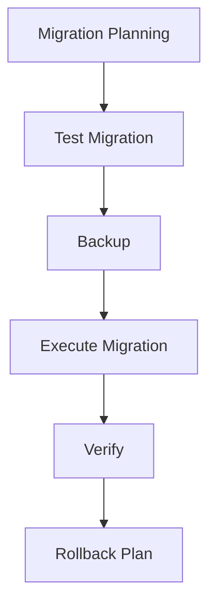

# Database Migrations

## 🗂️ Migration-Strategie



## 📋 Migration Types

### 1. Schema Migrations

```typescript
// Prisma Migration Example
import { PrismaClient } from '@prisma/client';

// prisma/migrations/20250304_add_user_preferences.ts
export const migration = {
  async up(prisma: PrismaClient) {
    await prisma.$executeRaw`
      ALTER TABLE "User" 
      ADD COLUMN "preferences" JSONB DEFAULT '{}'::jsonb;
    `;
  },

  async down(prisma: PrismaClient) {
    await prisma.$executeRaw`
      ALTER TABLE "User" 
      DROP COLUMN "preferences";
    `;
  }
};
```

### 2. Data Migrations

```typescript
// Data Migration Example
async function migrateUserPreferences() {
  const users = await prisma.user.findMany({
    where: {
      preferences: null
    }
  });

  for (const user of users) {
    await prisma.user.update({
      where: { id: user.id },
      data: {
        preferences: {
          theme: 'light',
          notifications: true,
          language: 'de'
        }
      }
    });
  }
}
```

## 🔄 Migration Process

### 1. Migration Script

```typescript
// Migration Runner
const migrationRunner = {
  async executeMigration(version: string) {
    try {
      // 1. Backup
      await backupDatabase();
      
      // 2. Run Migration
      const result = await prisma.$migrate.up({
        schema: './prisma/schema.prisma',
      });
      
      // 3. Verify
      await verifyMigration();
      
      // 4. Log Success
      await logMigration({
        version,
        status: 'success',
        timestamp: new Date(),
      });
      
    } catch (error) {
      // Handle Error & Rollback
      await handleMigrationError(error);
    }
  }
};
```

### 2. Migration Tracking

```sql
-- Migration History Table
CREATE TABLE migration_history (
    id SERIAL PRIMARY KEY,
    version VARCHAR(255) NOT NULL,
    description TEXT,
    applied_at TIMESTAMP DEFAULT CURRENT_TIMESTAMP,
    applied_by VARCHAR(255),
    status VARCHAR(50),
    duration INTEGER,
    rollback_script TEXT
);

-- Migration Lock Table
CREATE TABLE migration_locks (
    id INTEGER PRIMARY KEY,
    is_locked BOOLEAN DEFAULT FALSE,
    locked_at TIMESTAMP,
    locked_by VARCHAR(255)
);
```

## 🔒 Migration Safety

### 1. Pre-Migration Checks

```typescript
const migrationChecks = {
  async validateMigration() {
    const checks = {
      // Database Checks
      connection: await checkDatabaseConnection(),
      space: await checkDiskSpace(),
      locks: await checkMigrationLocks(),
      
      // Schema Checks
      schema: await validateSchemaChanges(),
      constraints: await checkConstraints(),
      
      // Data Checks
      dataValidation: await validateData(),
      estimates: await estimateMigrationTime(),
    };
    
    return Object.values(checks).every(check => check.passed);
  }
};
```

### 2. Backup Strategy

```typescript
const backupStrategy = {
  async createBackup() {
    // 1. Lock Tables
    await lockTables();
    
    try {
      // 2. Create Snapshot
      const snapshot = await createDatabaseSnapshot();
      
      // 3. Export to S3
      await uploadToS3(snapshot, {
        bucket: 'database-backups',
        key: `migration-${Date.now()}.dump`
      });
      
    } finally {
      // 4. Unlock Tables
      await unlockTables();
    }
  }
};
```

## 🔄 Rollback Strategy

### 1. Rollback Plan

```typescript
const rollbackPlan = {
  async prepareRollback(migration: Migration) {
    // 1. Generate Rollback Scripts
    const rollbackScripts = generateRollbackScripts(migration);
    
    // 2. Validate Rollback
    await validateRollbackScripts(rollbackScripts);
    
    // 3. Store Scripts
    await storeRollbackScripts(rollbackScripts);
    
    return rollbackScripts;
  },
  
  async executeRollback(version: string) {
    // 1. Load Rollback Scripts
    const scripts = await loadRollbackScripts(version);
    
    // 2. Execute Rollback
    await executeRollbackScripts(scripts);
    
    // 3. Verify State
    await verifyDatabaseState();
  }
};
```

### 2. Point-in-Time Recovery

```typescript
const recovery = {
  async recoverToPoint(timestamp: Date) {
    // 1. Find Nearest Backup
    const backup = await findNearestBackup(timestamp);
    
    // 2. Restore Backup
    await restoreBackup(backup);
    
    // 3. Apply WAL Logs
    await replayWALLogs(timestamp);
    
    // 4. Verify Recovery
    await verifyRecovery();
  }
};
```

## 📊 Migration Monitoring

### 1. Progress Tracking

```typescript
const migrationMonitoring = {
  async trackProgress(migration: Migration) {
    return {
      // Progress Metrics
      totalSteps: migration.steps.length,
      completedSteps: migration.completedSteps,
      currentStep: migration.currentStep,
      
      // Time Metrics
      startTime: migration.startTime,
      estimatedCompletion: migration.estimatedCompletion,
      duration: migration.duration,
      
      // Resource Usage
      cpuUsage: await getCPUUsage(),
      memoryUsage: await getMemoryUsage(),
      diskUsage: await getDiskUsage(),
    };
  }
};
```

### 2. Performance Monitoring

```typescript
const performanceMonitoring = {
  async monitorMigration() {
    return {
      // Database Metrics
      queryPerformance: await trackQueryPerformance(),
      lockWaits: await trackLockWaits(),
      tableGrowth: await trackTableGrowth(),
      
      // System Metrics
      systemLoad: await trackSystemLoad(),
      ioOperations: await trackIOOperations(),
      networkUsage: await trackNetworkUsage(),
    };
  }
};
```

## 📝 Migration Documentation

### 1. Migration Guide

```markdown
# Migration Guide für v1.2.0

## Voraussetzungen
- Database Version: PostgreSQL 14+
- Disk Space: 10GB frei
- Maintenance Window: 2 Stunden

## Schritte
1. Backup erstellen
2. Schema migrieren
3. Daten migrieren
4. Indizes aktualisieren
5. Verifizieren

## Rollback Plan
1. Backup restore
2. Schema rollback
3. Index rebuild

## Kontakte
- DBA: dba@nextleveltraders.com
- DevOps: devops@nextleveltraders.com
```

### 2. Changelog

```typescript
// Migration Changelog
const changelog = {
  version: '1.2.0',
  date: '2025-03-04',
  changes: [
    {
      type: 'schema',
      table: 'users',
      description: 'Added preferences column',
      rollback: 'DROP COLUMN preferences'
    },
    {
      type: 'data',
      description: 'Migrated user preferences',
      rollback: 'Reset preferences to default'
    }
  ]
};