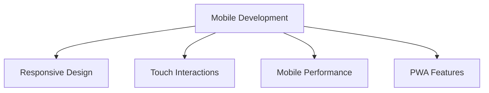

# Mobile Development Guidelines

## 📱 Mobile-Übersicht



## 🎨 Responsive Design

### 1. Viewport Configuration

```typescript
// Document Head
const DocumentHead = () => {
  return (
    <head>
      <meta
        name="viewport"
        content="width=device-width, initial-scale=1.0, viewport-fit=cover"
      />
      <meta
        name="theme-color"
        content="#ffffff"
        media="(prefers-color-scheme: light)"
      />
      <meta
        name="theme-color"
        content="#000000"
        media="(prefers-color-scheme: dark)"
      />
    </head>
  );
};

// Safe Area Handling
const SafeArea = styled.div`
  padding-top: env(safe-area-inset-top);
  padding-bottom: env(safe-area-inset-bottom);
  padding-left: env(safe-area-inset-left);
  padding-right: env(safe-area-inset-right);
`;
```

### 2. Breakpoint System

```typescript
// Breakpoint Configuration
const breakpoints = {
  sm: '640px',   // Small devices
  md: '768px',   // Medium devices
  lg: '1024px',  // Large devices
  xl: '1280px',  // Extra large devices
  '2xl': '1536px' // 2X large devices
};

// Media Queries
const media = {
  sm: `@media (min-width: ${breakpoints.sm})`,
  md: `@media (min-width: ${breakpoints.md})`,
  lg: `@media (min-width: ${breakpoints.lg})`,
  xl: `@media (min-width: ${breakpoints.xl})`,
  '2xl': `@media (min-width: ${breakpoints['2xl']})`
};

// Responsive Component
const ResponsiveLayout = styled.div`
  // Mobile first
  padding: 1rem;
  
  ${media.sm} {
    padding: 2rem;
  }
  
  ${media.lg} {
    padding: 4rem;
  }
`;
```

## 👆 Touch Interactions

### 1. Touch Targets

```typescript
// Touch Target Sizes
const TouchableArea = styled.button`
  // Minimum size for touch targets
  min-width: 44px;
  min-height: 44px;
  
  // Padding for touch area
  padding: 12px;
  
  // Spacing between targets
  margin: 4px;
  
  // Active state feedback
  &:active {
    opacity: 0.7;
  }
`;

// Interactive List Items
const ListItem = styled.li`
  // Large touch target
  padding: 16px;
  
  // Visual feedback
  &:active {
    background-color: rgba(0, 0, 0, 0.05);
  }
  
  // Hover only on devices with hover
  @media (hover: hover) {
    &:hover {
      background-color: rgba(0, 0, 0, 0.02);
    }
  }
`;
```

### 2. Gestures

```typescript
// Gesture Handler
const useGesture = ({
  onSwipe,
  threshold = 50
}: GestureConfig) => {
  const [startX, setStartX] = useState(0);
  const [startY, setStartY] = useState(0);
  
  const handleTouchStart = (e: TouchEvent) => {
    setStartX(e.touches[0].clientX);
    setStartY(e.touches[0].clientY);
  };
  
  const handleTouchEnd = (e: TouchEvent) => {
    const deltaX = e.changedTouches[0].clientX - startX;
    const deltaY = e.changedTouches[0].clientY - startY;
    
    if (Math.abs(deltaX) > threshold) {
      onSwipe(deltaX > 0 ? 'right' : 'left');
    }
  };
  
  return {
    onTouchStart: handleTouchStart,
    onTouchEnd: handleTouchEnd
  };
};
```

## ⚡ Mobile Performance

### 1. Image Optimization

```typescript
// Responsive Images
const ResponsiveImage = ({
  src,
  alt,
  sizes
}: ImageProps) => {
  return (
    <Image
      src={src}
      alt={alt}
      width={1200}
      height={800}
      sizes={sizes || '100vw'}
      loading="lazy"
      placeholder="blur"
      blurDataURL={generateBlurDataURL()}
    />
  );
};

// Image Preloading
const preloadImages = (images: string[]) => {
  images.forEach(src => {
    const img = new Image();
    img.src = src;
  });
};
```

### 2. Network Handling

```typescript
// Network Status
const useNetwork = () => {
  const [isOnline, setIsOnline] = useState(
    typeof navigator !== 'undefined' 
      ? navigator.onLine 
      : true
  );
  
  useEffect(() => {
    const handleOnline = () => setIsOnline(true);
    const handleOffline = () => setIsOnline(false);
    
    window.addEventListener('online', handleOnline);
    window.addEventListener('offline', handleOffline);
    
    return () => {
      window.removeEventListener('online', handleOnline);
      window.removeEventListener('offline', handleOffline);
    };
  }, []);
  
  return isOnline;
};
```

## 📱 PWA Features

### 1. Service Worker

```typescript
// Service Worker Registration
const registerServiceWorker = async () => {
  if ('serviceWorker' in navigator) {
    try {
      const registration = await navigator.serviceWorker
        .register('/sw.js');
      
      console.log('SW registered:', registration);
    } catch (error) {
      console.error('SW registration failed:', error);
    }
  }
};

// Service Worker Configuration
const serviceWorkerConfig = {
  // Cache Configuration
  caches: {
    static: 'static-v1',
    dynamic: 'dynamic-v1'
  },
  
  // Routes to Cache
  routes: [
    '/',
    '/dashboard',
    '/trades',
    '/settings'
  ]
};
```

### 2. App Installation

```typescript
// Install Prompt
const useInstallPrompt = () => {
  const [prompt, setPrompt] = useState<any>(null);
  
  useEffect(() => {
    const handler = (e: any) => {
      e.preventDefault();
      setPrompt(e);
    };
    
    window.addEventListener(
      'beforeinstallprompt',
      handler
    );
    
    return () => window.removeEventListener(
      'beforeinstallprompt',
      handler
    );
  }, []);
  
  const showInstallPrompt = async () => {
    if (prompt) {
      const result = await prompt.prompt();
      return result.outcome === 'accepted';
    }
    return false;
  };
  
  return { showInstallPrompt, canInstall: !!prompt };
};
```

## 📊 Mobile Analytics

### 1. Performance Tracking

```typescript
// Mobile Metrics
const mobileMetrics = {
  // Performance Metrics
  trackPerformance() {
    const fcpEntry = performance.getEntriesByName('FCP')[0];
    const lcpEntry = performance.getEntriesByName('LCP')[0];
    
    analytics.track('Mobile Performance', {
      fcp: fcpEntry?.startTime,
      lcp: lcpEntry?.startTime,
      deviceType: getDeviceType(),
      connection: getConnectionType()
    });
  },
  
  // Device Information
  getDeviceInfo() {
    return {
      screenSize: `${window.innerWidth}x${window.innerHeight}`,
      pixelRatio: window.devicePixelRatio,
      orientation: window.orientation,
      platform: navigator.platform
    };
  }
};
```

### 2. User Behavior

```typescript
// Touch Interaction Tracking
const touchTracking = {
  // Track Gestures
  trackGesture(
    type: 'swipe' | 'tap' | 'pinch',
    details: any
  ) {
    analytics.track('Mobile Gesture', {
      type,
      ...details,
      timestamp: Date.now()
    });
  },
  
  // Track Viewport
  trackViewport() {
    const observer = new ResizeObserver(entries => {
      for (const entry of entries) {
        analytics.track('Viewport Change', {
          width: entry.contentRect.width,
          height: entry.contentRect.height,
          orientation: window.orientation
        });
      }
    });
    
    observer.observe(document.body);
  }
};