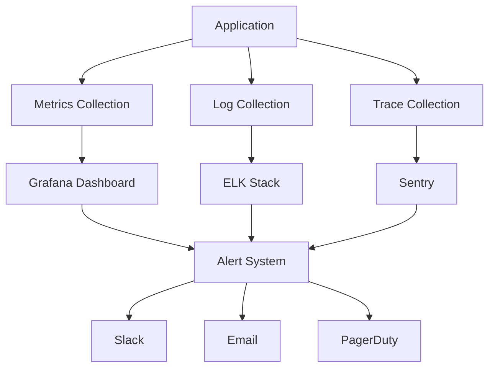

# Monitoring & Observability

## 📊 Monitoring-Übersicht



## 📈 Metriken

### Core Web Vitals
```typescript
// Next.js Web Vitals
export function reportWebVitals(metric: NextWebVitalsMetric) {
  const { id, name, label, value } = metric;
  
  analytics.track('Web Vitals', {
    metric_id: id,
    metric_name: name,
    metric_label: label,
    metric_value: Math.round(value),
    timestamp: Date.now(),
  });
}
```

### Custom Metrics
```typescript
// Business Metrics
const metrics = {
  async trackOrder(order: Order) {
    await prometheus.histogram('order_value', {
      value: order.amount,
      labels: {
        symbol: order.symbol,
        type: order.type,
      },
    });
  },

  async trackApiLatency(path: string, duration: number) {
    await prometheus.histogram('api_latency', {
      value: duration,
      labels: { path },
    });
  },
};
```

## 📝 Logging

### Structured Logging
```typescript
// Winston Logger Configuration
const logger = winston.createLogger({
  format: winston.format.combine(
    winston.format.timestamp(),
    winston.format.json()
  ),
  defaultMeta: { service: 'nextleveltraders' },
  transports: [
    new winston.transports.Console(),
    new winston.transports.Elasticsearch({
      level: 'info',
      clientOpts: { node: process.env.ELASTICSEARCH_URL },
      index: 'logs-nextleveltraders',
    }),
  ],
});

// Usage
logger.info('Order placed', {
  orderId: order.id,
  userId: user.id,
  amount: order.amount,
  symbol: order.symbol,
});
```

### Log Levels
```typescript
const LogLevels = {
  ERROR: 0,   // Fehler, die sofortige Aufmerksamkeit erfordern
  WARN: 1,    // Potenziell problematische Situationen
  INFO: 2,    // Wichtige Geschäftsereignisse
  DEBUG: 3,   // Entwicklungs-/Debug-Informationen
  TRACE: 4,   // Detaillierte Debugging-Informationen
} as const;
```

## 🔍 Tracing

### OpenTelemetry Setup
```typescript
// Tracing Configuration
const provider = new NodeTracerProvider({
  resource: Resource.default().merge(
    new Resource({
      'service.name': 'nextleveltraders',
      'deployment.environment': process.env.NODE_ENV,
    })
  ),
});

provider.addSpanProcessor(
  new BatchSpanProcessor(
    new JaegerExporter({
      endpoint: process.env.JAEGER_ENDPOINT,
    })
  )
);

provider.register();
```

### Request Tracing
```typescript
// Middleware für Request Tracing
export async function middleware(req: NextRequest) {
  const requestId = req.headers.get('x-request-id') || uuid();
  const span = tracer.startSpan('http_request');
  
  span.setAttributes({
    'http.method': req.method,
    'http.url': req.url,
    'http.request_id': requestId,
  });
  
  try {
    const response = await handleRequest(req);
    span.setStatus({ code: SpanStatusCode.OK });
    return response;
  } catch (error) {
    span.setStatus({ 
      code: SpanStatusCode.ERROR,
      message: error.message,
    });
    throw error;
  } finally {
    span.end();
  }
}
```

## 🚨 Alerting

### Alert Rules
```yaml
# Prometheus Alert Rules
groups:
  - name: nextleveltraders
    rules:
      - alert: HighErrorRate
        expr: rate(http_requests_total{status=~"5.."}[5m]) > 0.1
        for: 5m
        labels:
          severity: critical
        annotations:
          summary: High error rate detected
          description: Error rate is above 10% for 5 minutes

      - alert: HighLatency
        expr: histogram_quantile(0.95, rate(http_request_duration_seconds_bucket[5m])) > 1
        for: 5m
        labels:
          severity: warning
        annotations:
          summary: High latency detected
          description: 95th percentile latency is above 1s
```

### Alert Channels
```typescript
// Alert Manager Configuration
const alertManager = {
  async sendAlert(alert: Alert) {
    // Slack
    await slack.send({
      channel: '#alerts',
      text: `🚨 ${alert.summary}\n${alert.description}`,
      attachments: [{
        fields: alert.metadata,
        color: alert.severity === 'critical' ? 'danger' : 'warning',
      }],
    });

    // PagerDuty
    if (alert.severity === 'critical') {
      await pagerduty.createIncident({
        title: alert.summary,
        urgency: 'high',
        body: alert.description,
      });
    }
  },
};
```

## 📊 Dashboards

### Grafana Dashboards
```typescript
// Dashboard Configuration
const dashboards = {
  overview: {
    title: 'System Overview',
    refresh: '10s',
    panels: [
      {
        title: 'Request Rate',
        type: 'graph',
        query: 'rate(http_requests_total[5m])',
      },
      {
        title: 'Error Rate',
        type: 'graph',
        query: 'rate(http_errors_total[5m])',
      },
      {
        title: 'Latency',
        type: 'heatmap',
        query: 'rate(http_request_duration_seconds_bucket[5m])',
      },
    ],
  },
};
```

## 🔍 Health Checks

### Service Health
```typescript
// Health Check Endpoint
export async function GET(req: Request) {
  const health = {
    status: 'healthy',
    timestamp: new Date().toISOString(),
    version: process.env.APP_VERSION,
    checks: {
      database: await checkDatabase(),
      redis: await checkRedis(),
      api: await checkExternalApis(),
    },
  };

  return Response.json(health);
}
```

### External Service Checks
```typescript
const healthChecks = {
  async checkDatabase() {
    try {
      await prisma.$queryRaw`SELECT 1`;
      return { status: 'up' };
    } catch (error) {
      return { status: 'down', error: error.message };
    }
  },

  async checkRedis() {
    try {
      await redis.ping();
      return { status: 'up' };
    } catch (error) {
      return { status: 'down', error: error.message };
    }
  },
};
```

## 📈 Performance Monitoring

### Resource Usage
```typescript
// System Metrics Collection
const system = {
  async collectMetrics() {
    const metrics = {
      memory: process.memoryUsage(),
      cpu: process.cpuUsage(),
      uptime: process.uptime(),
      eventLoop: {
        lag: await measureEventLoopLag(),
      },
    };

    await prometheus.gauge('system_metrics', {
      memory_heap_used: metrics.memory.heapUsed,
      memory_heap_total: metrics.memory.heapTotal,
      cpu_user: metrics.cpu.user,
      cpu_system: metrics.cpu.system,
      uptime: metrics.uptime,
      event_loop_lag: metrics.eventLoop.lag,
    });
  },
};
```

### API Performance
```typescript
// API Metrics Collection
const apiMetrics = {
  async trackEndpoint(req: Request, duration: number) {
    await prometheus.histogram('api_request_duration', {
      value: duration,
      labels: {
        method: req.method,
        path: req.url,
        status: res.status,
      },
    });
  },
};
```

## 📱 Client Monitoring

### Error Tracking
```typescript
// Client Error Tracking
window.onerror = function(msg, url, line, col, error) {
  analytics.track('JavaScript Error', {
    message: msg,
    url: url,
    line: line,
    column: col,
    stack: error?.stack,
    userAgent: navigator.userAgent,
  });
};
```

### Performance Tracking
```typescript
// Performance Monitoring
const performance = {
  async trackPageLoad() {
    const metrics = await web_vitals.getCLS();
    const timing = performance.timing;
    
    analytics.track('Page Load', {
      pathname: window.location.pathname,
      loadTime: timing.loadEventEnd - timing.navigationStart,
      domReady: timing.domContentLoadedEventEnd - timing.navigationStart,
      cls: metrics.value,
    });
  },
};