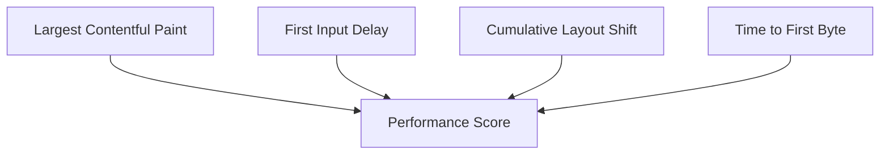

# Performance Optimierung

## 🎯 Performance-Metriken

### Core Web Vitals


## 🚀 Frontend Optimierung

### 1. Code Splitting

```typescript
// Dynamischer Import von Komponenten
const TradingChart = dynamic(() => import('@/components/TradingChart'), {
  loading: () => <ChartSkeleton />,
  ssr: false
});

// Route Segmente
import { Suspense } from 'react';

export default function Layout({ children }) {
  return (
    <>
      <Header />
      <Suspense fallback={<LoadingSpinner />}>
        {children}
      </Suspense>
      <Footer />
    </>
  );
}
```

### 2. Image Optimierung

```typescript
// Next.js Image Komponente
import Image from 'next/image';

export function OptimizedImage() {
  return (
    <Image
      src="/hero.jpg"
      alt="Trading Dashboard"
      width={1200}
      height={630}
      placeholder="blur"
      blurDataURL="data:image/jpeg;base64,..."
      priority={true}
      sizes="(max-width: 768px) 100vw,
             (max-width: 1200px) 50vw,
             33vw"
    />
  );
}
```

### 3. CSS Optimierung

```typescript
// Tailwind Purge
/** @type {import('tailwindcss').Config} */
module.exports = {
  content: [
    './pages/**/*.{js,ts,jsx,tsx}',
    './components/**/*.{js,ts,jsx,tsx}',
  ],
  theme: {
    extend: {},
  },
  plugins: [],
};

// CSS-in-JS Optimierung
const optimizedStyles = cva([
  // Gemeinsame Styles
  'transition-colors duration-200',
  // Varianten
  {
    variants: {
      intent: {
        primary: ['bg-blue-500', 'hover:bg-blue-600'],
        secondary: ['bg-gray-500', 'hover:bg-gray-600'],
      },
    },
  },
]);
```

## ⚡ Backend Optimierung

### 1. Caching Strategie

```typescript
// Redis Caching
const cache = {
  async get<T>(key: string): Promise<T | null> {
    const cached = await redis.get(key);
    return cached ? JSON.parse(cached) : null;
  },

  async set<T>(
    key: string,
    data: T,
    ttl: number = 3600
  ): Promise<void> {
    await redis.set(
      key,
      JSON.stringify(data),
      'EX',
      ttl
    );
  }
};

// API Route mit Caching
export async function GET(req: Request) {
  const cacheKey = `market-data:${req.url}`;
  
  // Check Cache
  const cached = await cache.get(cacheKey);
  if (cached) return Response.json(cached);
  
  // Fetch Data
  const data = await fetchMarketData();
  
  // Cache Result
  await cache.set(cacheKey, data, 300); // 5 minutes
  
  return Response.json(data);
}
```

### 2. Database Optimierung

```typescript
// Indexed Queries
const orders = await prisma.order.findMany({
  where: {
    userId,
    createdAt: {
      gte: startDate,
      lte: endDate
    }
  },
  orderBy: {
    createdAt: 'desc'
  },
  // Select nur benötigte Felder
  select: {
    id: true,
    symbol: true,
    amount: true,
    status: true
  }
});

// Batch Operations
const userIds = orders.map(order => order.userId);
const users = await prisma.user.findMany({
  where: {
    id: {
      in: userIds
    }
  }
});
```

### 3. API Optimierung

```typescript
// Request Batching
export async function batchRequests<T>(
  requests: Promise<T>[],
  batchSize: number = 5
): Promise<T[]> {
  const results: T[] = [];
  
  for (let i = 0; i < requests.length; i += batchSize) {
    const batch = requests.slice(i, i + batchSize);
    const batchResults = await Promise.all(batch);
    results.push(...batchResults);
  }
  
  return results;
}

// API Rate Limiting
export const rateLimiter = new RateLimiter({
  tokensPerInterval: 100,
  interval: "minute",
  fireImmediately: true
});
```

## 📦 Bundle Optimierung

### 1. Tree Shaking

```typescript
// Effiziente Imports
import { Button } from '@/components/ui/button';
import { formatDate } from '@/lib/utils';

// Vermeiden
import * as utils from '@/lib/utils';
```

### 2. Dependency Optimierung

```json
{
  "dependencies": {
    // Production Dependencies
    "next": "14.0.0",
    "react": "18.2.0"
  },
  "devDependencies": {
    // Development Dependencies
    "typescript": "5.0.0",
    "eslint": "8.0.0"
  }
}
```

## 📱 Mobile Optimierung

### 1. Progressive Web App

```typescript
// next.config.js
const withPWA = require('next-pwa')({
  dest: 'public',
  register: true,
  skipWaiting: true,
  disable: process.env.NODE_ENV === 'development'
});

module.exports = withPWA({
  // Next.js config
});
```

### 2. Responsive Images

```typescript
// Responsive Image Komponente
export function ResponsiveImage({ src, alt }: ImageProps) {
  return (
    <picture>
      <source
        media="(min-width: 1024px)"
        srcSet={`${src}?w=1200 1x, ${src}?w=2400 2x`}
      />
      <source
        media="(min-width: 768px)"
        srcSet={`${src}?w=800 1x, ${src}?w=1600 2x`}
      />
      
    </picture>
  );
}
```

## 📊 Performance Monitoring

### 1. Real User Monitoring

```typescript
// Performance Tracking
export function trackPerformance() {
  const metrics = {
    FCP: performance.getEntriesByName('first-contentful-paint')[0],
    LCP: performance.getEntriesByName('largest-contentful-paint')[0],
    FID: performance.getEntriesByName('first-input-delay')[0],
    CLS: performance.getEntriesByName('cumulative-layout-shift')[0],
  };

  analytics.track('Performance Metrics', metrics);
}
```

### 2. Error Tracking

```typescript
// Performance Error Tracking
window.addEventListener('error', (event) => {
  if (event.error?.name === 'NetworkError') {
    analytics.track('Network Error', {
      url: event.error.source,
      timestamp: Date.now(),
    });
  }
});
```

## 🔍 Performance Testing

### 1. Lighthouse CI

```yaml
name: Lighthouse CI
on: [push]
jobs:
  lighthouse:
    runs-on: ubuntu-latest
    steps:
      - uses: actions/checkout@v3
      - name: Run Lighthouse
        uses: treosh/lighthouse-ci-action@v9
        with:
          urls: |
            https://nextleveltraders.com/
            https://nextleveltraders.com/dashboard
          budgetPath: '.github/lighthouse/budget.json'
          uploadArtifacts: true
```

### 2. Load Testing

```typescript
// k6 Load Test Script
import http from 'k6/http';
import { check, sleep } from 'k6';

export const options = {
  vus: 10,
  duration: '30s',
};

export default function() {
  const res = http.get('https://api.nextleveltraders.com/market-data');
  
  check(res, {
    'status is 200': (r) => r.status === 200,
    'response time < 200ms': (r) => r.timings.duration < 200,
  });
  
  sleep(1);
}
```

## 🔄 Continuous Optimization

### 1. Performance Budget

```json
{
  "ci": {
    "collect": {
      "budgets": [
        {
          "path": "/*",
          "timings": [
            {
              "metric": "interactive",
              "budget": 3000
            },
            {
              "metric": "first-contentful-paint",
              "budget": 1000
            }
          ],
          "resourceSizes": [
            {
              "resourceType": "script",
              "budget": 300
            },
            {
              "resourceType": "total",
              "budget": 1000
            }
          ]
        }
      ]
    }
  }
}
```

### 2. Performance Monitoring Alerts

```typescript
// Performance Alert Rules
const performanceAlerts = {
  LCP: {
    threshold: 2500, // ms
    action: async (value: number) => {
      if (value > 2500) {
        await notify('slack', {
          channel: '#performance',
          text: `🚨 LCP is too high: ${value}ms`
        });
      }
    }
  },
  
  CLS: {
    threshold: 0.1,
    action: async (value: number) => {
      if (value > 0.1) {
        await notify('slack', {
          channel: '#performance',
          text: `🚨 CLS is too high: ${value}`
        });
      }
    }
  }
};