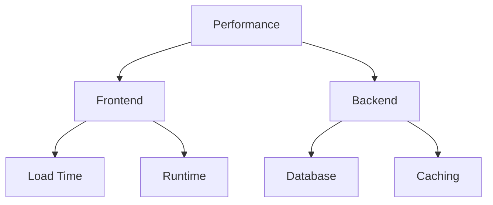

# Performance Optimization

## 📊 Performance-Übersicht



## 🌐 Frontend Performance

### 1. Bundle Optimization

```typescript
// Next.js Config
const nextConfig = {
  // Page Optimization
  optimizeFonts: true,
  
  // Image Optimization
  images: {
    domains: ['assets.nextleveltraders.com'],
    formats: ['image/avif', 'image/webp'],
    deviceSizes: [640, 750, 828, 1080, 1200],
    imageSizes: [16, 32, 48, 64, 96, 128, 256, 384],
  },
  
  // Bundle Analysis
  webpack: (config, { isServer }) => {
    if (!isServer) {
      config.plugins.push(
        new BundleAnalyzerPlugin({
          analyzerMode: 'server',
        })
      );
    }
    return config;
  },
};
```

### 2. Code Splitting

```typescript
// Dynamic Imports
const TradingChart = dynamic(() => import('@/components/TradingChart'), {
  loading: () => <ChartSkeleton />,
  ssr: false,
});

// Route Segmentation
export default function Layout({
  children,
  auth,
  trading,
}: {
  children: React.ReactNode;
  auth: React.ReactNode;
  trading: React.ReactNode;
}) {
  return (
    <div>
      {children}
      <Suspense fallback={<AuthSkeleton />}>
        {auth}
      </Suspense>
      <Suspense fallback={<TradingSkeleton />}>
        {trading}
      </Suspense>
    </div>
  );
}
```

## ⚡ Component Performance

### 1. Render Optimization

```typescript
// Memo Usage
const ExpensiveComponent = memo(({ data }) => {
  return (
    <div>
      {data.map(item => (
        <ExpensiveItem key={item.id} {...item} />
      ))}
    </div>
  );
}, propsAreEqual);

// Hook Optimization
function TradeList({ trades }) {
  // Memoize expensive calculations
  const sortedTrades = useMemo(
    () => sortTrades(trades),
    [trades]
  );
  
  // Memoize callbacks
  const handleTrade = useCallback(
    (trade) => executeTrade(trade),
    []
  );
  
  return (
    <VirtualizedList
      data={sortedTrades}
      onTrade={handleTrade}
    />
  );
}
```

### 2. Virtual Rendering

```typescript
// Virtual List Implementation
const VirtualizedList = ({
  items,
  rowHeight,
  visibleRows
}: VirtualListProps) => {
  const [scrollTop, setScrollTop] = useState(0);
  
  const startIndex = Math.floor(scrollTop / rowHeight);
  const endIndex = Math.min(
    startIndex + visibleRows,
    items.length
  );
  
  const visibleItems = items.slice(startIndex, endIndex);
  
  return (
    <div
      style={{ height: items.length * rowHeight }}
      onScroll={(e) => setScrollTop(e.currentTarget.scrollTop)}
    >
      <div style={{ transform: `translateY(${startIndex * rowHeight}px)` }}>
        {visibleItems.map(renderItem)}
      </div>
    </div>
  );
};
```

## 🗄️ Database Performance

### 1. Query Optimization

```typescript
// Index Strategy
model Trade {
  id        String   @id @default(cuid())
  userId    String
  symbol    String
  timestamp DateTime @default(now())
  
  @@index([userId, timestamp]) // For user's trade history
  @@index([symbol, timestamp]) // For symbol analysis
}

// Query Optimization
const getTradeHistory = async (userId: string) => {
  return prisma.trade.findMany({
    where: { userId },
    orderBy: { timestamp: "desc" },
    select: {
      id: true,
      symbol: true,
      amount: true,
      timestamp: true
    }
  });
};
```

### 2. Connection Pooling

```typescript
// Database Pool Configuration
const prisma = new PrismaClient({
  datasources: {
    db: {
      url: process.env.DATABASE_URL
    }
  },
  connectionLimit: 20,
  poolTimeout: 30,
});

// Connection Management
let prismaInstance: PrismaClient;

export function getPrisma() {
  if (!prismaInstance) {
    prismaInstance = new PrismaClient();
  }
  return prismaInstance;
}
```

## 🚀 API Performance

### 1. Caching Strategy

```typescript
// Cache Configuration
const cacheConfig = {
  // TTL Configuration
  ttl: {
    quotes: 60, // 1 minute
    history: 3600, // 1 hour
    profile: 86400 // 24 hours
  },
  
  // Cache Keys
  keys: {
    quote: (symbol: string) => `quote:${symbol}`,
    trades: (userId: string) => `trades:${userId}`,
    profile: (userId: string) => `profile:${userId}`
  }
};

// Cache Implementation
async function getCachedData<T>(
  key: string,
  fetchFn: () => Promise<T>,
  ttl: number
): Promise<T> {
  const cached = await redis.get(key);
  if (cached) return JSON.parse(cached);
  
  const data = await fetchFn();
  await redis.setex(key, ttl, JSON.stringify(data));
  
  return data;
}
```

### 2. Rate Limiting

```typescript
// Rate Limit Configuration
const rateLimits = {
  public: {
    window: "1m",
    max: 60
  },
  authenticated: {
    window: "1m",
    max: 120
  },
  premium: {
    window: "1m",
    max: 300
  }
};

// Rate Limit Implementation
const rateLimit = new RateLimit({
  tokensPerInterval: rateLimits.authenticated.max,
  interval: rateLimits.authenticated.window,
  fireImmediately: true,
});

// Middleware Usage
export async function withRateLimit(
  req: NextRequest,
  res: NextResponse
) {
  try {
    await rateLimit.check(req);
    return NextResponse.next();
  } catch {
    return new NextResponse("Too Many Requests", { 
      status: 429 
    });
  }
}
```

## 📊 Monitoring

### 1. Performance Metrics

```typescript
// Core Web Vitals
export function reportWebVitals(metric: NextWebVitalsMetric) {
  // Track Core Web Vitals
  analytics.track("Web Vitals", {
    name: metric.name,
    value: metric.value,
    id: metric.id,
    label: metric.label
  });
}

// Custom Metrics
const performanceMetrics = {
  // API Latency
  trackApiLatency(endpoint: string, duration: number) {
    analytics.track("API Latency", {
      endpoint,
      duration,
      timestamp: Date.now()
    });
  },
  
  // Component Render Time
  trackRenderTime(component: string, duration: number) {
    analytics.track("Render Time", {
      component,
      duration,
      timestamp: Date.now()
    });
  }
};
```

### 2. Error Tracking

```typescript
// Error Boundaries
class PerformanceErrorBoundary extends React.Component {
  componentDidCatch(error: Error, info: React.ErrorInfo) {
    // Track render errors
    analytics.track("Render Error", {
      error: error.message,
      component: info.componentStack,
      timestamp: Date.now()
    });
  }
}

// API Error Tracking
async function trackApiError(
  error: Error,
  endpoint: string
) {
  await analytics.track("API Error", {
    error: error.message,
    endpoint,
    timestamp: Date.now()
  });
}