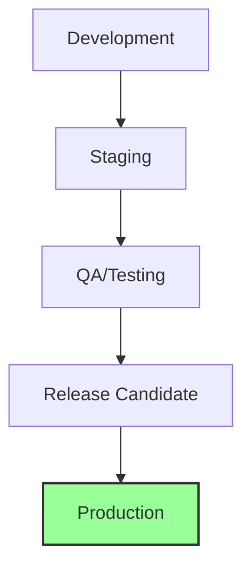

# Release Management

## 🎯 Release-Strategie



## 📅 Release-Zyklus

### 1. Release Planning

```typescript
interface Release {
  version: string;          // Semantic Versioning
  scheduledDate: Date;      // Geplantes Release-Datum
  features: Feature[];      // Geplante Features
  fixes: BugFix[];         // Geplante Fixes
  breakingChanges: Change[]; // Breaking Changes
}

interface Feature {
  id: string;
  title: string;
  description: string;
  status: 'planned' | 'in-progress' | 'completed' | 'verified';
  priority: 'high' | 'medium' | 'low';
}
```

### 2. Versioning

```typescript
// Semantic Versioning
const version = {
  major: 1,    // Breaking Changes
  minor: 2,    // New Features
  patch: 3,    // Bug Fixes
  toString() {
    return `${this.major}.${this.minor}.${this.patch}`;
  }
};

// Version Bump Script
async function bumpVersion(type: 'major' | 'minor' | 'patch') {
  const pkg = require('./package.json');
  const newVersion = calculateNewVersion(pkg.version, type);
  
  // Update files
  await Promise.all([
    updatePackageJson(newVersion),
    updateChangelog(newVersion),
    updateVersionFile(newVersion),
  ]);
  
  // Git tags
  await git.tag(`v${newVersion}`);
}
```

## 🔄 Release Process

### 1. Pre-Release Checklist

```typescript
const preReleaseChecks = {
  async validate() {
    const checks = [
      // Code Quality
      await runTests(),
      await checkCoverage(),
      await runLinting(),
      
      // Dependencies
      await checkDependencies(),
      await auditSecurity(),
      
      // Documentation
      await validateDocs(),
      await checkChangelog(),
      
      // Database
      await validateMigrations(),
      await checkDbCompatibility(),
    ];
    
    return checks.every(check => check.status === 'passed');
  }
};
```

### 2. Release Workflow

```yaml
# .github/workflows/release.yml
name: Release
on:
  push:
    tags:
      - 'v*'

jobs:
  release:
    runs-on: ubuntu-latest
    steps:
      - uses: actions/checkout@v3
      
      - name: Create Release
        id: create_release
        uses: actions/create-release@v1
        env:
          GITHUB_TOKEN: ${{ secrets.GITHUB_TOKEN }}
        with:
          tag_name: ${{ github.ref }}
          release_name: Release ${{ github.ref }}
          body_path: '.github/RELEASE_TEMPLATE.md'
          draft: false
          prerelease: false
          
      - name: Deploy to Production
        uses: amondnet/vercel-action@v20
        with:
          vercel-token: ${{ secrets.VERCEL_TOKEN }}
          vercel-org-id: ${{ secrets.ORG_ID }}
          vercel-project-id: ${{ secrets.PROJECT_ID }}
          vercel-args: '--prod'
```

## 📝 Release Notes

### 1. Changelog Management

```markdown
# Changelog Template

## [1.2.3] - 2025-03-04

### 🎯 Highlights
- Trading-Bot Integration
- Erweiterte Marktanalyse
- Performance-Optimierungen

### 🚀 Neue Features
- Feature A: Beschreibung
- Feature B: Beschreibung

### 🐛 Bugfixes
- Fix A: Beschreibung
- Fix B: Beschreibung

### 🔄 Breaking Changes
- Change A: Migration Guide
- Change B: Migration Guide

### 📚 Dokumentation
- Doc A: Update
- Doc B: Update
```

### 2. Release Notes Generator

```typescript
// Release Notes Generator
const releaseNotes = {
  async generate(version: string) {
    const commits = await git.log({ from: lastTag, to: 'HEAD' });
    
    const categorizedChanges = {
      features: commits.filter(c => c.type === 'feat'),
      fixes: commits.filter(c => c.type === 'fix'),
      docs: commits.filter(c => c.type === 'docs'),
      breaking: commits.filter(c => c.breaking),
    };
    
    return generateMarkdown(categorizedChanges);
  }
};
```

## 🔒 Release Security

### 1. Security Checklist

```typescript
const securityChecks = {
  async validateRelease() {
    return {
      // Dependency Scanning
      dependencies: await checkDependencyVulnerabilities(),
      
      // Code Scanning
      code: await runSecurityScan(),
      
      // Secret Scanning
      secrets: await checkForSecrets(),
      
      // License Compliance
      licenses: await validateLicenses(),
    };
  }
};
```

### 2. Release Signing

```typescript
// Release Signing
const signing = {
  async signRelease(version: string) {
    // Generate checksum
    const checksum = await generateChecksum();
    
    // Sign with GPG
    await gpg.sign(checksum, {
      key: process.env.GPG_SIGNING_KEY,
    });
    
    return {
      version,
      checksum,
      signature: signature,
    };
  }
};
```

## 📊 Release Monitoring

### 1. Health Checks

```typescript
// Post-Release Health Check
const healthCheck = {
  async monitorRelease() {
    return {
      // System Health
      system: await checkSystemMetrics(),
      
      // Error Rates
      errors: await monitorErrorRates(),
      
      // Performance
      performance: await checkPerformanceMetrics(),
      
      // User Impact
      users: await monitorUserMetrics(),
    };
  }
};
```

### 2. Rollback Procedure

```typescript
// Rollback Process
const rollback = {
  async initiateRollback(version: string) {
    // 1. Stop Traffic
    await loadBalancer.stopTraffic();
    
    // 2. Revert Deployment
    await deployment.revertTo(version);
    
    // 3. Run Database Migrations
    await database.rollback(version);
    
    // 4. Verify System Health
    await healthCheck.verify();
    
    // 5. Resume Traffic
    await loadBalancer.resumeTraffic();
    
    // 6. Notify Team
    await notify.sendRollbackAlert();
  }
};
```

## 📱 Mobile Release

### 1. App Store Release

```typescript
// iOS Release Process
const iosRelease = {
  async release() {
    // 1. Build
    await xcodebuild.archive();
    
    // 2. Sign
    await codesign.sign();
    
    // 3. TestFlight
    await testflight.upload();
    
    // 4. App Store
    await appstore.submit();
  }
};
```

### 2. Play Store Release

```typescript
// Android Release Process
const androidRelease = {
  async release() {
    // 1. Build Bundle
    await gradle.bundle();
    
    // 2. Sign Bundle
    await signing.signBundle();
    
    // 3. Upload to Play Store
    await playstore.upload();
    
    // 4. Release to Production
    await playstore.promote();
  }
};
```

## 📈 Release Analytics

### 1. Metrics Tracking

```typescript
// Release Metrics
const metrics = {
  async trackRelease(version: string) {
    await analytics.track('Release', {
      version,
      duration: releaseDuration,
      success: releaseSuccess,
      rollbacks: rollbackCount,
      errors: errorCount,
      userImpact: impactedUsers,
    });
  }
};
```

### 2. User Impact Analysis

```typescript
// User Impact Analysis
const impact = {
  async analyzeUserImpact() {
    return {
      // Usage Metrics
      activeUsers: await getActiveUsers(),
      errorRates: await getErrorRates(),
      performance: await getPerformanceMetrics(),
      
      // Business Metrics
      conversions: await getConversionRates(),
      revenue: await getRevenueImpact(),
    };
  }
};