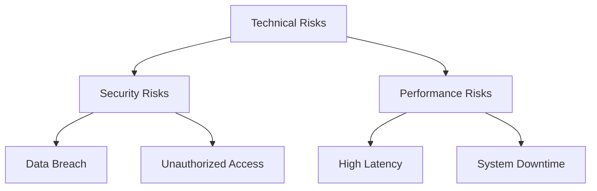

# Risk Assessment

## 🎯 Risiko-Übersicht



## 🔒 Security Risks

### 1. Data Breach

```typescript
interface DataBreachRisk {
  risk: {
    severity: 'Critical',
    likelihood: 'Low',
    impact: 'High'
  };
  
  mitigation: {
    prevention: [
      'End-to-End Encryption',
      'Regular Security Audits',
      'Access Controls',
      'Data Minimization'
    ],
    detection: [
      'Security Monitoring',
      'Anomaly Detection',
      'Log Analysis'
    ],
    response: [
      'Incident Response Plan',
      'Customer Notification',
      'Legal Compliance'
    ]
  };
}
```

### 2. Unauthorized Access

```typescript
interface AccessRisk {
  risk: {
    severity: 'High',
    likelihood: 'Medium',
    impact: 'High'
  };
  
  mitigation: {
    authentication: {
      mfa: 'Required for all accounts',
      passwordPolicy: 'Strong requirements',
      sessionManagement: 'Secure token handling'
    },
    monitoring: {
      loginAttempts: 'Track failed attempts',
      unusualActivity: 'Behavior analysis',
      accessPatterns: 'Pattern recognition'
    }
  };
}
```

## 🚀 Performance Risks

### 1. System Latency

```typescript
interface LatencyRisk {
  risk: {
    severity: 'High',
    likelihood: 'Medium',
    impact: 'High'
  };
  
  mitigation: {
    monitoring: {
      metrics: [
        'Response Time',
        'Processing Time',
        'Queue Length'
      ],
      thresholds: {
        warning: '100ms',
        critical: '500ms'
      }
    },
    optimization: {
      caching: 'Multi-level cache',
      scaling: 'Auto-scaling rules',
      loadBalancing: 'Smart distribution'
    }
  };
}
```

### 2. System Downtime

```typescript
interface DowntimeRisk {
  risk: {
    severity: 'Critical',
    likelihood: 'Low',
    impact: 'Critical'
  };
  
  mitigation: {
    prevention: {
      redundancy: 'Multiple regions',
      monitoring: '24/7 monitoring',
      maintenance: 'Scheduled updates'
    },
    recovery: {
      backups: 'Regular snapshots',
      failover: 'Automatic failover',
      restoration: 'Quick recovery'
    }
  };
}
```

## 💰 Financial Risks

### 1. Trading Risk

```typescript
interface TradingRisk {
  risk: {
    severity: 'High',
    likelihood: 'High',
    impact: 'High'
  };
  
  mitigation: {
    limits: {
      position: 'Maximum position size',
      exposure: 'Total exposure limit',
      loss: 'Stop-loss limits'
    },
    monitoring: {
      realtime: 'Price monitoring',
      alerts: 'Risk level alerts',
      reporting: 'Risk reports'
    }
  };
}
```

### 2. Operational Risk

```typescript
interface OperationalRisk {
  risk: {
    severity: 'Medium',
    likelihood: 'Medium',
    impact: 'High'
  };
  
  mitigation: {
    processes: {
      documentation: 'Clear procedures',
      training: 'Staff training',
      automation: 'Automated checks'
    },
    controls: {
      approvals: 'Multi-level approval',
      reconciliation: 'Daily reconciliation',
      audit: 'Regular audits'
    }
  };
}
```

## 🔄 Business Continuity

### 1. Disaster Recovery

```typescript
interface DisasterRecovery {
  risk: {
    severity: 'Critical',
    likelihood: 'Low',
    impact: 'Critical'
  };
  
  mitigation: {
    plan: {
      rto: '1 hour',  // Recovery Time Objective
      rpo: '5 min',   // Recovery Point Objective
      steps: [
        'Activate backup site',
        'Restore data',
        'Verify systems'
      ]
    },
    testing: {
      frequency: 'Quarterly',
      scenarios: [
        'Complete outage',
        'Data corruption',
        'Network failure'
      ]
    }
  };
}
```

### 2. Business Impact

```typescript
interface BusinessImpact {
  risk: {
    severity: 'High',
    likelihood: 'Medium',
    impact: 'Critical'
  };
  
  mitigation: {
    analysis: {
      criticalSystems: [
        'Trading Engine',
        'Payment Processing',
        'User Authentication'
      ],
      dependencies: [
        'Third-party APIs',
        'Payment Providers',
        'Market Data Feeds'
      ]
    },
    continuity: {
      alternatives: 'Backup providers',
      communication: 'Crisis communication',
      recovery: 'Business recovery'
    }
  };
}
```

## 📊 Risk Monitoring

### 1. Metrics & KPIs

```typescript
interface RiskMetrics {
  technical: {
    availability: {
      target: '99.99%',
      warning: '99.9%',
      critical: '99%'
    },
    performance: {
      latency: '100ms',
      errorRate: '0.1%',
      capacity: '1000 rps'
    }
  },
  
  business: {
    financial: {
      exposure: 'Max portfolio risk',
      liquidity: 'Available funds',
      losses: 'Max drawdown'
    },
    operational: {
      incidents: 'Monthly count',
      resolution: 'MTTR',
      compliance: 'Violations'
    }
  }
};
```

### 2. Reporting & Reviews

```typescript
interface RiskReporting {
  regular: {
    daily: [
      'System health',
      'Trading risks',
      'Security events'
    ],
    weekly: [
      'Performance review',
      'Incident analysis',
      'Risk trends'
    ],
    monthly: [
      'Compliance review',
      'Risk assessment',
      'Control effectiveness'
    ]
  },
  
  escalation: {
    levels: [
      'Team Lead',
      'Department Head',
      'Executive Team'
    ],
    criteria: {
      severity: 'Impact level',
      urgency: 'Time sensitivity',
      scope: 'Affected areas'
    }
  }
};