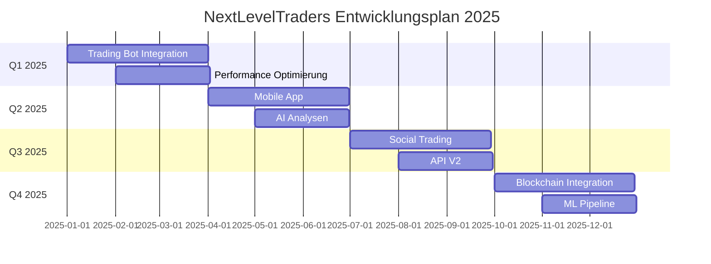

# Development Roadmap

## 🎯 2025 Roadmap



## 📅 Q1 2025: Trading Automation

### 1. Trading Bot Integration

```typescript
interface TradingBot {
  // Bot Configuration
  config: {
    strategy: string;
    risk: {
      maxPosition: number;
      stopLoss: number;
      takeProfit: number;
    };
    timeframe: '1m' | '5m' | '15m' | '1h' | '4h' | '1d';
  };
  
  // Trading Logic
  strategy: {
    analyze: (data: MarketData) => Signal;
    execute: (signal: Signal) => Promise<Order>;
    monitor: (position: Position) => Promise<Action>;
  };
}
```

### 2. Performance Optimierung

```typescript
const performanceGoals = {
  // Frontend Performance
  frontend: {
    loadTime: '< 2s',
    interactivity: '< 100ms',
    renderTime: '< 50ms'
  },
  
  // Backend Performance
  backend: {
    apiLatency: '< 100ms',
    throughput: '> 1000 rps',
    errorRate: '< 0.1%'
  }
};
```

## 📅 Q2 2025: Mobile & AI

### 1. Mobile App

```typescript
const mobileFeatures = {
  // Core Features
  core: [
    'Real-time Kurse',
    'Trading Dashboard',
    'Push Notifications',
    'Biometrische Auth'
  ],
  
  // Advanced Features
  advanced: [
    'Offline Modus',
    'Chart Analysen',
    'Widget Support',
    'Apple Watch App'
  ]
};
```

### 2. AI Trading Analyse

```typescript
interface AIAnalysis {
  // Market Analysis
  market: {
    sentiment: 'bullish' | 'bearish' | 'neutral';
    confidence: number;
    factors: string[];
  };
  
  // Trade Recommendations
  recommendations: {
    entries: TradingSignal[];
    exits: TradingSignal[];
    riskScore: number;
  };
}
```

## 📅 Q3 2025: Social & API

### 1. Social Trading

```typescript
interface SocialFeatures {
  // Trader Profiles
  profile: {
    performance: PerformanceMetrics;
    strategy: string;
    followers: number;
    reputation: number;
  };
  
  // Copy Trading
  copyTrading: {
    maxTraders: number;
    riskManagement: RiskSettings;
    automationRules: Rule[];
  };
}
```

### 2. API V2

```typescript
const apiV2Features = {
  // New Endpoints
  endpoints: [
    'GraphQL Support',
    'Websocket Streams',
    'Batch Operations',
    'Rate Limiting V2'
  ],
  
  // Improvements
  improvements: [
    'Enhanced Security',
    'Better Documentation',
    'Performance Boost',
    'More Integrations'
  ]
};
```

## 📅 Q4 2025: Blockchain & ML

### 1. Blockchain Integration

```typescript
interface BlockchainFeatures {
  // Smart Contracts
  contracts: {
    trading: string[];
    settlement: string[];
    governance: string[];
  };
  
  // DeFi Integration
  defi: {
    protocols: string[];
    assets: string[];
    yields: string[];
  };
}
```

### 2. Machine Learning Pipeline

```typescript
interface MLPipeline {
  // Data Processing
  data: {
    sources: string[];
    preprocessing: string[];
    features: string[];
  };
  
  // Models
  models: {
    prediction: string[];
    classification: string[];
    optimization: string[];
  };
}
```

## 🔄 Continuous Improvements

### 1. Infrastructure

```typescript
const infrastructureGoals = {
  // Scaling
  scaling: {
    users: '100k+',
    transactions: '1M/day',
    storage: '10TB+'
  },
  
  // Reliability
  reliability: {
    uptime: '99.99%',
    backups: 'real-time',
    recovery: '< 15min'
  }
};
```

### 2. Security

```typescript
const securityEnhancements = {
  // Security Features
  features: [
    'Zero Trust Architecture',
    'Enhanced Encryption',
    'Advanced Threat Detection',
    'Automated Security Testing'
  ],
  
  // Compliance
  compliance: [
    'SOC 2 Type II',
    'ISO 27001',
    'GDPR Advanced',
    'Financial Regulations'
  ]
};
```

## 📊 Success Metrics

### 1. Business Metrics

```typescript
const businessMetrics = {
  // Growth Targets
  growth: {
    users: '200% YoY',
    revenue: '300% YoY',
    transactions: '400% YoY'
  },
  
  // Quality Metrics
  quality: {
    userSatisfaction: '> 4.5/5',
    retention: '> 80%',
    nps: '> 50'
  }
};
```

### 2. Technical Metrics

```typescript
const technicalMetrics = {
  // Performance
  performance: {
    availability: '99.99%',
    responseTime: '< 100ms',
    errorRate: '< 0.1%'
  },
  
  // Development
  development: {
    releaseFrequency: 'weekly',
    bugResolutionTime: '< 24h',
    testCoverage: '> 90%'
  }
};