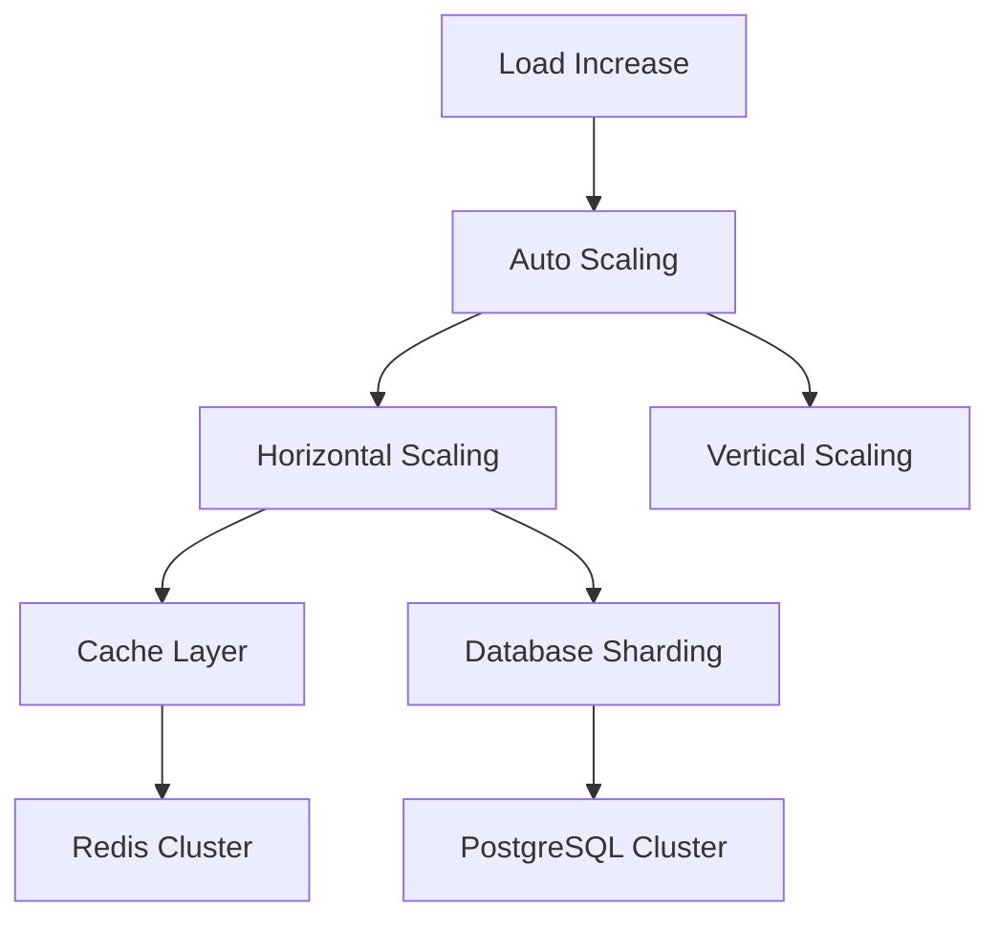

# Scaling Strategy

## 📈 Skalierungsübersicht



## 🚀 Application Scaling

### 1. Horizontal Scaling

```typescript
// Vercel Scaling Configuration
const scalingConfig = {
  // Auto-scaling Rules
  minInstances: 3,
  maxInstances: 10,
  
  // Regions
  regions: [
    'fra1',  // Frankfurt
    'lhr1',  // London
    'iad1'   // Virginia
  ],
  
  // Scale Triggers
  triggers: {
    cpu: {
      target: 70,    // 70% CPU utilization
      window: '5m'   // 5-minute average
    },
    memory: {
      target: 80,    // 80% memory utilization
      window: '5m'
    }
  }
};
```

### 2. Load Balancing

```typescript
// Load Balancer Configuration
const loadBalancer = {
  algorithm: 'least_connections',
  healthCheck: {
    path: '/api/health',
    interval: '10s',
    timeout: '5s',
    unhealthyThreshold: 2,
    healthyThreshold: 3
  },
  
  // SSL Termination
  ssl: {
    enabled: true,
    certificates: ['*.nextleveltraders.com'],
    minVersion: 'TLSv1.2'
  },
  
  // Rate Limiting
  rateLimit: {
    requests: 1000,
    period: '1m',
    burst: 50
  }
};
```

## 💾 Database Scaling

### 1. Connection Pooling

```typescript
// Database Pool Configuration
const dbPool = {
  min: 5,
  max: 20,
  idleTimeoutMillis: 30000,
  connectionTimeoutMillis: 2000,
  
  // Query Timeouts
  statement_timeout: 10000,    // 10s
  idle_in_transaction_session_timeout: 30000,  // 30s
  
  // SSL
  ssl: {
    rejectUnauthorized: true,
    ca: process.env.DB_CA_CERT
  }
};
```

### 2. Sharding Strategy

```typescript
const shardingStrategy = {
  // Shard Key Selection
  getShardKey(data: any): string {
    return `shard_${hashFunction(data.userId) % TOTAL_SHARDS}`;
  },
  
  // Shard Management
  async routeToShard(shardKey: string) {
    const shard = await getShardInfo(shardKey);
    return {
      connection: getShardConnection(shard),
      replica: getReplicaConnection(shard)
    };
  },
  
  // Rebalancing
  async rebalanceShards() {
    const shards = await getAllShards();
    const distribution = analyzeShardDistribution(shards);
    
    if (needsRebalancing(distribution)) {
      await rebalanceData(distribution);
    }
  }
};
```

## 🚀 Caching Strategy

### 1. Multi-Level Caching

```typescript
const cacheStrategy = {
  // Browser Cache
  browser: {
    static: '1y',
    api: '5m',
    images: '7d'
  },
  
  // CDN Cache
  cdn: {
    static: '1y',
    api: '1m',
    images: '30d'
  },
  
  // Application Cache
  redis: {
    session: '24h',
    api: '5m',
    rateLimit: '1m'
  }
};
```

### 2. Redis Cluster

```typescript
const redisCluster = {
  nodes: [
    {
      host: 'redis-1',
      port: 6379,
      role: 'master'
    },
    {
      host: 'redis-2',
      port: 6379,
      role: 'replica'
    },
    {
      host: 'redis-3',
      port: 6379,
      role: 'replica'
    }
  ],
  
  options: {
    maxRedirections: 16,
    retryDelayOnFailover: 100,
    enableReadyCheck: true
  }
};
```

## 📊 Monitoring & Alerts

### 1. Scaling Metrics

```typescript
const scalingMetrics = {
  // System Metrics
  system: {
    cpu: {
      threshold: 70,
      window: '5m',
      action: 'scale_up'
    },
    memory: {
      threshold: 80,
      window: '5m',
      action: 'scale_up'
    }
  },
  
  // Application Metrics
  application: {
    responseTime: {
      threshold: 500,  // ms
      window: '1m',
      action: 'alert'
    },
    errorRate: {
      threshold: 1,    // 1%
      window: '5m',
      action: 'alert'
    }
  },
  
  // Database Metrics
  database: {
    connections: {
      threshold: 80,   // 80% of max
      window: '1m',
      action: 'alert'
    },
    queryTime: {
      threshold: 1000, // ms
      window: '5m',
      action: 'alert'
    }
  }
};
```

### 2. Auto-Scaling Rules

```typescript
const autoScalingRules = {
  // Scale Up Rules
  scaleUp: {
    cpu: {
      threshold: 70,
      duration: '5m',
      increment: 1
    },
    memory: {
      threshold: 80,
      duration: '5m',
      increment: 1
    },
    responseTime: {
      threshold: 500,
      duration: '5m',
      increment: 2
    }
  },
  
  // Scale Down Rules
  scaleDown: {
    cpu: {
      threshold: 30,
      duration: '15m',
      decrement: 1
    },
    memory: {
      threshold: 40,
      duration: '15m',
      decrement: 1
    }
  }
};
```

## 🔄 Performance Optimierung

### 1. Query Optimierung

```typescript
const queryOptimizations = {
  // Indexing Strategy
  indexes: [
    {
      table: 'trades',
      columns: ['user_id', 'created_at'],
      type: 'btree'
    },
    {
      table: 'orders',
      columns: ['status', 'created_at'],
      type: 'btree'
    }
  ],
  
  // Query Patterns
  patterns: {
    pagination: {
      maxLimit: 100,
      defaultLimit: 20
    },
    sorting: {
      maxFields: 3
    },
    filtering: {
      maxConditions: 5
    }
  }
};
```

### 2. Asset Optimierung

```typescript
const assetOptimizations = {
  // Image Optimization
  images: {
    formats: ['webp', 'avif'],
    sizes: [
      { width: 640, height: 360 },
      { width: 1280, height: 720 },
      { width: 1920, height: 1080 }
    ],
    quality: 80
  },
  
  // JS/CSS Optimization
  bundling: {
    splitting: true,
    minification: true,
    treeshaking: true,
    compression: {
      brotli: true,
      gzip: true
    }
  }
};
```

## 📈 Capacity Planning

### 1. Resource Estimation

```typescript
const resourceEstimates = {
  // Per User
  perUser: {
    cpu: 0.1,    // CPU cores
    memory: 50,  // MB
    storage: 100 // MB
  },
  
  // Growth Projections
  growth: {
    users: {
      current: 10000,
      yearly: 2.5  // 250% yearly growth
    },
    data: {
      current: 500, // GB
      yearly: 3.0   // 300% yearly growth
    }
  }
};
```

### 2. Infrastructure Planning

```typescript
const infrastructurePlan = {
  // Current Setup
  current: {
    webServers: 5,
    dbServers: 3,
    cacheNodes: 3,
    storage: '1TB'
  },
  
  // 6 Month Projection
  sixMonths: {
    webServers: 10,
    dbServers: 5,
    cacheNodes: 6,
    storage: '3TB'
  },
  
  // 12 Month Projection
  oneYear: {
    webServers: 20,
    dbServers: 8,
    cacheNodes: 12,
    storage: '10TB'
  }
};