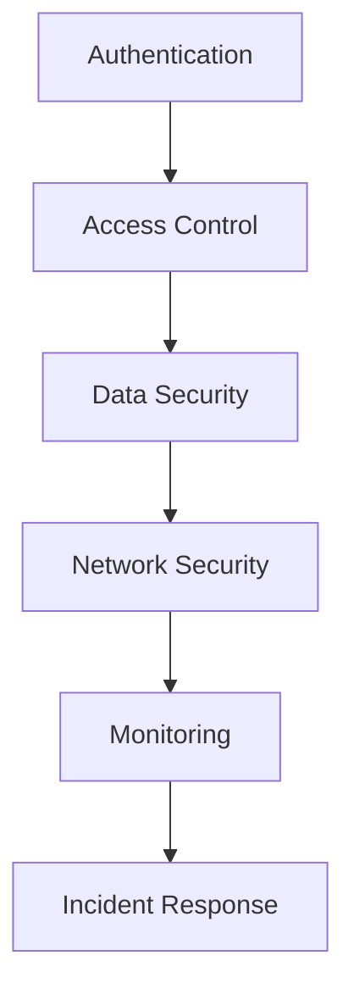

# Security Checklist

## 🔒 Sicherheitsübersicht



## 🔐 Authentication & Authorization

### 1. Authentication

- [ ] **Multi-Factor Authentication (MFA)**
  ```typescript
  const mfaConfig = {
    required: true,
    methods: ['authenticator', 'sms', 'email'],
    gracePerior: '7d',
    exceptions: ['health-check', 'webhook']
  };
  ```

- [ ] **Password Policy**
  ```typescript
  const passwordPolicy = {
    minLength: 12,
    requireUppercase: true,
    requireLowercase: true,
    requireNumbers: true,
    requireSpecialChars: true,
    maxAge: 90, // days
    preventReuse: 12 // last 12 passwords
  };
  ```

### 2. Authorization

- [ ] **Role-Based Access Control (RBAC)**
  ```typescript
  interface Role {
    name: string;
    permissions: Permission[];
    restrictions: Restriction[];
  }

  const roles = {
    admin: {
      name: 'Administrator',
      permissions: ['*'],
      restrictions: ['audit-logs']
    },
    trader: {
      name: 'Trader',
      permissions: ['read:market', 'write:orders'],
      restrictions: ['delete:orders']
    }
  };
  ```

## 🔒 Data Security

### 1. Data Encryption

- [ ] **Encryption at Rest**
  ```typescript
  const encryptionConfig = {
    algorithm: 'AES-256-GCM',
    keyRotation: '90d',
    backup: true
  };
  ```

- [ ] **Encryption in Transit**
  ```typescript
  const tlsConfig = {
    minVersion: 'TLSv1.2',
    preferredCipherSuites: [
      'TLS_AES_256_GCM_SHA384',
      'TLS_CHACHA20_POLY1305_SHA256'
    ]
  };
  ```

### 2. Data Classification

- [ ] **Sensitive Data Handling**
  ```typescript
  const dataClassification = {
    public: {
      retention: '7d',
      encryption: false
    },
    internal: {
      retention: '90d',
      encryption: true
    },
    confidential: {
      retention: '365d',
      encryption: true,
      audit: true
    }
  };
  ```

## 🛡️ Network Security

### 1. Firewall Rules

- [ ] **Inbound Rules**
  ```typescript
  const firewallRules = {
    inbound: [
      {
        port: 443,
        source: ['0.0.0.0/0'],
        protocol: 'tcp'
      },
      {
        port: 80,
        source: ['0.0.0.0/0'],
        protocol: 'tcp',
        action: 'redirect-to-https'
      }
    ]
  };
  ```

- [ ] **Outbound Rules**
  ```typescript
  const outboundRules = {
    default: 'deny',
    allow: [
      {
        destination: 'api.stripe.com',
        port: 443,
        protocol: 'tcp'
      },
      {
        destination: 'api.clerk.dev',
        port: 443,
        protocol: 'tcp'
      }
    ]
  };
  ```

### 2. Rate Limiting

- [ ] **API Rate Limits**
  ```typescript
  const rateLimits = {
    global: {
      requests: 1000,
      period: '1m'
    },
    endpoints: {
      'api/auth/*': {
        requests: 5,
        period: '1m'
      },
      'api/trading/*': {
        requests: 100,
        period: '1m'
      }
    }
  };
  ```

## 🔍 Security Monitoring

### 1. Logging

- [ ] **Security Events**
  ```typescript
  const securityEvents = {
    auth: [
      'login',
      'logout',
      'mfa-enabled',
      'mfa-disabled',
      'password-changed'
    ],
    access: [
      'permission-granted',
      'permission-revoked',
      'role-changed'
    ],
    data: [
      'data-exported',
      'pii-accessed',
      'record-deleted'
    ]
  };
  ```

### 2. Alerts

- [ ] **Security Alerts**
  ```typescript
  const securityAlerts = {
    critical: {
      channels: ['pagerduty', 'slack', 'email'],
      response: 'immediate'
    },
    high: {
      channels: ['slack', 'email'],
      response: '1h'
    },
    medium: {
      channels: ['slack'],
      response: '4h'
    }
  };
  ```

## 🚨 Incident Response

### 1. Response Plan

- [ ] **Incident Classification**
  ```typescript
  const incidentLevels = {
    critical: {
      description: 'System breach or data leak',
      response: 'immediate',
      team: ['security-lead', 'cto', 'legal']
    },
    high: {
      description: 'Unauthorized access attempt',
      response: '1h',
      team: ['security-team', 'devops']
    },
    medium: {
      description: 'Policy violation',
      response: '4h',
      team: ['security-team']
    }
  };
  ```

### 2. Communication Plan

- [ ] **Notification Matrix**
  ```typescript
  const notifications = {
    internal: {
      critical: ['management', 'security-team', 'all-staff'],
      high: ['security-team', 'affected-teams'],
      medium: ['security-team']
    },
    external: {
      critical: ['affected-users', 'authorities'],
      high: ['affected-users'],
      medium: []
    }
  };
  ```

## 📝 Compliance Requirements

### 1. GDPR Compliance

- [ ] **Data Subject Rights**
  ```typescript
  const gdprRights = {
    access: {
      timeframe: '30d',
      format: 'machine-readable'
    },
    deletion: {
      timeframe: '30d',
      verification: 'required'
    },
    portability: {
      timeframe: '30d',
      format: 'json'
    }
  };
  ```

### 2. Financial Compliance

- [ ] **Trade Monitoring**
  ```typescript
  const tradeMonitoring = {
    patterns: [
      'wash-trading',
      'front-running',
      'insider-trading'
    ],
    reporting: {
      frequency: 'daily',
      recipients: ['compliance-team']
    },
    retention: '7y'
  };
  ```

## 🔄 Regular Reviews

### 1. Security Reviews

- [ ] **Weekly**
  - Access logs review
  - Failed login attempts
  - Rate limit violations
  - Security alerts

- [ ] **Monthly**
  - User access review
  - Permission audit
  - Certificate expiration check
  - Dependency security audit

- [ ] **Quarterly**
  - Penetration testing
  - Security training
  - Policy review
  - Disaster recovery test

### 2. Documentation

- [ ] **Required Documentation**
  ```typescript
  const securityDocs = {
    policies: [
      'security-policy.md',
      'access-control.md',
      'incident-response.md'
    ],
    procedures: [
      'security-review.md',
      'access-management.md',
      'incident-handling.md'
    ],
    training: [
      'security-awareness.md',
      'incident-response.md',
      'data-handling.md'
    ]
  };
  ```

## ✅ Implementation Checklist

### 1. New Features

- [ ] Security review completed
- [ ] Threat modeling performed
- [ ] Access controls implemented
- [ ] Input validation added
- [ ] Output encoding implemented
- [ ] Error handling secured
- [ ] Logging implemented
- [ ] Security tests written

### 2. Deployment

- [ ] Security headers configured
- [ ] TLS configured
- [ ] Firewall rules updated
- [ ] Monitoring enabled
- [ ] Backups verified
- [ ] Rollback tested
- [ ] Documentation updated