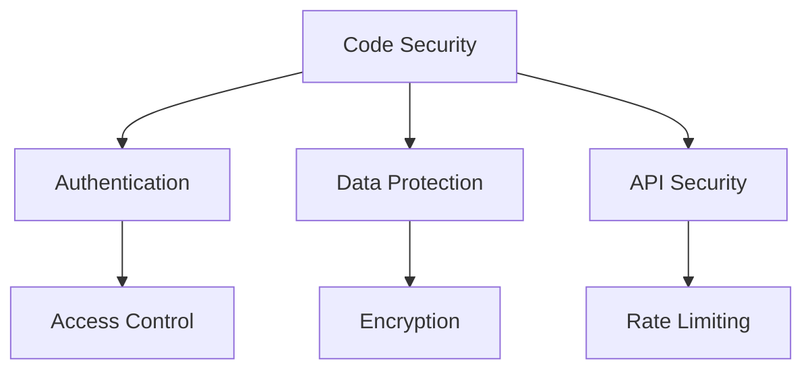

# Security Guidelines

## 🔐 Security-Übersicht



## 🔒 Authentication & Authorization

### 1. Authentication Best Practices

```typescript
const authGuidelines = {
  // Password Requirements
  password: {
    minLength: 12,
    requirements: [
      'Uppercase letter',
      'Lowercase letter',
      'Number',
      'Special character'
    ],
    hashingAlgorithm: 'bcrypt',
    saltRounds: 12
  },
  
  // MFA Configuration
  mfa: {
    required: true,
    methods: [
      'TOTP (Authenticator)',
      'SMS Backup',
      'Security Keys (WebAuthn)'
    ],
    gracePeroid: '7 days'
  }
};
```

### 2. Session Management

```typescript
const sessionSecurity = {
  // Session Configuration
  config: {
    httpOnly: true,
    secure: true,
    sameSite: 'strict',
    maxAge: '24h',
    rotateOnAuth: true
  },
  
  // Session Validation
  validation: `
    function validateSession(session: Session) {
      return (
        session.isValid() &&
        !session.isExpired() &&
        !session.isRevoked() &&
        session.deviceMatch()
      );
    }
  `
};
```

## 🛡️ Data Protection

### 1. Encryption Standards

```typescript
const encryptionStandards = {
  // At Rest
  atRest: {
    algorithm: 'AES-256-GCM',
    keyManagement: 'AWS KMS',
    keyRotation: '90 days'
  },
  
  // In Transit
  inTransit: {
    tls: {
      minVersion: 'TLS 1.3',
      ciphers: [
        'TLS_AES_256_GCM_SHA384',
        'TLS_CHACHA20_POLY1305_SHA256'
      ]
    }
  }
};
```

### 2. Data Classification

```typescript
const dataClassification = {
  // Classification Levels
  levels: {
    public: {
      description: 'Publicly available data',
      examples: ['Market Data', 'Company Info'],
      protection: 'Basic'
    },
    internal: {
      description: 'Internal use only',
      examples: ['Analytics', 'Logs'],
      protection: 'Encrypted'
    },
    confidential: {
      description: 'Sensitive business data',
      examples: ['User Data', 'Trade Data'],
      protection: 'Encrypted + Access Control'
    },
    restricted: {
      description: 'Highly sensitive data',
      examples: ['Credentials', 'Keys'],
      protection: 'Max Security'
    }
  }
};
```

## 🌐 API Security

### 1. Input Validation

```typescript
const inputValidation = {
  // Validation Rules
  rules: {
    sanitization: `
      function sanitizeInput(input: unknown) {
        return {
          // Remove dangerous characters
          stripTags: stripHtmlTags(input),
          // Escape special characters
          escape: escapeSpecialChars(input),
          // Normalize data
          normalize: normalizeData(input)
        };
      }
    `,
    
    validation: `
      const schema = z.object({
        email: z.string().email(),
        password: z.string().min(12),
        amount: z.number().positive()
      });
    `
  }
};
```

### 2. Rate Limiting

```typescript
const rateLimiting = {
  // Rate Limit Configuration
  config: {
    public: {
      requests: 60,
      window: '1m',
      blockDuration: '1h'
    },
    authenticated: {
      requests: 1000,
      window: '1m',
      blockDuration: '15m'
    }
  },
  
  // Implementation
  implementation: `
    export const rateLimit = new RateLimit({
      windowMs: 60 * 1000,
      max: (req) => isAuthenticated(req) ? 1000 : 60,
      handler: (req, res) => {
        throw new RateLimitExceeded();
      }
    });
  `
};
```

## 🔍 Security Monitoring

### 1. Logging & Auditing

```typescript
const securityMonitoring = {
  // Security Events
  events: {
    auth: [
      'Login attempts',
      'Password changes',
      'MFA changes',
      'Permission changes'
    ],
    data: [
      'Data access',
      'Data modifications',
      'Data exports'
    ],
    system: [
      'Configuration changes',
      'API key usage',
      'Error conditions'
    ]
  },
  
  // Audit Trails
  audit: `
    async function auditLog(event: SecurityEvent) {
      await logger.log({
        type: event.type,
        user: event.user,
        action: event.action,
        resource: event.resource,
        timestamp: new Date(),
        metadata: event.metadata
      });
    }
  `
};
```

### 2. Alerting

```typescript
const securityAlerts = {
  // Alert Conditions
  conditions: {
    critical: [
      'Multiple failed login attempts',
      'Unauthorized access attempts',
      'Suspicious transactions'
    ],
    high: [
      'Unusual access patterns',
      'Configuration changes',
      'Rate limit exceeded'
    ],
    medium: [
      'New IP addresses',
      'New devices',
      'Pattern anomalies'
    ]
  },
  
  // Alert Handling
  handling: `
    async function handleSecurityAlert(alert: SecurityAlert) {
      // 1. Log alert
      await logAlert(alert);
      
      // 2. Notify team
      if (alert.severity === 'critical') {
        await notifySecurityTeam(alert);
      }
      
      // 3. Take action
      await executeResponse(alert);
    }
  `
};
```

## 🚨 Incident Response

### 1. Response Plan

```typescript
const incidentResponse = {
  // Response Steps
  steps: {
    identification: [
      'Detect incident',
      'Assess severity',
      'Initial containment'
    ],
    containment: [
      'Isolate affected systems',
      'Block attack vectors',
      'Preserve evidence'
    ],
    eradication: [
      'Remove threat',
      'Patch vulnerabilities',
      'Update security'
    ],
    recovery: [
      'Restore systems',
      'Verify security',
      'Resume operations'
    ]
  }
};
```

### 2. Communication Plan

```typescript
const communicationPlan = {
  // Stakeholder Communication
  stakeholders: {
    internal: {
      security: 'security@nextleveltraders.com',
      management: 'management@nextleveltraders.com',
      legal: 'legal@nextleveltraders.com'
    },
    external: {
      users: 'Affected users',
      authorities: 'If required by law',
      public: 'Public disclosure if needed'
    }
  },
  
  // Communication Templates
  templates: {
    notification: 'Security incident notification',
    update: 'Incident status update',
    resolution: 'Incident resolution notice'
  }
};