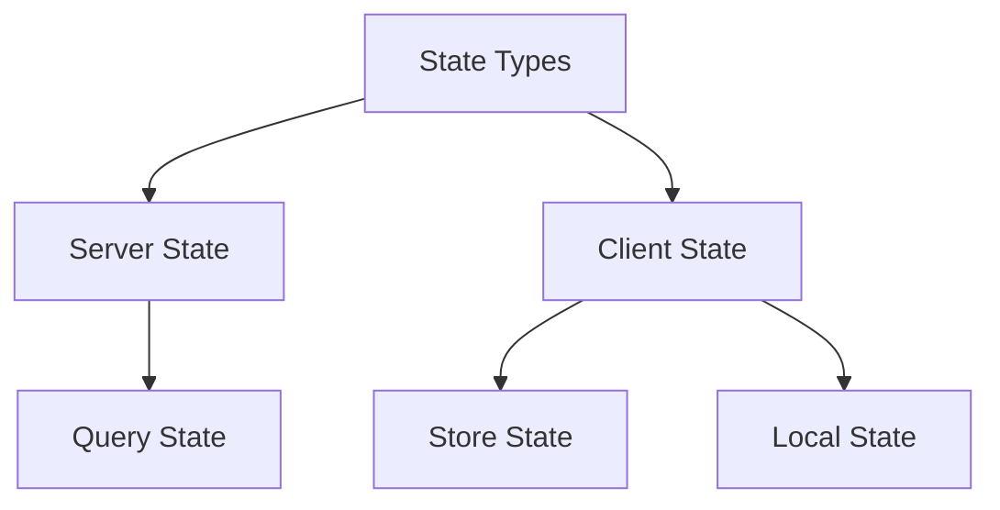

# State Management

## 🔄 State-Übersicht



## 📊 State Kategorien

### 1. Server State (TanStack Query)

```typescript
// Query Definition
const useTrades = () => {
  return useQuery({
    queryKey: ['trades'],
    queryFn: async () => {
      const response = await fetch('/api/trades');
      return response.json();
    },
    staleTime: 1000 * 60, // 1 minute
    cacheTime: 1000 * 60 * 5 // 5 minutes
  });
};

// Query mit Parametern
const useTradeHistory = (symbol: string) => {
  return useQuery({
    queryKey: ['trades', symbol],
    queryFn: () => fetchTradeHistory(symbol),
    enabled: Boolean(symbol)
  });
};

// Mutation
const useCreateTrade = () => {
  return useMutation({
    mutationFn: (trade: Trade) => {
      return fetch('/api/trades', {
        method: 'POST',
        body: JSON.stringify(trade)
      });
    },
    onSuccess: () => {
      queryClient.invalidateQueries(['trades']);
    }
  });
};
```

### 2. Client State (Zustand)

```typescript
// Global Store
interface AppStore {
  theme: 'light' | 'dark';
  setTheme: (theme: 'light' | 'dark') => void;
  sidebarOpen: boolean;
  toggleSidebar: () => void;
}

const useAppStore = create<AppStore>((set) => ({
  theme: 'light',
  setTheme: (theme) => set({ theme }),
  sidebarOpen: false,
  toggleSidebar: () => set((state) => ({ 
    sidebarOpen: !state.sidebarOpen 
  }))
}));

// Feature Store
interface TradingStore {
  selectedSymbol: string | null;
  watchlist: string[];
  orderBook: OrderBook;
  
  setSelectedSymbol: (symbol: string) => void;
  addToWatchlist: (symbol: string) => void;
  updateOrderBook: (orders: OrderBook) => void;
}

const useTradingStore = create<TradingStore>((set) => ({
  // State und Actions
}));
```

### 3. Local State (React)

```typescript
// Component State
const TradingForm = () => {
  // Form State
  const [amount, setAmount] = useState<number>(0);
  const [type, setType] = useState<'buy' | 'sell'>('buy');
  
  // Validation State
  const [errors, setErrors] = useState<Record<string, string>>({});
  
  // Derived State
  const isValid = useMemo(() => {
    return amount > 0 && !Object.keys(errors).length;
  }, [amount, errors]);
  
  return (
    <form>
      {/* Form JSX */}
    </form>
  );
};
```

## 🔄 State Updates

### 1. Immutable Updates

```typescript
// ✅ Gut: Immutable Array Updates
const addItem = (items: Item[], newItem: Item) => {
  return [...items, newItem];
};

const removeItem = (items: Item[], id: string) => {
  return items.filter(item => item.id !== id);
};

const updateItem = (items: Item[], updatedItem: Item) => {
  return items.map(item =>
    item.id === updatedItem.id ? updatedItem : item
  );
};

// ✅ Gut: Immutable Object Updates
const updateUser = (user: User, updates: Partial<User>) => {
  return {
    ...user,
    ...updates
  };
};
```

### 2. Batch Updates

```typescript
// ✅ Gut: Batch State Updates
const handleTrade = () => {
  batch(() => {
    // Update Portfolio
    setPortfolio(prev => updatePortfolio(prev, trade));
    
    // Update Balance
    setBalance(prev => prev - trade.amount);
    
    // Update Trade History
    setTradeHistory(prev => [...prev, trade]);
  });
};
```

## 🔐 State Persistence

### 1. Local Storage

```typescript
// Persistence Middleware
const persistMiddleware = (config: PersistConfig) =>
  (set: SetState<any>, get: GetState<any>) =>
    Object.assign({}, {
      ...config.initialState,
      set: (fn: SetState<any>) => {
        set(fn);
        if (typeof window !== 'undefined') {
          localStorage.setItem(
            config.key,
            JSON.stringify(get())
          );
        }
      }
    });

// Usage
const usePersistedStore = create(
  persistMiddleware({
    key: 'app-state',
    initialState: {
      theme: 'light',
      settings: {}
    }
  })
);
```

### 2. Sync State

```typescript
// State Synchronization
const syncState = () => {
  // Listen to Storage Events
  window.addEventListener('storage', (e) => {
    if (e.key === 'app-state') {
      const newState = JSON.parse(e.newValue || '{}');
      useAppStore.setState(newState);
    }
  });
  
  // Listen to Online/Offline
  window.addEventListener('online', () => {
    synchronizeWithServer();
  });
};
```

## 📊 Performance Optimierung

### 1. Selektive Re-Renders

```typescript
// ✅ Gut: Selektive Store Subscriptions
const useTheme = () => useAppStore(
  (state) => state.theme
);

const useSidebarState = () => useAppStore(
  (state) => state.sidebarOpen
);

// ✅ Gut: Memoized Selectors
const useFilteredTrades = () => {
  const trades = useTradingStore(
    (state) => state.trades
  );
  
  return useMemo(
    () => filterTrades(trades),
    [trades]
  );
};
```

### 2. State Normalisierung

```typescript
// ✅ Gut: Normalisierte State Struktur
interface NormalizedState {
  entities: {
    trades: Record<string, Trade>;
    orders: Record<string, Order>;
    users: Record<string, User>;
  };
  ids: {
    trades: string[];
    orders: string[];
    users: string[];
  };
}

// Selektoren
const selectTrade = (state: NormalizedState, id: string) =>
  state.entities.trades[id];

const selectUserTrades = (state: NormalizedState, userId: string) =>
  state.ids.trades
    .map(id => state.entities.trades[id])
    .filter(trade => trade.userId === userId);
```

## 🔍 Debugging

### 1. DevTools Integration

```typescript
// Store DevTools
const useStore = create(
  devtools(
    (set) => ({
      // Store implementation
    }),
    {
      name: 'AppStore',
      trace: true
    }
  )
);

// Query DevTools
const queryClient = new QueryClient({
  defaultOptions: {
    queries: {
      retry: false
    }
  }
});

if (process.env.NODE_ENV === 'development') {
  import('react-query-devtools').then(({ ReactQueryDevtools }) => {
    ReactQueryDevtools.init();
  });
}
```

### 2. Logging Middleware

```typescript
// State Logging
const logMiddleware = (config = {}) =>
  (set: SetState<any>, get: GetState<any>) =>
    Object.assign({}, {
      set: (fn: SetState<any>) => {
        const prev = get();
        set(fn);
        const next = get();
        console.log('State Update:', {
          prev,
          next,
          diff: getDiff(prev, next)
        });
      }
    });

// Usage
const useStore = create(
  logMiddleware()(
    (set) => ({
      // Store implementation
    })
  )
);