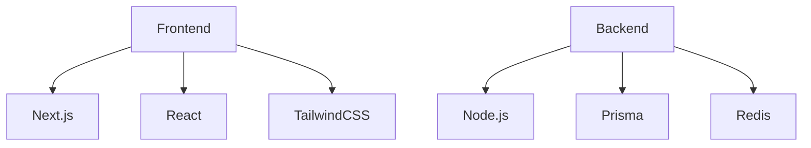

# Technology Stack

## 🚀 Stack-Übersicht



## 🎨 Frontend Technologies

### 1. Core Framework

```typescript
const frontendCore = {
  // Next.js
  next: {
    version: '14.x',
    features: [
      'App Router',
      'Server Components',
      'Server Actions',
      'Edge Runtime'
    ],
    benefits: [
      'Server-Side Rendering',
      'Static Site Generation',
      'API Routes',
      'Image Optimization'
    ]
  },
  
  // React
  react: {
    version: '18.x',
    features: [
      'Hooks',
      'Suspense',
      'Server Components',
      'Streaming SSR'
    ],
    patterns: [
      'Custom Hooks',
      'Compound Components',
      'Render Props',
      'HOCs'
    ]
  }
};
```

### 2. UI & Styling

```typescript
const uiStack = {
  // TailwindCSS
  tailwind: {
    version: '3.x',
    features: [
      'JIT Compiler',
      'CSS Variables',
      'Dark Mode',
      'Custom Plugins'
    ],
    tools: [
      'PostCSS',
      'Autoprefixer',
      'CSS Nesting'
    ]
  },
  
  // UI Components
  components: {
    shadcn: 'Radix-based components',
    headlessui: 'Unstyled components',
    framerMotion: 'Animations',
    icons: 'Lucide icons'
  }
};
```

## 💻 Backend Technologies

### 1. Server Runtime

```typescript
const backendCore = {
  // Node.js
  node: {
    version: '18.x',
    features: [
      'ESM Support',
      'Web Streams',
      'Worker Threads',
      'Native Fetch'
    ],
    runtime: {
      edge: 'Vercel Edge Runtime',
      serverless: 'Vercel Functions'
    }
  },
  
  // API Framework
  api: {
    rest: 'Next.js API Routes',
    rpc: 'tRPC',
    graphql: 'Apollo Server'
  }
};
```

### 2. Database & Caching

```typescript
const dataStack = {
  // Database
  database: {
    primary: {
      type: 'PostgreSQL',
      version: '14.x',
      orm: 'Prisma',
      hosting: 'Supabase'
    },
    features: [
      'Migrations',
      'Type Safety',
      'Relationships',
      'Full-text Search'
    ]
  },
  
  // Caching
  cache: {
    provider: 'Redis',
    hosting: 'Upstash',
    usage: [
      'API Caching',
      'Session Storage',
      'Rate Limiting',
      'Job Queue'
    ]
  }
};
```

## 🔒 Authentication & Security

### 1. Authentication

```typescript
const authStack = {
  // Authentication Provider
  auth: {
    provider: 'Clerk',
    features: [
      'OAuth Providers',
      'MFA Support',
      'Session Management',
      'User Management'
    ],
    security: [
      'JWT Tokens',
      'PKCE Flow',
      'Rate Limiting',
      'Fraud Protection'
    ]
  },
  
  // Authorization
  rbac: {
    system: 'Custom RBAC',
    storage: 'PostgreSQL',
    caching: 'Redis'
  }
};
```

### 2. Security Tools

```typescript
const securityStack = {
  // Security Measures
  security: {
    headers: 'Helmet.js',
    csrf: 'Custom Tokens',
    rateLimit: 'Upstash Rate Limit',
    scanning: 'Snyk'
  },
  
  // Monitoring
  monitoring: {
    errors: 'Sentry',
    performance: 'Vercel Analytics',
    logs: 'Vercel Logs'
  }
};
```

## 📊 Data & Analytics

### 1. Market Data

```typescript
const dataStack = {
  // Market Data Providers
  marketData: {
    realtime: 'WebSocket API',
    historical: 'REST API',
    providers: [
      'Alpha Vantage',
      'Finnhub',
      'Polygon.io'
    ]
  },
  
  // Analytics
  analytics: {
    tools: [
      'TradingView Charts',
      'Technical Indicators',
      'Portfolio Analytics'
    ],
    storage: {
      timeSeries: 'TimescaleDB',
      analytics: 'PostgreSQL'
    }
  }
};
```

### 2. Machine Learning

```typescript
const mlStack = {
  // ML Infrastructure
  infrastructure: {
    training: 'Python Scripts',
    inference: 'TensorFlow.js',
    deployment: 'Edge Functions'
  },
  
  // ML Features
  features: {
    prediction: [
      'Price Prediction',
      'Trend Analysis',
      'Risk Assessment'
    ],
    models: [
      'LSTM Networks',
      'Random Forest',
      'Gradient Boosting'
    ]
  }
};
```

## 🚀 DevOps & Infrastructure

### 1. CI/CD

```typescript
const devopsStack = {
  // CI/CD Pipeline
  cicd: {
    platform: 'GitHub Actions',
    processes: [
      'Automated Testing',
      'Code Quality',
      'Security Scans',
      'Automated Deployment'
    ]
  },
  
  // Infrastructure
  infrastructure: {
    hosting: 'Vercel',
    cdn: 'Vercel Edge Network',
    monitoring: 'Datadog',
    logging: 'Vercel Logs'
  }
};
```

### 2. Development Tools

```typescript
const devTools = {
  // Development Environment
  environment: {
    editor: 'VS Code',
    extensions: [
      'ESLint',
      'Prettier',
      'GitLens',
      'Tailwind CSS IntelliSense'
    ],
    containerization: 'Docker'
  },
  
  // Testing Tools
  testing: {
    unit: 'Jest',
    integration: 'Testing Library',
    e2e: 'Playwright',
    api: 'SuperTest'
  }
};