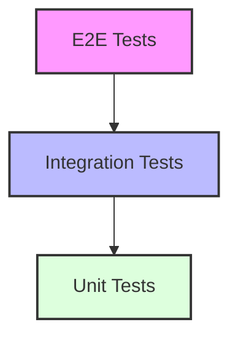

# Testing Strategie

## 🎯 Test-Pyramide



## 🧪 Test-Arten

### 1. Unit Tests

```typescript
// Component Test
describe("Button", () => {
  it("renders with default props", () => {
    render(<Button>Click me</Button>);
    expect(screen.getByRole("button")).toHaveTextContent("Click me");
  });

  it("handles click events", async () => {
    const onPress = jest.fn();
    render(<Button onClick={onPress}>Click me</Button>);
    
    await userEvent.click(screen.getByRole("button"));
    expect(onPress).toHaveBeenCalledTimes(1);
  });
});

// Hook Test
describe("useAuth", () => {
  it("returns user when logged in", () => {
    const { result } = renderHook(() => useAuth());
    expect(result.current.user).toBeDefined();
  });
});

// Utility Test
describe("formatCurrency", () => {
  it("formats EUR correctly", () => {
    expect(formatCurrency(42.42)).toBe("42,42 €");
  });
});
```

### 2. Integration Tests

```typescript
describe("Trading Flow", () => {
  it("allows placing an order", async () => {
    // Setup
    const { user } = renderWithProviders(<TradingPage />);
    
    // Enter order details
    await user.type(screen.getByLabelText(/amount/i), "100");
    await user.selectOptions(screen.getByLabelText(/type/i), "buy");
    
    // Submit order
    await user.click(screen.getByRole("button", { name: /place order/i }));
    
    // Verify
    expect(await screen.findByText(/order placed/i)).toBeInTheDocument();
  });
});
```

### 3. E2E Tests

```typescript
test("complete trading workflow", async ({ page }) => {
  // Login
  await page.goto("/login");
  await page.fill("[name=email]", "test@example.com");
  await page.fill("[name=password]", "password");
  await page.click("button[type=submit]");

  // Navigate to trading
  await page.click("text=Trading");
  
  // Place order
  await page.fill("[name=amount]", "100");
  await page.selectOption("[name=type]", "buy");
  await page.click("button:has-text('Place Order')");
  
  // Verify
  await expect(page.locator("text=Order Placed")).toBeVisible();
});
```

## 📋 Test-Konventionen

### 1. Datei-Struktur

```
src/
├── components/
│   ├── Button.tsx
│   ├── Button.test.tsx      # Unit Tests
│   └── Button.e2e.test.ts   # E2E Tests
├── hooks/
│   ├── useAuth.ts
│   └── useAuth.test.ts
└── utils/
    ├── format.ts
    └── format.test.ts
```

### 2. Namenskonventionen

```typescript
describe("ComponentName", () => {
  // ✅ Gut
  it("renders without crashing", () => {});
  it("displays error message when API fails", () => {});
  it("updates count when clicked", () => {});

  // ❌ Schlecht
  it("test 1", () => {});
  it("should work", () => {});
  it("testing component", () => {});
});
```

## 🛠️ Testing Utilities

### 1. Custom Renders

```typescript
// test-utils.ts
export function renderWithProviders(
  ui: React.ReactElement,
  options: RenderOptions = {}
) {
  return render(
    <Providers>
      {ui}
    </Providers>,
    options
  );
}
```

### 2. Test Hooks

```typescript
// useTestId.ts
export function useTestId(component: string, element?: string) {
  return `${component}${element ? `-${element}` : ""}`;
}

// Verwendung
<button data-testid={useTestId("login-form", "submit")}>
```

## 🔄 Test Lifecycle

### 1. Setup & Teardown

```typescript
describe("DatabaseTests", () => {
  beforeAll(async () => {
    await db.connect();
  });

  afterAll(async () => {
    await db.disconnect();
  });

  beforeEach(async () => {
    await db.clear();
  });
});
```

### 2. Mocking

```typescript
// API Mocks
jest.mock("@/lib/api", () => ({
  fetchUser: jest.fn().mockResolvedValue({
    id: "1",
    name: "Test User"
  })
}));

// Time Mocks
jest.useFakeTimers();
jest.setSystemTime(new Date("2025-03-04"));

// Environment Mocks
const mockEnv = {
  NEXT_PUBLIC_API_URL: "http://test.api"
};

jest.mock("@/env.mjs", () => ({
  env: mockEnv
}));
```

## 📊 Test Coverage

### 1. Coverage Ziele

| Category    | Target |
|-------------|--------|
| Statements  | > 80%  |
| Branches    | > 75%  |
| Functions   | > 85%  |
| Lines       | > 80%  |

### 2. Coverage Report

```bash
# Generate coverage report
npm run test:coverage

# HTML report: coverage/index.html
```

## 🚀 CI/CD Integration

### 1. GitHub Actions

```yaml
name: Tests
on: [push, pull_request]
jobs:
  test:
    runs-on: ubuntu-latest
    steps:
      - uses: actions/checkout@v3
      - uses: actions/setup-node@v3
      - run: npm ci
      - run: npm test
      - run: npm run test:e2e
```

### 2. Pre-commit Hooks

```bash
# .husky/pre-commit
npm run test:changed
```

## 🔍 Test Monitoring

### 1. Test Reports

```typescript
// jest.config.js
module.exports = {
  reporters: [
    "default",
    ["jest-junit", {
      outputDirectory: "reports/junit",
      outputName: "jest-junit.xml",
    }]
  ]
};
```

### 2. Test Analytics

- Test Execution Time
- Failure Rates
- Coverage Trends
- Flaky Tests

## 📚 Best Practices

### 1. SOLID Testing

```typescript
// ✅ Gut: Ein Test testet eine Sache
it("updates count when clicked", async () => {
  const { getByRole } = render(<Counter />);
  await userEvent.click(getByRole("button"));
  expect(getByRole("heading")).toHaveTextContent("1");
});

// ❌ Schlecht: Mehrere Tests in einem
it("counter works", async () => {
  const { getByRole } = render(<Counter />);
  expect(getByRole("heading")).toHaveTextContent("0");
  await userEvent.click(getByRole("button"));
  expect(getByRole("heading")).toHaveTextContent("1");
  await userEvent.click(getByRole("button"));
  expect(getByRole("heading")).toHaveTextContent("2");
});
```

### 2. Arrange-Act-Assert

```typescript
it("submits form with valid data", async () => {
  // Arrange
  const onSubmit = jest.fn();
  render(<LoginForm onSubmit={onSubmit} />);

  // Act
  await userEvent.type(screen.getByLabelText(/email/i), "test@example.com");
  await userEvent.type(screen.getByLabelText(/password/i), "password");
  await userEvent.click(screen.getByRole("button", { name: /submit/i }));

  // Assert
  expect(onSubmit).toHaveBeenCalledWith({
    email: "test@example.com",
    password: "password"
  });
});
```

## 🐛 Debug Tools

### 1. Debug Utilities

```typescript
// debug.ts
export const debug = {
  component: (container: HTMLElement) => {
    console.log(prettyDOM(container));
  },
  element: (element: HTMLElement) => {
    console.log(prettyDOM(element));
  }
};

// Verwendung
it("renders correctly", () => {
  const { container } = render(<MyComponent />);
  debug.component(container);
});
```

### 2. Test Playground

```typescript
// screen.logTestingPlaygroundURL();
// Öffnet Testing Playground mit aktuellem DOM
```

## 📈 Continuous Improvement

### 1. Test Review Process

- Code Review für Tests
- Test Coverage Reviews
- Performance Reviews
- Flaky Test Analyse

### 2. Test Maintenance

- Regelmäßige Test Updates
- Entfernung veralteter Tests
- Refactoring von Test Code
- Documentation Updates