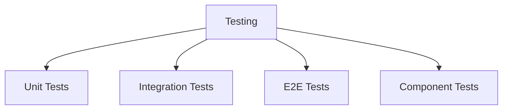

# Testing Patterns

## 🧪 Test-Übersicht



## 📋 Unit Tests

### 1. Test Structure

```typescript
// Test Helpers
const createTestUser = (overrides = {}) => ({
  id: 'test-id',
  email: 'test@example.com',
  name: 'Test User',
  ...overrides
});

// Service Test
describe('UserService', () => {
  let userService: UserService;
  let mockRepository: MockType<UserRepository>;
  
  beforeEach(() => {
    mockRepository = createMockRepository();
    userService = new UserService(mockRepository);
  });
  
  describe('createUser', () => {
    it('creates a new user with valid data', async () => {
      // Arrange
      const userData = createTestUser();
      mockRepository.create.mockResolvedValue(userData);
      
      // Act
      const result = await userService.createUser(userData);
      
      // Assert
      expect(result).toEqual(userData);
      expect(mockRepository.create).toHaveBeenCalledWith(userData);
    });
    
    it('throws error with invalid data', async () => {
      // Arrange
      const invalidData = {};
      
      // Act & Assert
      await expect(
        userService.createUser(invalidData)
      ).rejects.toThrow('Invalid user data');
    });
  });
});
```

### 2. Mock Patterns

```typescript
// Mock Factory
const createMockRepository = () => ({
  create: jest.fn(),
  findById: jest.fn(),
  update: jest.fn(),
  delete: jest.fn()
});

// API Mock
const createMockApi = () => ({
  get: jest.fn(),
  post: jest.fn(),
  put: jest.fn(),
  delete: jest.fn()
});

// Context Mock
const TestProvider = ({ children, value }) => (
  <TestContext.Provider value={value}>
    {children}
  </TestContext.Provider>
);

// Hook Test
const renderHook = (hook: Function, context = {}) => {
  let result: any;
  
  function TestComponent() {
    result = hook();
    return null;
  }
  
  render(
    <TestProvider value={context}>
      <TestComponent />
    </TestProvider>
  );
  
  return result;
};
```

## 🔄 Integration Tests

### 1. API Tests

```typescript
// API Test Setup
const setupApiTest = () => {
  const api = createTestApi();
  const db = createTestDatabase();
  
  beforeAll(async () => {
    await db.connect();
  });
  
  afterAll(async () => {
    await db.disconnect();
  });
  
  afterEach(async () => {
    await db.cleanup();
  });
  
  return { api, db };
};

// API Test Example
describe('Trade API', () => {
  const { api, db } = setupApiTest();
  
  describe('POST /api/trades', () => {
    it('creates a new trade', async () => {
      // Arrange
      const trade = createTestTrade();
      
      // Act
      const response = await api
        .post('/api/trades')
        .send(trade);
      
      // Assert
      expect(response.status).toBe(201);
      expect(response.body).toMatchObject(trade);
      
      // Verify Database
      const savedTrade = await db.trades.findById(
        response.body.id
      );
      expect(savedTrade).toMatchObject(trade);
    });
  });
});
```

### 2. Database Tests

```typescript
// Database Test Setup
const setupDbTest = () => {
  const prisma = new PrismaClient();
  
  beforeAll(async () => {
    await prisma.$connect();
  });
  
  afterAll(async () => {
    await prisma.$disconnect();
  });
  
  afterEach(async () => {
    await prisma.$transaction([
      prisma.trade.deleteMany(),
      prisma.user.deleteMany()
    ]);
  });
  
  return prisma;
};

// Repository Test
describe('TradeRepository', () => {
  const prisma = setupDbTest();
  let repository: TradeRepository;
  
  beforeEach(() => {
    repository = new TradeRepository(prisma);
  });
  
  describe('createTrade', () => {
    it('persists trade to database', async () => {
      // Arrange
      const trade = createTestTrade();
      
      // Act
      const result = await repository.create(trade);
      
      // Assert
      const saved = await prisma.trade.findUnique({
        where: { id: result.id }
      });
      expect(saved).toMatchObject(trade);
    });
  });
});
```

## 🖥️ Component Tests

### 1. Component Testing

```typescript
// Component Test Setup
const setupComponentTest = () => {
  const user = userEvent.setup();
  
  const renderComponent = (
    ui: React.ReactElement,
    options = {}
  ) => {
    return render(ui, {
      wrapper: TestProvider,
      ...options
    });
  };
  
  return { user, renderComponent };
};

// Component Test Example
describe('TradingForm', () => {
  const { user, renderComponent } = setupComponentTest();
  
  it('submits trade with valid data', async () => {
    // Arrange
    const onSubmit = jest.fn();
    renderComponent(
      <TradingForm onSubmit={onSubmit} />
    );
    
    // Act
    await user.type(
      screen.getByLabelText(/amount/i),
      '100'
    );
    await user.click(
      screen.getByRole('button', { name: /buy/i })
    );
    
    // Assert
    expect(onSubmit).toHaveBeenCalledWith({
      amount: 100,
      type: 'buy'
    });
  });
});
```

### 2. Custom Matchers

```typescript
// Custom Jest Matchers
expect.extend({
  toHaveValidationError(
    element: HTMLElement,
    expectedError: string
  ) {
    const error = element.getAttribute('aria-errormessage');
    const errorElement = document.getElementById(error || '');
    
    return {
      pass: errorElement?.textContent === expectedError,
      message: () => `Expected element to have validation error "${expectedError}"`
    };
  },
  
  toBeValidInput(element: HTMLElement) {
    const isValid = !element.getAttribute('aria-invalid');
    
    return {
      pass: isValid,
      message: () => `Expected element to be valid input`
    };
  }
});

// Usage
it('shows validation errors', async () => {
  // Arrange
  renderComponent(<TradingForm />);
  
  // Act
  await user.click(
    screen.getByRole('button', { name: /buy/i })
  );
  
  // Assert
  expect(
    screen.getByLabelText(/amount/i)
  ).toHaveValidationError('Amount is required');
});
```

## 🔄 E2E Tests

### 1. Test Setup

```typescript
// Playwright Setup
const test = base.extend({
  // Custom Fixture
  loggedInPage: async ({ page }, use) => {
    await page.goto('/login');
    await page.fill('[name=email]', 'test@example.com');
    await page.fill('[name=password]', 'password');
    await page.click('button[type=submit]');
    await page.waitForURL('/dashboard');
    
    await use(page);
  }
});

// Global Setup
async function globalSetup() {
  // Setup Test Database
  const db = createTestDatabase();
  await db.migrate();
  await db.seed();
  
  // Setup Test Users
  await createTestUsers();
}
```

### 2. Test Cases

```typescript
// E2E Test Example
test.describe('Trading Flow', () => {
  test('user can place trade', async ({ loggedInPage: page }) => {
    // Navigate to trading page
    await page.goto('/trading');
    
    // Fill trade details
    await page.fill('[name=amount]', '100');
    await page.selectOption('[name=type]', 'buy');
    
    // Submit trade
    await page.click('button[type=submit]');
    
    // Verify success
    await expect(page.locator('.toast')).toContainText(
      'Trade placed successfully'
    );
    
    // Verify trade in list
    await expect(page.locator('table')).toContainText('100');
  });
});