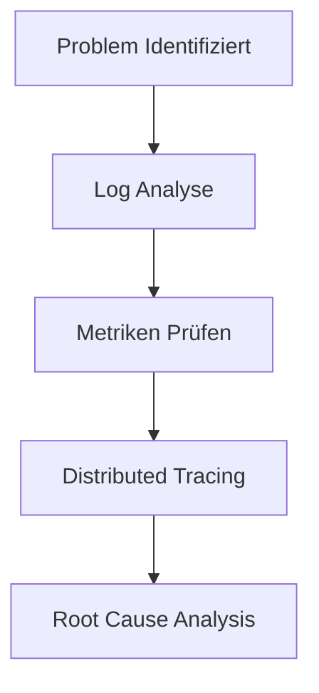

# Troubleshooting Guide

## 🔍 Problem-Diagnose



## 🚨 Common Issues

### 1. Performance Issues

#### Slow API Response
```typescript
// Problem: API Endpoints reagieren langsam
const performanceDiagnosis = {
  checks: [
    // 1. Database Check
    async checkDatabase() {
      const queryTimes = await getSlowQueries();
      return {
        avgResponseTime: queryTimes.average,
        slowQueries: queryTimes.slow,
        connections: await getActiveConnections()
      };
    },

    // 2. Cache Check
    async checkCache() {
      const cacheStats = await redis.info();
      return {
        hitRate: cacheStats.hitRate,
        memory: cacheStats.usedMemory,
        fragmentation: cacheStats.memFragmentation
      };
    },

    // 3. Network Check
    async checkNetwork() {
      return {
        latency: await measureLatency(),
        bandwidth: await measureBandwidth(),
        packetLoss: await measurePacketLoss()
      };
    }
  ]
};

// Solution Steps
const performanceSolution = {
  database: [
    'Analyze and optimize slow queries',
    'Add appropriate indexes',
    'Update statistics',
    'Check connection pool settings'
  ],
  cache: [
    'Increase cache hit rate',
    'Implement cache warming',
    'Adjust TTL values',
    'Monitor memory usage'
  ],
  network: [
    'Check CDN configuration',
    'Optimize payload size',
    'Enable compression',
    'Use connection pooling'
  ]
};
```

### 2. Memory Issues

#### Memory Leaks
```typescript
// Problem: Memory Usage steigt kontinuierlich
const memoryDiagnosis = {
  async diagnoseMemoryIssue() {
    // 1. Collect Metrics
    const metrics = {
      heap: process.memoryUsage(),
      gc: await getGCMetrics(),
      objects: await getObjectCounts()
    };

    // 2. Analyze Growth
    const growth = await analyzeMemoryGrowth(metrics);

    // 3. Identify Leaks
    const leaks = await findMemoryLeaks(growth);

    return { metrics, growth, leaks };
  }
};

// Solution Steps
const memorySolution = {
  immediate: [
    'Restart problematic services',
    'Increase swap space',
    'Clear caches'
  ],
  longTerm: [
    'Fix memory leaks in code',
    'Implement proper cleanup',
    'Add memory monitoring',
    'Set up alerts'
  ]
};
```

### 3. Database Issues

#### Connection Problems
```typescript
// Problem: Database Verbindungsprobleme
const dbDiagnosis = {
  async diagnoseDBIssue() {
    // 1. Check Connectivity
    const connection = await checkDBConnection();
    
    // 2. Check Pool
    const pool = await checkConnectionPool();
    
    // 3. Check Load
    const load = await checkDBLoad();
    
    return { connection, pool, load };
  }
};

// Solution Steps
const dbSolution = {
  connection: [
    'Verify credentials',
    'Check network access',
    'Validate SSL certificates',
    'Review firewall rules'
  ],
  performance: [
    'Optimize queries',
    'Update indexes',
    'Adjust pool size',
    'Scale resources'
  ]
};
```

### 4. Authentication Issues

#### Login Problems
```typescript
// Problem: Benutzer können sich nicht einloggen
const authDiagnosis = {
  async diagnoseAuthIssue(userId: string) {
    // 1. Check User Status
    const user = await getUserStatus(userId);
    
    // 2. Check Auth Provider
    const provider = await checkAuthProvider();
    
    // 3. Check Sessions
    const sessions = await checkUserSessions(userId);
    
    return { user, provider, sessions };
  }
};

// Solution Steps
const authSolution = {
  user: [
    'Reset user session',
    'Clear browser cache',
    'Check account status',
    'Verify email confirmation'
  ],
  system: [
    'Verify auth provider status',
    'Check JWT configuration',
    'Review CORS settings',
    'Update SSL certificates'
  ]
};
```

## 🔍 Diagnostic Tools

### 1. Log Analysis

```typescript
const logAnalysis = {
  // Log Collection
  async collectLogs(timeRange: TimeRange) {
    return {
      application: await getApplicationLogs(timeRange),
      system: await getSystemLogs(timeRange),
      access: await getAccessLogs(timeRange),
      error: await getErrorLogs(timeRange)
    };
  },

  // Pattern Analysis
  async analyzeLogs(logs: Logs) {
    return {
      patterns: findPatterns(logs),
      anomalies: detectAnomalies(logs),
      trends: analyzeTrends(logs)
    };
  }
};
```

### 2. Monitoring Tools

```typescript
const monitoring = {
  // System Monitoring
  async checkSystem() {
    return {
      cpu: await getCPUMetrics(),
      memory: await getMemoryMetrics(),
      disk: await getDiskMetrics(),
      network: await getNetworkMetrics()
    };
  },

  // Application Monitoring
  async checkApplication() {
    return {
      requests: await getRequestMetrics(),
      errors: await getErrorMetrics(),
      latency: await getLatencyMetrics(),
      saturation: await getSaturationMetrics()
    };
  }
};
```

## 🚀 Quick Fixes

### 1. Performance Optimization

```typescript
const quickFixes = {
  // Cache Warming
  async warmCache() {
    await Promise.all([
      warmUserCache(),
      warmConfigCache(),
      warmDataCache()
    ]);
  },

  // Connection Reset
  async resetConnections() {
    await Promise.all([
      resetDBConnections(),
      resetRedisConnections(),
      resetAPIConnections()
    ]);
  }
};
```

### 2. Emergency Procedures

```typescript
const emergency = {
  // Circuit Breaking
  async enableCircuitBreaker() {
    await setFeatureFlags({
      'heavy-features': false,
      'background-jobs': false,
      'real-time-updates': false
    });
  },

  // Traffic Throttling
  async enableThrottling() {
    await updateRateLimits({
      'api-requests': 50,
      'background-jobs': 10,
      'websockets': 100
    });
  }
};
```

## 📊 Problem Tracking

### 1. Issue Documentation

```typescript
interface Issue {
  id: string;
  type: 'performance' | 'security' | 'functionality';
  severity: 'low' | 'medium' | 'high' | 'critical';
  status: 'open' | 'investigating' | 'resolved';
  description: string;
  steps: string[];
  solution?: string;
}

const issueTracker = {
  async documentIssue(issue: Issue) {
    await createIssue(issue);
    await notifyTeam(issue);
    await updateMetrics(issue);
  }
};
```

### 2. Resolution Documentation

```typescript
interface Resolution {
  issueId: string;
  solution: string;
  timeToResolve: number;
  preventiveMeasures: string[];
  affectedSystems: string[];
}

const resolutionTracker = {
  async documentResolution(resolution: Resolution) {
    await updateIssue(resolution);
    await createPostMortem(resolution);
    await updatePlaybook(resolution);
  }
};