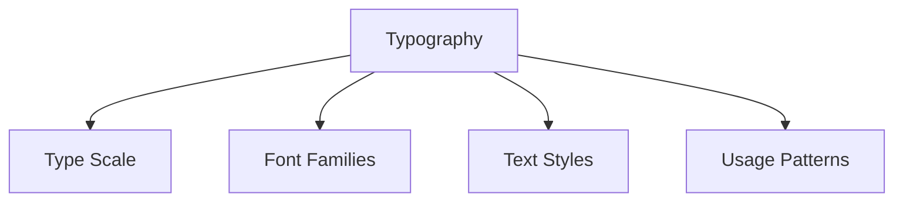

# Typography System

## 📝 Typografie-Übersicht



## 📏 Type Scale

### 1. Font Size Scale

```typescript
// Font Size Scale
const fontSize = {
  // Base Sizes
  xs: '0.75rem',    // 12px
  sm: '0.875rem',   // 14px
  base: '1rem',     // 16px
  lg: '1.125rem',   // 18px
  xl: '1.25rem',    // 20px
  '2xl': '1.5rem',  // 24px
  '3xl': '1.875rem',// 30px
  '4xl': '2.25rem', // 36px
  '5xl': '3rem',    // 48px
  
  // Fluid Sizes
  fluid: {
    hero: 'clamp(2.5rem, 5vw, 4rem)',
    heading: 'clamp(1.5rem, 3vw, 2.5rem)',
    subheading: 'clamp(1.125rem, 2vw, 1.5rem)'
  }
};

// Line Height Scale
const lineHeight = {
  none: '1',
  tight: '1.25',
  snug: '1.375',
  normal: '1.5',
  relaxed: '1.625',
  loose: '2'
};
```

### 2. Font Weight Scale

```typescript
// Font Weight Scale
const fontWeight = {
  thin: '100',
  extralight: '200',
  light: '300',
  normal: '400',
  medium: '500',
  semibold: '600',
  bold: '700',
  extrabold: '800',
  black: '900'
};

// Letter Spacing
const letterSpacing = {
  tighter: '-0.05em',
  tight: '-0.025em',
  normal: '0em',
  wide: '0.025em',
  wider: '0.05em',
  widest: '0.1em'
};
```

## 🎨 Font Families

### 1. Font Configuration

```typescript
// Font Family Definitions
const fontFamily = {
  // Sans-serif Stack
  sans: [
    'Inter var',
    'Inter',
    'system-ui',
    '-apple-system',
    'BlinkMacSystemFont',
    'Segoe UI',
    'Roboto',
    'Arial',
    'sans-serif'
  ].join(','),
  
  // Monospace Stack
  mono: [
    'JetBrains Mono',
    'Menlo',
    'Monaco',
    'Consolas',
    'Liberation Mono',
    'Courier New',
    'monospace'
  ].join(','),
  
  // Display Stack
  display: [
    'CalSans-SemiBold',
    'Inter var',
    'system-ui',
    'sans-serif'
  ].join(',')
};

// Font Loading
const fontLoader = {
  async loadFonts() {
    await Promise.all([
      loadFont('Inter var', '/fonts/Inter-var.woff2'),
      loadFont('JetBrains Mono', '/fonts/JetBrainsMono.woff2'),
      loadFont('CalSans-SemiBold', '/fonts/CalSans-SemiBold.woff2')
    ]);
  }
};
```

### 2. Font Loading Strategy

```typescript
// Font Loading Component
const FontLoader = () => {
  return (
    <Head>
      {/* Preload Critical Fonts */}
      <link
        rel="preload"
        href="/fonts/Inter-var.woff2"
        as="font"
        type="font/woff2"
        crossOrigin="anonymous"
      />
      
      {/* Font Face Declarations */}
      <style jsx global>{`
        @font-face {
          font-family: 'Inter var';
          font-weight: 100 900;
          font-display: swap;
          src: url('/fonts/Inter-var.woff2') format('woff2');
        }
      `}</style>
    </Head>
  );
};
```

## 📚 Text Styles

### 1. Heading Styles

```typescript
// Heading Components
const Heading = {
  // H1 Style
  H1: styled.h1`
    font-family: ${fontFamily.display};
    font-size: ${fontSize['5xl']};
    line-height: ${lineHeight.tight};
    font-weight: ${fontWeight.bold};
    letter-spacing: ${letterSpacing.tight};
  `,
  
  // H2 Style
  H2: styled.h2`
    font-family: ${fontFamily.display};
    font-size: ${fontSize['3xl']};
    line-height: ${lineHeight.tight};
    font-weight: ${fontWeight.semibold};
  `,
  
  // H3 Style
  H3: styled.h3`
    font-family: ${fontFamily.display};
    font-size: ${fontSize['2xl']};
    line-height: ${lineHeight.snug};
    font-weight: ${fontWeight.semibold};
  `
};
```

### 2. Body Styles

```typescript
// Text Components
const Text = {
  // Body Text
  Body: styled.p`
    font-family: ${fontFamily.sans};
    font-size: ${fontSize.base};
    line-height: ${lineHeight.normal};
    font-weight: ${fontWeight.normal};
  `,
  
  // Large Text
  Large: styled.p`
    font-family: ${fontFamily.sans};
    font-size: ${fontSize.lg};
    line-height: ${lineHeight.relaxed};
  `,
  
  // Small Text
  Small: styled.p`
    font-family: ${fontFamily.sans};
    font-size: ${fontSize.sm};
    line-height: ${lineHeight.normal};
  `
};
```

## 🎯 Usage Patterns

### 1. Typography Components

```typescript
// Typography System Components
const Typography = {
  // Page Title
  PageTitle: styled.h1`
    font-family: ${fontFamily.display};
    font-size: ${fontSize.fluid.hero};
    line-height: ${lineHeight.tight};
    font-weight: ${fontWeight.bold};
    letter-spacing: ${letterSpacing.tight};
  `,
  
  // Section Title
  SectionTitle: styled.h2`
    font-family: ${fontFamily.display};
    font-size: ${fontSize.fluid.heading};
    line-height: ${lineHeight.snug};
    font-weight: ${fontWeight.semibold};
  `,
  
  // Article Text
  Article: styled.article`
    font-family: ${fontFamily.sans};
    font-size: ${fontSize.lg};
    line-height: ${lineHeight.relaxed};
    
    h1, h2, h3, h4 {
      font-family: ${fontFamily.display};
      margin-top: 2em;
      margin-bottom: 1em;
    }
    
    p {
      margin-bottom: 1.5em;
    }
  `
};
```

### 2. Layout Patterns

```typescript
// Typography Layout
const TypographyLayout = {
  // Content Spacing
  spacing: {
    after: {
      title: '2rem',
      heading: '1.5rem',
      paragraph: '1rem'
    }
  },
  
  // Content Width
  maxWidth: {
    paragraph: '65ch',
    title: '20ch'
  }
};

// Layout Components
const Content = styled.div`
  h1, h2, h3 {
    max-width: ${TypographyLayout.maxWidth.title};
    margin-bottom: ${TypographyLayout.spacing.after.heading};
  }
  
  p {
    max-width: ${TypographyLayout.maxWidth.paragraph};
    margin-bottom: ${TypographyLayout.spacing.after.paragraph};
  }
`;
```

## 🌐 Responsive Typography

### 1. Responsive Rules

```typescript
// Responsive Typography
const responsiveType = {
  // Media Queries
  media: {
    sm: '@media (min-width: 640px)',
    md: '@media (min-width: 768px)',
    lg: '@media (min-width: 1024px)'
  },
  
  // Responsive Styles
  styles: {
    heading: css`
      font-size: ${fontSize['2xl']};
      
      ${media.sm} {
        font-size: ${fontSize['3xl']};
      }
      
      ${media.lg} {
        font-size: ${fontSize['4xl']};
      }
    `,
    
    body: css`
      font-size: ${fontSize.base};
      
      ${media.lg} {
        font-size: ${fontSize.lg};
      }
    `
  }
};
```

### 2. Fluid Typography

```typescript
// Fluid Typography Utilities
const fluidType = {
  // Fluid Scale
  scale: (
    minSize: number,
    maxSize: number,
    minScreen = 320,
    maxScreen = 1200
  ) => {
    const slope = (maxSize - minSize) / (maxScreen - minScreen);
    const base = minSize - slope * minScreen;
    
    return `clamp(
      ${minSize}rem,
      ${base}rem + ${slope * 100}vw,
      ${maxSize}rem
    )`;
  },
  
  // Usage Examples
  examples: {
    hero: scale(2, 4),      // 32px - 64px
    heading: scale(1.5, 3), // 24px - 48px
    body: scale(1, 1.25)    // 16px - 20px
  }
};