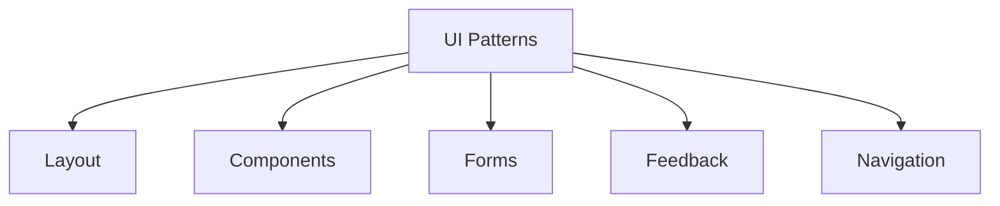

# UI Design Patterns

## 🎨 Pattern-Übersicht



## 📐 Layout Patterns

### 1. Page Layout

```typescript
// Base Layout
const DashboardLayout = ({ children }) => {
  return (
    <div className="min-h-screen flex">
      {/* Sidebar */}
      <aside className="w-64 bg-gray-800">
        <Navigation />
      </aside>
      
      {/* Main Content */}
      <main className="flex-1">
        {/* Header */}
        <header className="h-16 border-b">
          <TopBar />
        </header>
        
        {/* Content */}
        <div className="p-6">
          {children}
        </div>
      </main>
    </div>
  );
};

// Responsive Layout
const ResponsiveLayout = ({ children }) => {
  const [isSidebarOpen, setSidebarOpen] = useState(false);
  
  return (
    <div>
      {/* Mobile Sidebar */}
      <Sheet open={isSidebarOpen} onOpenChange={setSidebarOpen}>
        <SheetContent side="left">
          <Navigation />
        </SheetContent>
      </Sheet>
      
      {/* Content */}
      <div className="lg:pl-64">
        {children}
      </div>
    </div>
  );
};
```

### 2. Grid Systems

```typescript
// Grid Component
const Grid = ({
  columns = 1,
  gap = 4,
  children
}: GridProps) => {
  return (
    <div
      className={cn(
        'grid',
        `grid-cols-${columns}`,
        `gap-${gap}`
      )}
    >
      {children}
    </div>
  );
};

// Responsive Grid
const ResponsiveGrid = ({ children }) => {
  return (
    <div className="grid grid-cols-1 md:grid-cols-2 lg:grid-cols-3 xl:grid-cols-4 gap-4">
      {children}
    </div>
  );
};
```

## 🧩 Component Patterns

### 1. Compound Components

```typescript
// Tabs Component
const Tabs = {
  // Root Component
  Root: ({ children, defaultValue }) => {
    const [value, setValue] = useState(defaultValue);
    
    return (
      <TabsContext.Provider value={{ value, setValue }}>
        {children}
      </TabsContext.Provider>
    );
  },
  
  // List Component
  List: ({ children }) => {
    return (
      <div role="tablist" className="flex border-b">
        {children}
      </div>
    );
  },
  
  // Trigger Component
  Trigger: ({ value, children }) => {
    const { value: selectedValue, setValue } = useTabsContext();
    
    return (
      <button
        role="tab"
        aria-selected={value === selectedValue}
        onClick={() => setValue(value)}
      >
        {children}
      </button>
    );
  },
  
  // Content Component
  Content: ({ value, children }) => {
    const { value: selectedValue } = useTabsContext();
    
    if (value !== selectedValue) return null;
    
    return (
      <div role="tabpanel">
        {children}
      </div>
    );
  }
};
```

### 2. Controlled Components

```typescript
// Select Component
interface SelectProps {
  value: string;
  onChange: (value: string) => void;
  options: Option[];
}

const Select = ({
  value,
  onChange,
  options
}: SelectProps) => {
  return (
    <select
      value={value}
      onChange={(e) => onChange(e.target.value)}
    >
      {options.map(option => (
        <option key={option.value} value={option.value}>
          {option.label}
        </option>
      ))}
    </select>
  );
};

// Usage
const TradingForm = () => {
  const [symbol, setSymbol] = useState('AAPL');
  
  return (
    <Select
      value={symbol}
      onChange={setSymbol}
      options={symbols}
    />
  );
};
```

## 📝 Form Patterns

### 1. Form Validation

```typescript
// Form Hook
const useForm = <T extends object>(config: FormConfig<T>) => {
  const [values, setValues] = useState<T>(config.defaultValues);
  const [errors, setErrors] = useState<Record<string, string>>({});
  
  const validate = async (data: T) => {
    try {
      await config.schema.parseAsync(data);
      setErrors({});
      return true;
    } catch (error) {
      if (error instanceof z.ZodError) {
        setErrors(formatZodErrors(error));
      }
      return false;
    }
  };
  
  const onSubmit = async (e: FormEvent) => {
    e.preventDefault();
    if (await validate(values)) {
      config.onSubmit(values);
    }
  };
  
  return { values, setValues, errors, onSubmit };
};

// Usage
const TradeForm = () => {
  const form = useForm({
    defaultValues: {
      symbol: '',
      amount: 0,
    },
    schema: tradeSchema,
    onSubmit: handleTrade
  });
  
  return (
    <form onSubmit={form.onSubmit}>
      {/* Form fields */}
    </form>
  );
};
```

### 2. Field Components

```typescript
// Text Field
const TextField = ({
  label,
  name,
  error,
  ...props
}: TextFieldProps) => {
  const id = useId();
  
  return (
    <div>
      <label htmlFor={id}>{label}</label>
      <input
        id={id}
        name={name}
        aria-invalid={Boolean(error)}
        aria-describedby={error ? `${id}-error` : undefined}
        {...props}
      />
      {error && (
        <div id={`${id}-error`} className="text-red-500">
          {error}
        </div>
      )}
    </div>
  );
};

// Number Field
const NumberField = ({
  label,
  name,
  value,
  onChange,
  min,
  max,
  step = 1
}: NumberFieldProps) => {
  return (
    <TextField
      type="number"
      inputMode="decimal"
      label={label}
      name={name}
      value={value}
      onChange={onChange}
      min={min}
      max={max}
      step={step}
    />
  );
};
```

## 🔄 Feedback Patterns

### 1. Loading States

```typescript
// Loading Skeleton
const Skeleton = () => {
  return (
    <div className="animate-pulse">
      <div className="h-4 bg-gray-200 rounded w-3/4" />
      <div className="space-y-3 mt-4">
        <div className="h-4 bg-gray-200 rounded" />
        <div className="h-4 bg-gray-200 rounded w-5/6" />
      </div>
    </div>
  );
};

// Loading Spinner
const Spinner = ({
  size = 'md',
  className
}: SpinnerProps) => {
  return (
    <div
      className={cn(
        'animate-spin rounded-full border-2',
        'border-primary border-t-transparent',
        sizeClasses[size],
        className
      )}
    />
  );
};
```

### 2. Error States

```typescript
// Error Message
const ErrorMessage = ({
  title,
  message,
  action
}: ErrorProps) => {
  return (
    <div
      role="alert"
      className="rounded-lg bg-red-50 p-4"
    >
      <h3 className="text-red-800 font-medium">
        {title}
      </h3>
      <p className="text-red-700 mt-2">
        {message}
      </p>
      {action && (
        <div className="mt-4">
          {action}
        </div>
      )}
    </div>
  );
};

// Error Boundary
class ErrorBoundary extends React.Component {
  state = { hasError: false };

  static getDerivedStateFromError() {
    return { hasError: true };
  }

  render() {
    if (this.state.hasError) {
      return (
        <ErrorMessage
          title="Something went wrong"
          message="Please try again later"
          action={
            <Button onClick={() => window.location.reload()}>
              Retry
            </Button>
          }
        />
      );
    }

    return this.props.children;
  }
}